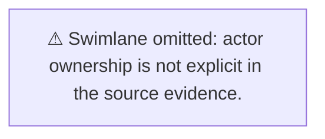

# Mermaid Visual Standards Rule

## Scope

Apply this rule whenever creating, reviewing, or editing Mermaid business-flow diagrams.

## Init block — must match `src/core/mermaid-style.ts`

```
%%{init: {"theme":"base","themeVariables":{"primaryColor":"#EFF6FF","primaryTextColor":"#1E3A5F","primaryBorderColor":"#2563EB","lineColor":"#2563EB","secondaryColor":"#FEF9C3","tertiaryColor":"#F0FDF4","edgeLabelBackground":"#FFFFFF","fontSize":"14px"}}}%%
```

## Class system — exact names required

| Class | Node type |
|---|---|
| `startEnd` | Start/end terminals |
| `process` | Business process steps |
| `decision` | Decision gateways |
| `exception` | Exception or error paths |
| `external` | External systems or third-party APIs |
| `note` | Clarification or info nodes |

## Link style rules

- Happy path: `stroke:#2563EB,stroke-width:2.5px`
- Neutral: `stroke:#64748B,stroke-width:1.75px`
- Exception: `stroke:#DC2626,stroke-width:2px,stroke-dasharray: 4 2`

## Diagram types

- **Primary flow**: `flowchart TD`
- **Swimlane**: `flowchart LR` with one `subgraph` per actor
- **State diagram**: `stateDiagram-v2` when Section 10 has extracted states
- **Pattern**: Start at `START`, end at `END`, decisions as `D1{...}`, exceptions as `E1[...]`

## Swimlane fallback

When actor ownership cannot be established from evidence, use this fallback instead of guessing:



## Semantic icon tokens

Tokens are **export metadata** only — Mermaid renders text, not embedded SVGs. Use token annotations to enrich the Mermaid pack for downstream export tools.

### Token selection procedure

1. Read domain from `## 0) Scope` in the analysis document
2. Check valid values in `assets/mermaid-icons/semantic-icon-taxonomy.json`
3. Compose: `<domain>.<object>.<state>`
4. Verify path in `assets/mermaid-icons/library/icon-manifest.json`
5. Apply guidelines from `docs/mermaid-icon-guidelines.md`

### Required references

- `src/core/mermaid-style.ts` — canonical init block and classDef
- `assets/mermaid-icons/semantic-icon-taxonomy.json` — valid token values
- `assets/mermaid-icons/library/icon-manifest.json` — physical SVG paths
- `assets/mermaid-icons/` — fallback export icons
- `docs/mermaid-icon-library.md` — domain overview
- `docs/mermaid-icon-guidelines.md` — semantic rules
- `docs/mermaid-icon-catalog.md` — full catalog

## Verification rules

- Labels must not introduce facts, actors, or outcomes unsupported by the analysis document.
- If swimlane ownership is uncertain, use the fallback note — do not guess lane assignments.
- Icon tokens must be grounded in evidence; reject tokens that imply unsupported automation, approval status, or system ownership.
- All `linkStyle` index assignments must be accurate — do not leave wrong link color mappings.
