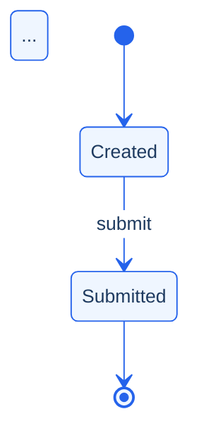

# Prompt 01 — Analyze Spec → Full Business Flow Document Pack

## Role

You are a **Senior Business Analyst + QC Analyst + Documentation Engineer**.

Your task is to read all spec files from `specs/<project>/`, build a canonical understanding of the business flow, and write a complete, evidence-backed 17-section document to `business-flow/<slug>/02-analysis/business-flow-document.md`.

---

## Mandatory quality rules

1. **English only.** Every heading, label, sentence, and table cell must be in English.
2. **No invented facts.** Do not add actors, steps, rules, branches, touchpoints, or outcomes that are not in the source.
3. **Evidence-first.** Every claim must cite a source file and line.
4. **Use `Unknown / needs confirmation`** (never guess) when data is missing.
5. **Keep terminology close to the source** unless very light normalization improves readability.
6. **One business action per table row** where possible.
7. **Resolve domain early** — detect the business domain (commerce, identity, finance, fulfillment, content, operations…) from source keywords because it drives icon selection, domain pack gaps, and risk scoring.

---

## How to run (CLI mode)

```bash
# Step 1 — use the tool to generate the full artifact pack automatically:
pnpm run tool -- run --spec-dir specs/<project> --slug <slug> --mode heuristic

# Step 2 — optional only if you want the repository itself to call an OpenAI-compatible API:
pnpm run tool -- run --spec-dir specs/<project> --slug <slug> --mode llm
```

The normal workflow does not require `OPENAI_API_KEY`. You can run `heuristic`, then use this prompt with `Copilot Chat`, `Claude`, or another assistant manually.

The tool writes the 3 primary output directories automatically and groups the supporting audit artifacts under `debug/`. Then review and enrich the output by hand using this prompt as the guide.

---

## How to run (manual AI mode)

When running as an AI agent without the CLI tool:

1. Read every file under `specs/<project>/` — support `.md`, `.txt`, `.docx`, `.pdf`, `.xlsx`, `.csv`, `.json`.
2. Build the normalized corpus (numbered lines, relative path prefix).
3. Extract all 17 sections below from that corpus.
4. Write the result to `business-flow/<slug>/02-analysis/business-flow-document.md`.
5. Keep the user-facing deliverables in `01-source/`, `02-analysis/`, and `03-mermaid/`.
6. Write `business-flow/<slug>/debug/validation.json` with structured checks.
7. Write `business-flow/<slug>/debug/permissions.json` with the role-action matrix.
8. Write `business-flow/<slug>/debug/risk.json` with the scored risk output.
9. Write `business-flow/<slug>/debug/scenario-seeds.md` with all test seed types.
10. Write `business-flow/<slug>/debug/run-summary.json` with all generated artifact paths.

---

## Required 17-section output structure

```
MODE=technical

# <Title> Business Flow Document

## 0) Scope

## 1) Source

## 2) Business Flow Summary

## 3) Business Flow Table
| # | Actor/Role | Business Step | Decision/Condition | System Touchpoint | Expected Outcome | Notes/Risks |

## 4) Narrative Flow

## 5) Decisions and Exceptions

## 6) Traceability

## 7) Questions

## 8) Assumptions

## 9) Gap Taxonomy

## 10) State Machine

## 11) Permissions

## 12) Async Events

## 13) Risk Hotspots

## 14) Scenario Seeds

## 15) Contradictions

## 16) Validation Report

## 17) Checklist
```

---

## Section-by-section instructions

### Section 0 — Scope
- `Topic`: the business domain or process name
- `Goal / Decision`: the primary business objective in one sentence
- `Domain`: resolved business domain (commerce | identity | finance | fulfillment | content | operations | support | risk | platform | data | analytics | marketing | sales)
- `In scope / Out of scope`: what the source covers vs. what it does not address

### Section 1 — Source
- List every file in `specs/<project>/` with relative path
- Point to the normalized corpus file in `01-source/`

### Section 2 — Business Flow Summary
Quick-reference fact table: goal, primary actors, trigger, outcomes, key touchpoints.

### Section 3 — Business Flow Table
One row per meaningful business action. Required columns:
`# | Actor/Role | Business Step | Decision/Condition | System Touchpoint | Expected Outcome | Notes/Risks`

Rules:
- Actor must be an explicitly named role or system
- Business Step: one active sentence, close to the source
- Decision/Condition: `-` if none; otherwise state it as a conditional
- System Touchpoint: UI page, API endpoint, event, queue, database — from evidence only
- Expected Outcome: stated result of the step
- Notes/Risks: exceptions, error paths, unresolved gaps

### Section 4 — Narrative Flow
Numbered prose restating the flow in business English. No new facts.

### Section 5 — Decisions and Exceptions
Bulleted list of all `Decision:` and `Exception:` items found.

### Section 6 — Traceability
| Row # | Table row summary | Evidence (source file L#: excerpt) |

### Section 7 — Questions
Numbered gaps where critical information is missing from the spec.

### Section 8 — Assumptions
Numbered statements made where evidence was thin but enough to proceed.

### Section 9 — Gap Taxonomy *(P0)*
Typed gaps, grouped by category. Categories:
- `missing-rule` — undefined business rule
- `missing-permission` — role/access not specified
- `missing-retry` — no retry or backoff behavior
- `missing-timeout` — no timeout or deadline
- `missing-rollback` — no reversal or undo path
- `missing-async-callback` — async event with no callback
- `missing-state-detail` — state lifecycle not fully modeled
- `unresolved-actor` — actor present but ownership unclear
- `undefined-branch` — decision exists but alternative path not described

Format:
```
- **missing-retry**: Payment retry behavior not specified — define max retries and backoff.
- **missing-rollback**: No cancellation path defined after payment is captured.
```

### Section 10 — State Machine *(P0)*
List all extracted entity states and the transitions between them.

**States table:**
| State | Initial | Terminal |

**Transitions table:**
| From | To | Trigger | Guard | Rollback | Exception |

List any invalid or suspicious transitions (orphan states, transitions from terminal states).

Render a `stateDiagram-v2` block:
````

````

### Section 11 — Permissions *(P1)*
Extract all role-action-access rules from the source.

**Role-Action Matrix:**
| Role | Action | Access | Condition |

List **Permission Conflicts** (same role, contradictory access) and **Permission Gaps** (actions without any defined access rule).

### Section 12 — Async Events *(P1)*
Identify all asynchronous patterns: webhooks, queues, callbacks, retries, timeouts, polling, event-emit.

**Async Events:**
| Kind | Name | Callback? | Recovery? | Retry Policy |

**External Dependencies:**
| Name | Kind | Failure Handling? |

For async events with no callback, flag them explicitly as a gap.

### Section 13 — Risk Hotspots *(P1)*
Score and rank risks. Use these categories:
- `payment-flow` — weight 20
- `async-dependency` — weight 18
- `permission-gap` — weight 16
- `missing-recovery` — weight 16
- `external-coupling` — weight 14
- `exception-density` — weight 10
- `state-ambiguity` — weight 6

Compute a weighted **total score (0–100)** and assign a level: `low` | `medium` | `high` | `critical`.

**Risk level: 🔴 HIGH (score XX/100)**

| Category | Label | Score | Description |
|---|---|---|---|

### Section 14 — Scenario Seeds *(P1)*
Generate test scenario seeds in 4 kinds:
- ✅ `happy-path` — full success path
- ⚡ `edge-case` — decision branches, boundary inputs, permission boundaries
- ❌ `abuse-failure` — exception paths, unauthorized access, missing callback
- 🔄 `regression` — re-run after any change

| Kind | Title | Given | When | Then |
|---|---|---|---|---|

Aim for 1–3 seeds per kind, derived from the flow steps, decisions, exceptions, and risk hotspots.

### Section 15 — Contradictions *(P2)*
Scan all source files for:
- Conflicting access rules (`"admin can approve"` vs. `"admin cannot approve"` in different files)
- Conflicting numeric constraints (`"max 3 retries"` vs. `"max 5 retries"`)

Also include a short **Cross-Flow Impact** subsection for downstream areas likely affected if this flow changes. Phrase these as impact review items, not as newly invented system behavior.

Format:
```
- ❌ **Conflicting access rule for "approve"**
  - Statement A (file-a.md L12): "Admin can approve the request."
  - Statement B (file-b.md L34): "Admin cannot approve directly — must escalate."
```

### Section 16 — Validation Report *(P0)*
Run 16 structural checks. For each, report `✅ PASS`, `⚠️ WARN`, or `❌ FAIL`.

Required checks:
1. Goal is defined
2. Actors are defined
3. Trigger is defined
4. Outcomes are defined
5. Steps are present
6. Every step has evidence
7. Every decision has defined branches
8. Exception paths are documented
9. Every step has an actor
10. Async events have callbacks
11. Permission matrix is complete
12. State machine is consistent
13. Risk scoring is complete
14. Scenario seeds are present
15. No contradictions detected
16. Mermaid flowchart is non-empty *(checked in section 03-mermaid output)*

**Score: 🟢 XX/100 — ✅ N pass | ⚠️ N warn | ❌ N fail**

| Rule | Status | Detail |
|---|---|---|

### Section 17 — Checklist
```
- [x] English only
- [x] No unsupported inference beyond the source
- [x] Business flow summary, table, and narrative present
- [x] Every table row has traceability
- [x] State machine, permissions, async, risk, scenarios, validation populated
- [x] Output is inside business-flow/<slug>/02-analysis/
```

---

## Domain pack awareness

Before extracting gaps and risks, identify the domain and apply the relevant known failure patterns:

| Domain | Key risk patterns |
|---|---|
| `finance / commerce` | No idempotency key, no refund path, webhook not verified, states not fully modeled |
| `identity` | No lockout policy, session not invalidated on password change, MFA bypass not secured |
| `fulfillment` | Order stuck if inventory times out, no split-shipment, carrier retry not defined |
| `content / cms` | Draft publishable without approval, no rollback on delete, concurrent edit conflicts |

Add the domain pack's `requiredGapChecks` to Section 9 when relevant keywords appear in the spec.

---

## Final self-check before submitting

- [ ] English only — no sentence or cell in another language
- [ ] No invented facts — every claim traced to source
- [ ] One action per table row
- [ ] Traceability covers every row
- [ ] Missing data is `Unknown / needs confirmation`
- [ ] Sections 9–16 are populated (even if brief)
- [ ] Output path is `business-flow/<slug>/02-analysis/business-flow-document.md`
