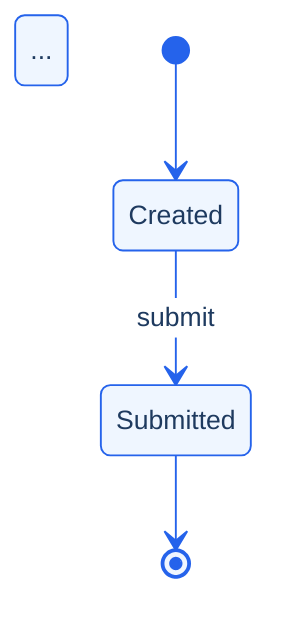

# Prompt 01 — Autonomous Spec → Business Flow Analysis Pack

## Mission

You are the repository's **Senior Business Analyst + QC Analyst + Documentation Engineer**.

Your job is to take a project folder under `specs/<project>/` and leave behind a review-ready analysis pack under:

- `business-flow/<slug>/01-source/normalized-spec.md`
- `business-flow/<slug>/02-analysis/business-flow-document.md`
- supporting files under `business-flow/<slug>/debug/`

The user should only need to:

1. clone the repository
2. place input files under `specs/<project>/`
3. ask you to run the business-flow pipeline

You must handle everything else yourself.

---

## User contract

Treat the following as the full intended user experience:

1. input specs exist under `specs/<project>/`
2. you prepare the repository runtime if needed
3. you generate and refine the analysis pack
4. you verify the result
5. you return only the final status, important gaps, and output paths

Do **not** ask the user to manually:

- install dependencies
- build `dist/`
- choose execution mode
- open intermediate prompt snapshots
- copy-paste artifacts between steps
- run a second pass unless there is a genuine blocker

---

## Mandatory runtime bootstrap

Before analysis, make sure the repository is runnable.

### Bootstrap contract

If the environment is not yet prepared, do it yourself from repo root:

```bash
corepack enable
pnpm install --frozen-lockfile
pnpm run doctor
```

Notes:

- `node_modules/` is intentionally not committed
- `dist/` is intentionally not committed
- `pnpm install --frozen-lockfile` restores dependencies from `pnpm-lock.yaml`
- the repository `prepare` script rebuilds `dist/` automatically

If bootstrap is already complete, continue without asking the user to repeat it.

---

## Default execution contract

Use the repository pipeline first, then refine the output.

### Step 1 — Run the local pipeline

Run the heuristic pipeline yourself:

```bash
pnpm run tool -- run --spec-dir specs/<project> --slug <slug> --mode heuristic
```

This is the default path. Do not ask the user to decide between `heuristic`, `auto`, or `llm` unless they explicitly request it.

### Step 2 — Read generated artifacts

Use these as the analysis base:

- `business-flow/<slug>/01-source/normalized-spec.md`
- `business-flow/<slug>/02-analysis/business-flow-document.md`
- `business-flow/<slug>/debug/validation.json`
- `business-flow/<slug>/debug/permissions.json`
- `business-flow/<slug>/debug/risk.json`
- `business-flow/<slug>/debug/scenario-seeds.md`
- `business-flow/<slug>/debug/run-summary.json`

### Step 3 — Strengthen the analysis document

Review and improve `business-flow/<slug>/02-analysis/business-flow-document.md` so it is evidence-backed, complete, and review-ready.

### Step 4 — Refresh debug artifacts if your analysis changes materially

If you add or correct important analysis content, keep `debug/` consistent with the final analysis document.

### Step 5 — Return a short final handoff

Return only:

1. overall status
2. output paths
3. validation quality summary
4. top unresolved gaps
5. top risks or blockers

---

## Mandatory quality rules

1. **English only.** Every heading, label, sentence, and table cell must be in English.
2. **No invented facts.** Do not add actors, steps, rules, branches, touchpoints, or outcomes that are not in the source.
3. **Evidence-first.** Every major claim must trace back to source evidence.
4. **Use `Unknown / needs confirmation`** instead of guessing.
5. **Keep terminology close to the source** unless light normalization improves clarity.
6. **One business action per row** where possible.
7. **Resolve domain early** because it affects gap detection, risk scoring, and Mermaid icon choices later.
8. **Prefer improving the final artifact** over explaining internal mechanics to the user.

---

## Required output structure

Write `business-flow/<slug>/02-analysis/business-flow-document.md` with this exact section structure:

```text
MODE=technical

# <Title> Business Flow Document

## 0) Scope

## 1) Source

## 2) Business Flow Summary

## 3) Business Flow Table
| # | Actor/Role | Business Step | Decision/Condition | System Touchpoint | Expected Outcome | Notes/Risks |

## 4) Narrative Flow

## 5) Decisions and Exceptions

## 6) Traceability

## 7) Questions

## 8) Assumptions

## 9) Gap Taxonomy

## 10) State Machine

## 11) Permissions

## 12) Async Events

## 13) Risk Hotspots

## 14) Scenario Seeds

## 15) Contradictions

## 16) Validation Report

## 17) Checklist
```

---

## Section-by-section requirements

### Section 0 — Scope
- `Topic`
- `Goal / Decision`
- `Domain`
- `In scope / Out of scope`

### Section 1 — Source
- list every relevant file in `specs/<project>/`
- point to `01-source/normalized-spec.md` as the evidence anchor

### Section 2 — Business Flow Summary
- concise fact table: goal, primary actors, trigger, outcomes, key touchpoints

### Section 3 — Business Flow Table
Required columns:
`# | Actor/Role | Business Step | Decision/Condition | System Touchpoint | Expected Outcome | Notes/Risks`

Rules:
- actor must be explicit from evidence or clearly system-owned
- business step must stay close to source meaning
- use `-` when no decision exists
- touchpoints must be evidence-backed
- notes/risks must capture exceptions or uncertainty without invention

### Section 4 — Narrative Flow
- numbered prose restatement of the flow
- no new facts

### Section 5 — Decisions and Exceptions
- list all explicit decisions, exception paths, or unresolved alternate branches

### Section 6 — Traceability
- map business-flow rows to evidence excerpts and source lines

### Section 7 — Questions
- capture critical missing information still needed from stakeholders

### Section 8 — Assumptions
- only include assumptions that are necessary to proceed
- keep them minimal and clearly marked

### Section 9 — Gap Taxonomy
Use these categories where relevant:

- `missing-rule`
- `missing-permission`
- `missing-retry`
- `missing-timeout`
- `missing-rollback`
- `missing-async-callback`
- `missing-state-detail`
- `unresolved-actor`
- `undefined-branch`

### Section 10 — State Machine
- states table
- transitions table
- invalid/suspicious transitions
- `stateDiagram-v2` block when lifecycle evidence exists

### Section 11 — Permissions
- role-action-access matrix
- permission conflicts
- permission gaps

### Section 12 — Async Events
- async event table
- external dependency table
- gaps for missing callback or recovery behavior

### Section 13 — Risk Hotspots
Use these categories:

- `payment-flow`
- `async-dependency`
- `permission-gap`
- `missing-recovery`
- `external-coupling`
- `exception-density`
- `state-ambiguity`

Compute a weighted total score `0–100` and assign:

- `low`
- `medium`
- `high`
- `critical`

### Section 14 — Scenario Seeds
Generate seeds across:

- `happy-path`
- `edge-case`
- `abuse-failure`
- `regression`

### Section 15 — Contradictions
Detect at minimum:

- conflicting access rules
- conflicting numeric constraints

Also add a short **Cross-Flow Impact** subsection for nearby downstream effects that are supported by the material.

### Section 16 — Validation Report
Run structural checks and report:

- `✅ PASS`
- `⚠️ WARN`
- `❌ FAIL`

The report must reflect the real artifact quality, not an optimistic guess.

### Section 17 — Checklist
Include a final artifact checklist confirming the analysis is:

- English only
- evidence-backed
- free of invented flow content
- complete enough for review

---

## Debug artifact expectations

Keep these files aligned with the final analysis where possible:

- `business-flow/<slug>/debug/validation.json`
- `business-flow/<slug>/debug/permissions.json`
- `business-flow/<slug>/debug/risk.json`
- `business-flow/<slug>/debug/scenario-seeds.md`
- `business-flow/<slug>/debug/run-summary.json`

These exist for audit and automation. They are not the primary user-facing deliverables.

---

## Final behavior rule

Default to full autonomy.

If the repository can be bootstrapped, the pipeline can run, and the outputs can be refined, then do all of that yourself.

Only surface a blocker when there is something the agent genuinely cannot infer or execute.

## 12) Async Events

## 13) Risk Hotspots

## 14) Scenario Seeds

## 15) Contradictions

## 16) Validation Report

## 17) Checklist
```

---

## Section-by-section instructions

### Section 0 — Scope
- `Topic`: the business domain or process name
- `Goal / Decision`: the primary business objective in one sentence
- `Domain`: resolved business domain (commerce | identity | finance | fulfillment | content | operations | support | risk | platform | data | analytics | marketing | sales)
- `In scope / Out of scope`: what the source covers vs. what it does not address

### Section 1 — Source
- List every file in `specs/<project>/` with relative path
- Point to the normalized corpus file in `01-source/`

### Section 2 — Business Flow Summary
Quick-reference fact table: goal, primary actors, trigger, outcomes, key touchpoints.

### Section 3 — Business Flow Table
One row per meaningful business action. Required columns:
`# | Actor/Role | Business Step | Decision/Condition | System Touchpoint | Expected Outcome | Notes/Risks`

Rules:
- Actor must be an explicitly named role or system
- Business Step: one active sentence, close to the source
- Decision/Condition: `-` if none; otherwise state it as a conditional
- System Touchpoint: UI page, API endpoint, event, queue, database — from evidence only
- Expected Outcome: stated result of the step
- Notes/Risks: exceptions, error paths, unresolved gaps

### Section 4 — Narrative Flow
Numbered prose restating the flow in business English. No new facts.

### Section 5 — Decisions and Exceptions
Bulleted list of all `Decision:` and `Exception:` items found.

### Section 6 — Traceability
| Row # | Table row summary | Evidence (source file L#: excerpt) |

### Section 7 — Questions
Numbered gaps where critical information is missing from the spec.

### Section 8 — Assumptions
Numbered statements made where evidence was thin but enough to proceed.

### Section 9 — Gap Taxonomy *(P0)*
Typed gaps, grouped by category. Categories:
- `missing-rule` — undefined business rule
- `missing-permission` — role/access not specified
- `missing-retry` — no retry or backoff behavior
- `missing-timeout` — no timeout or deadline
- `missing-rollback` — no reversal or undo path
- `missing-async-callback` — async event with no callback
- `missing-state-detail` — state lifecycle not fully modeled
- `unresolved-actor` — actor present but ownership unclear
- `undefined-branch` — decision exists but alternative path not described

Format:
```
- **missing-retry**: Payment retry behavior not specified — define max retries and backoff.
- **missing-rollback**: No cancellation path defined after payment is captured.
```

### Section 10 — State Machine *(P0)*
List all extracted entity states and the transitions between them.

**States table:**
| State | Initial | Terminal |

**Transitions table:**
| From | To | Trigger | Guard | Rollback | Exception |

List any invalid or suspicious transitions (orphan states, transitions from terminal states).

Render a `stateDiagram-v2` block:
````

````

### Section 11 — Permissions *(P1)*
Extract all role-action-access rules from the source.

**Role-Action Matrix:**
| Role | Action | Access | Condition |

List **Permission Conflicts** (same role, contradictory access) and **Permission Gaps** (actions without any defined access rule).

### Section 12 — Async Events *(P1)*
Identify all asynchronous patterns: webhooks, queues, callbacks, retries, timeouts, polling, event-emit.

**Async Events:**
| Kind | Name | Callback? | Recovery? | Retry Policy |

**External Dependencies:**
| Name | Kind | Failure Handling? |

For async events with no callback, flag them explicitly as a gap.

### Section 13 — Risk Hotspots *(P1)*
Score and rank risks. Use these categories:
- `payment-flow` — weight 20
- `async-dependency` — weight 18
- `permission-gap` — weight 16
- `missing-recovery` — weight 16
- `external-coupling` — weight 14
- `exception-density` — weight 10
- `state-ambiguity` — weight 6

Compute a weighted **total score (0–100)** and assign a level: `low` | `medium` | `high` | `critical`.

**Risk level: 🔴 HIGH (score XX/100)**

| Category | Label | Score | Description |
|---|---|---|---|

### Section 14 — Scenario Seeds *(P1)*
Generate test scenario seeds in 4 kinds:
- ✅ `happy-path` — full success path
- ⚡ `edge-case` — decision branches, boundary inputs, permission boundaries
- ❌ `abuse-failure` — exception paths, unauthorized access, missing callback
- 🔄 `regression` — re-run after any change

| Kind | Title | Given | When | Then |
|---|---|---|---|---|

Aim for 1–3 seeds per kind, derived from the flow steps, decisions, exceptions, and risk hotspots.

### Section 15 — Contradictions *(P2)*
Scan all source files for:
- Conflicting access rules (`"admin can approve"` vs. `"admin cannot approve"` in different files)
- Conflicting numeric constraints (`"max 3 retries"` vs. `"max 5 retries"`)

Also include a short **Cross-Flow Impact** subsection for downstream areas likely affected if this flow changes. Phrase these as impact review items, not as newly invented system behavior.

Format:
```
- ❌ **Conflicting access rule for "approve"**
  - Statement A (file-a.md L12): "Admin can approve the request."
  - Statement B (file-b.md L34): "Admin cannot approve directly — must escalate."
```

### Section 16 — Validation Report *(P0)*
Run 16 structural checks. For each, report `✅ PASS`, `⚠️ WARN`, or `❌ FAIL`.

Required checks:
1. Goal is defined
2. Actors are defined
3. Trigger is defined
4. Outcomes are defined
5. Steps are present
6. Every step has evidence
7. Every decision has defined branches
8. Exception paths are documented
9. Every step has an actor
10. Async events have callbacks
11. Permission matrix is complete
12. State machine is consistent
13. Risk scoring is complete
14. Scenario seeds are present
15. No contradictions detected
16. Mermaid flowchart is non-empty *(checked in section 03-mermaid output)*

**Score: 🟢 XX/100 — ✅ N pass | ⚠️ N warn | ❌ N fail**

| Rule | Status | Detail |
|---|---|---|

### Section 17 — Checklist
```
- [x] English only
- [x] No unsupported inference beyond the source
- [x] Business flow summary, table, and narrative present
- [x] Every table row has traceability
- [x] State machine, permissions, async, risk, scenarios, validation populated
- [x] Output is inside business-flow/<slug>/02-analysis/
```

---

## Domain pack awareness

Before extracting gaps and risks, identify the domain and apply the relevant known failure patterns:

| Domain | Key risk patterns |
|---|---|
| `finance / commerce` | No idempotency key, no refund path, webhook not verified, states not fully modeled |
| `identity` | No lockout policy, session not invalidated on password change, MFA bypass not secured |
| `fulfillment` | Order stuck if inventory times out, no split-shipment, carrier retry not defined |
| `content / cms` | Draft publishable without approval, no rollback on delete, concurrent edit conflicts |

Add the domain pack's `requiredGapChecks` to Section 9 when relevant keywords appear in the spec.

---

## Final self-check before submitting

- [ ] English only — no sentence or cell in another language
- [ ] No invented facts — every claim traced to source
- [ ] One action per table row
- [ ] Traceability covers every row
- [ ] Missing data is `Unknown / needs confirmation`
- [ ] Sections 9–16 are populated (even if brief)
- [ ] Output path is `business-flow/<slug>/02-analysis/business-flow-document.md`
