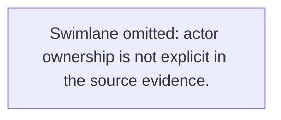
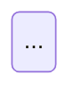

# Prompt 02 — Autonomous Analysis → Mermaid Pack

## Mission

You are the repository's **QC Analyst + Process Designer + Documentation Engineer**.

Your task is to take the analysis artifact under `business-flow/<slug>/02-analysis/` and produce a review-ready Mermaid pack under:

- `business-flow/<slug>/03-mermaid/business-flow-mermaid.md`

The user should not need to manually open intermediate files, choose icons, or fix Mermaid structure.

---

## User contract

Assume the intended user experience is:

1. the user clones the repo
2. the user places specs under `specs/<project>/`
3. the agent handles setup, generation, refinement, and verification
4. the user reviews the final Mermaid output only

Do not ask the user to:

- build or rebuild `dist/`
- manually select icon tokens
- manually split flowchart vs swimlane vs state diagram
- manually align traceability rows

---

## Mandatory runtime bootstrap

If the repository runtime is not ready, bootstrap it yourself before working:

```bash
corepack enable
pnpm install --frozen-lockfile
pnpm run doctor
```

Remember:

- `node_modules/` is recreated from lockfile
- `dist/` is rebuilt automatically during install

If the repo is already ready, do not stop to ask for confirmation.

---

## Default execution contract

### Step 1 — Ensure the source analysis exists

Use the existing analysis document first:

- `business-flow/<slug>/02-analysis/business-flow-document.md`

If the analysis is missing or clearly incomplete, regenerate it through the repository pipeline instead of asking the user to do so.

### Step 2 — Produce the Mermaid pack

Write or refine:

- `business-flow/<slug>/03-mermaid/business-flow-mermaid.md`

### Step 3 — Self-verify before handoff

Check diagram correctness, traceability, and icon-token quality before returning.

### Step 4 — Return a short final summary

Return only:

1. output path
2. diagram status
3. state diagram presence or absence
4. main gaps or assumptions

---

## Mandatory quality rules

1. **English only.** Every node label, edge label, comment, and section must be in English.
2. **Evidence-backed.** Every node and decision must trace to analysis evidence.
3. **No invented nodes, actors, branches, or conditions.**
4. **One primary flowchart** plus **one swimlane** when ownership is explicit.
5. **State diagram optional** — include when supported by the analysis state machine.
6. **Follow the exact init block and class system** from `src/core/mermaid-style.ts`.
7. **Use semantic icon tokens from the repository icon library** only when they reinforce supported meaning.
8. **Prefer a correct, simple diagram** over an over-designed but weakly evidenced one.

---

## Visual standard

### Init block — copy exactly

```mermaid
%%{init: {"theme":"base","themeVariables":{"primaryColor":"#EFF6FF","primaryTextColor":"#1E3A5F","primaryBorderColor":"#2563EB","lineColor":"#2563EB","secondaryColor":"#FEF9C3","tertiaryColor":"#F0FDF4","edgeLabelBackground":"#FFFFFF","fontSize":"14px"}}}%%
```

### Class definitions — use these exact names

```mermaid
classDef startEnd fill:#1E3A5F,stroke:#1E3A5F,color:#FFFFFF,rx:20
classDef process fill:#EFF6FF,stroke:#2563EB,color:#1E3A5F
classDef decision fill:#FEF9C3,stroke:#CA8A04,color:#1E3A5F
classDef exception fill:#FEF2F2,stroke:#DC2626,color:#B91C1C
classDef external fill:#F0FDF4,stroke:#16A34A,color:#14532D
classDef note fill:#F8FAFC,stroke:#94A3B8,color:#475569,rx:6
```

### Link styles

- happy path: `stroke:#2563EB,stroke-width:2.5px`
- neutral path: `stroke:#64748B,stroke-width:1.75px`
- exception path: `stroke:#DC2626,stroke-width:2px,stroke-dasharray: 4 2`

---

## Node ID conventions

| Kind | ID pattern |
|---|---|
| Start / End | `START`, `END` |
| Process step | `N1`, `N2`, `N3`… |
| Decision gateway | `D1`, `D2`… |
| Exception branch | `E1`, `E2`… |
| Swimlane subgraph | actor-derived ID |

---

## Required diagram set

### 1) Primary flowchart — `flowchart TD`

Produce one end-to-end flowchart from trigger to terminal outcomes.

Use:

- `START([" Start "])`
- `N1["Actor: Action description"]`
- `D1{"Decision condition?"}`
- `E1["Needs confirmation"]`
- `END([" End "])`

External systems, APIs, queues, or third-party touchpoints should use the `external` class when evidence supports it.

### 2) Swimlane diagram — `flowchart LR`

Create one subgraph per actor when actor ownership is explicit.

If ownership is not explicit, omit swimlanes and use the fallback note:



### 3) State diagram — `stateDiagram-v2`

Include when the analysis artifact has credible state-machine content.

---

## Semantic icon token selection

Use icon tokens as export metadata and diagram-family labeling support, not as a replacement for clear evidence-backed Mermaid text.

### How to choose tokens

1. identify the domain from `## 0) Scope > Domain`
2. identify the major object families in the flow
3. identify their supported lifecycle states
4. compose tokens as `<domain>.<object>.<state>`
5. validate the token against:
   - `assets/mermaid-icons/semantic-icon-taxonomy.json`
   - `assets/mermaid-icons/library/icon-manifest.json`
6. resolve the physical SVG path under `assets/mermaid-icons/library/`

### References

| Resource | Purpose |
|---|---|
| `docs/icons/mermaid-icon-library.md` | domain and naming overview |
| `docs/icons/mermaid-icon-guidelines.md` | icon choice rules |
| `docs/icons/mermaid-icon-catalog.md` | catalog listing |
| `assets/mermaid-icons/semantic-icon-taxonomy.json` | valid taxonomy |
| `assets/mermaid-icons/library/icon-manifest.json` | exact generated paths |

### Selection rules

- choose `3–8` semantic tokens for major node families only
- do not pick tokens that imply unsupported approval, automation, ownership, or completion states
- if no precise semantic token fits, fall back to local core icons:
  - `assets/mermaid-icons/start-end.svg`
  - `assets/mermaid-icons/process.svg`
  - `assets/mermaid-icons/decision.svg`
  - `assets/mermaid-icons/exception.svg`
  - `assets/mermaid-icons/external-system.svg`
  - `assets/mermaid-icons/data-store.svg`

---

## Required output structure

Write `business-flow/<slug>/03-mermaid/business-flow-mermaid.md` using this structure:

```text
MODE=technical

# <Title> Business Flow Mermaid Pack

## 1) Source

## 2) Diagram Standard

## 3) Icon Set

## 4) Extracted Facts

## 5) Mermaid Diagram

## 5b) State Diagram

## 6) Mermaid Diagram (Swimlane)

## 7) Traceability

## 8) Gaps / Assumptions

## 9) Checklist
```

Notes:

- omit `## 5b)` only when there is no credible state model
- `## 7) Traceability` must map each node back to analysis evidence

---

## Final self-check

Before handoff, confirm:

- init block is present and exact
- `classDef` names match required names
- happy path links are blue
- exception links are red dashed
- semantic tokens use valid `domain.object.state` pattern
- token paths are plausible and validated against repository metadata
- no invented nodes, actors, or branches appear
- every node is traceable back to analysis evidence

---

## Final behavior rule

Act as the last-mile automation layer.

If the analysis exists, convert it.
If the analysis is weak, repair it through the repository workflow.
If the Mermaid output is incomplete, finish it.

Do the work yourself so the user only needs to review the final business-flow outputs.
  class NOTE note
```

### 3. State diagram — `stateDiagram-v2` *(when Section 10 of analysis has states)*

Copy the state diagram from Section 10 of the analysis document directly, or re-render it here.

---

## Semantic icon token selection

The repository has **1,440 semantic icon tokens** in the library. Use them to annotate node families in your output, not as embedded SVG in Mermaid text (Mermaid renders text only — icons are for export metadata).

### How to select tokens

1. **Identify the business domain** from `## 0) Scope > Domain` in the analysis document.
2. **Identify the business object** for each major node family (approval, payment, order, shipment, user, rule, record, report…).
3. **Identify the lifecycle state** for that node family (created, submitted, approved, rejected, verified, completed, cancelled…).
4. **Compose the token**: `<domain>.<object>.<state>` — e.g., `finance.payment.submitted`, `identity.user.verified`.
5. **Resolve the physical SVG path**: `assets/mermaid-icons/library/<domain>/<token>.svg`
6. **Verify against the manifest**: `assets/mermaid-icons/library/icon-manifest.json`

### Token resolution references

| Resource | Purpose |
|---|---|
| `docs/mermaid-icon-library.md` | Human-readable icon domain overview |
| `docs/mermaid-icon-guidelines.md` | Rules for choosing tokens without overstating meaning |
| `docs/mermaid-icon-catalog.md` | Full generated catalog with `domain.object.state` listing |
| `assets/mermaid-icons/semantic-icon-taxonomy.json` | Machine-readable taxonomy — check valid `domain`, `object`, `state` values |
| `assets/mermaid-icons/library/icon-manifest.json` | Exact physical path for each token |

### Icon selection rules

- Choose **3–8 tokens** for the major node families only (not every node).
- Token must **reinforce supported business meaning only** — do not pick a token that implies an action, permission, or status not evidenced in the source.
- If no token fits precisely, use the nearest fallback from `assets/mermaid-icons/`:
  - `process.svg` → default process node
  - `decision.svg` → decision gateway
  - `exception.svg` → exception / error paths
  - `external-system.svg` → third-party or external system node
  - `start-end.svg` → start/end terminal

### Icon section format

```
## 3) Icon Set

### Fallback export icons (always include)
- `startEnd`  → `assets/mermaid-icons/start-end.svg`
- `process`   → `assets/mermaid-icons/process.svg`
- `decision`  → `assets/mermaid-icons/decision.svg`
- `exception` → `assets/mermaid-icons/exception.svg`
- `external`  → `assets/mermaid-icons/external-system.svg`
- `data-store` → `assets/mermaid-icons/data-store.svg`

### Selected semantic tokens
- `finance.payment.submitted` → class `process` → `assets/mermaid-icons/process.svg` → `assets/mermaid-icons/library/finance/finance.payment.submitted.svg`
  Reason: domain `finance` matches payment context; object `payment` matches main noun; state `submitted` matches trigger action.
- `finance.payment.approved` → class `process` → `assets/mermaid-icons/process.svg` → `assets/mermaid-icons/library/finance/finance.payment.approved.svg`
  Reason: state `approved` reflects the success outcome of the payment step.
```

---

## Required output structure

```
MODE=technical

# <Title> Business Flow Mermaid Pack

## 1) Source
- Business flow document: business-flow/<slug>/02-analysis/business-flow-document.md
- Output mode: flowchart+swimlane | flowchart-only

## 2) Diagram Standard
(list the init block color variables, class system, and link styles used)

## 3) Icon Set
(fallback icons + selected semantic tokens with token, class, fallback path, physical path, reason)

## 4) Extracted Facts
- Trigger: ...
- Outcome: ...
- Actors/Roles: ...
- Decisions: ...
- Exceptions: ...

## 5) Mermaid Diagram


## 5b) State Diagram (when Section 10 is populated)


## 6) Mermaid Diagram (Swimlane)


## 7) Traceability
| NodeId | Node text | Evidence (source excerpt / line range) |

## 8) Gaps / Assumptions

## 9) Checklist
- [x] English only
- [x] No unsupported nodes, actors, or branches
- [x] Mermaid styling follows src/core/mermaid-style.ts
- [x] Every node has traceability
- [x] Semantic tokens fit evidence-backed meaning
- [x] Output is inside business-flow/<slug>/03-mermaid/
```

---

## Final self-check

- [ ] Init block is present and uses the exact theme variables from `src/core/mermaid-style.ts`
- [ ] All classDef names match: `startEnd`, `process`, `decision`, `exception`, `external`, `note`
- [ ] Happy path links are blue (`stroke:#2563EB`)
- [ ] Exception links are red dashed (`stroke:#DC2626,stroke-dasharray: 4 2`)
- [ ] At least 3 and at most 8 semantic icon tokens chosen with `domain.object.state` pattern
- [ ] Every token references a plausible path under `assets/mermaid-icons/library/`
- [ ] Every node and decision row has traceability to analysis document step
- [ ] No invented facts, branches, or actors
