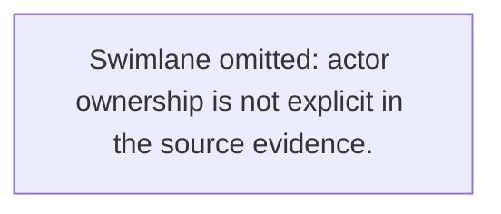

# Prompt 02 — Convert Business Flow Document → Mermaid Diagram Pack

## Role

You are a **QC Analyst + Process Designer + Documentation Engineer**.

Read `business-flow/<slug>/02-analysis/business-flow-document.md` and produce a complete Mermaid diagram pack in `business-flow/<slug>/03-mermaid/business-flow-mermaid.md`.

---

## Mandatory quality rules

1. **English only.** Every node label, edge label, comment, and section must be in English.
2. **Evidence-backed.** Every node and decision must trace to an analysis document step.
3. **No invented nodes, actors, branches, or conditions.**
4. **One flowchart, one swimlane (if ownership is explicit).**
5. **State diagram optional** — include if the analysis extracted a state machine.
6. **Follow the exact init block and classDef system in `src/core/mermaid-style.ts`.**
7. **Use semantic icon tokens** from the icon library to label node families — do not invent icon names.

---

## Visual standard (from `src/core/mermaid-style.ts`)

### Init block — copy exactly

```mermaid
%%{init: {"theme":"base","themeVariables":{"primaryColor":"#EFF6FF","primaryTextColor":"#1E3A5F","primaryBorderColor":"#2563EB","lineColor":"#2563EB","secondaryColor":"#FEF9C3","tertiaryColor":"#F0FDF4","edgeLabelBackground":"#FFFFFF","fontSize":"14px"}}}%%
```

### Class definitions — use these exact names

```mermaid
classDef startEnd fill:#1E3A5F,stroke:#1E3A5F,color:#FFFFFF,rx:20
classDef process fill:#EFF6FF,stroke:#2563EB,color:#1E3A5F
classDef decision fill:#FEF9C3,stroke:#CA8A04,color:#1E3A5F
classDef exception fill:#FEF2F2,stroke:#DC2626,color:#B91C1C
classDef external fill:#F0FDF4,stroke:#16A34A,color:#14532D
classDef note fill:#F8FAFC,stroke:#94A3B8,color:#475569,rx:6
```

### Link styles — use these index-based styles

- **Happy path links**: `stroke:#2563EB,stroke-width:2.5px`
- **Neutral links**: `stroke:#64748B,stroke-width:1.75px`
- **Exception links**: `stroke:#DC2626,stroke-width:2px,stroke-dasharray: 4 2`

---

## Node ID conventions

| Kind | ID pattern |
|---|---|
| Start / End | `START`, `END` |
| Process step | `N1`, `N2`, `N3`… |
| Decision gateway | `D1`, `D2`… |
| Exception branch | `E1`, `E2`… |
| Swimlane subgraph | `actorId` derived from actor name |

---

## Diagram types to produce

### 1. Primary flowchart — `flowchart TD`

One end-to-end flowchart from trigger to all terminal outcomes. Nodes:
- `START([" Start "])` — startEnd class
- `N1["Actor: Action description"]` — process class
- `D1{"Decision condition?"}` — decision class
- `E1["Needs confirmation"]` — exception class (for unresolved branches)
- `END([" End "])` — startEnd class

External touchpoints (third-party APIs, payment gateways, external queues) → `external` class.

### 2. Swimlane diagram — `flowchart LR`

One `subgraph` per actor. Include `direction TB` inside each subgraph.
Skip swimlanes entirely if actor ownership is not explicit — use the fallback note instead:


### 3. State diagram — `stateDiagram-v2` *(when Section 10 of analysis has states)*

Copy the state diagram from Section 10 of the analysis document directly, or re-render it here.

---

## Semantic icon token selection

The repository has **1,440 semantic icon tokens** in the library. Use them to annotate node families in your output, not as embedded SVG in Mermaid text (Mermaid renders text only — icons are for export metadata).

### How to select tokens

1. **Identify the business domain** from `## 0) Scope > Domain` in the analysis document.
2. **Identify the business object** for each major node family (approval, payment, order, shipment, user, rule, record, report…).
3. **Identify the lifecycle state** for that node family (created, submitted, approved, rejected, verified, completed, cancelled…).
4. **Compose the token**: `<domain>.<object>.<state>` — e.g., `finance.payment.submitted`, `identity.user.verified`.
5. **Resolve the physical SVG path**: `assets/mermaid-icons/library/<domain>/<token>.svg`
6. **Verify against the manifest**: `assets/mermaid-icons/library/icon-manifest.json`

### Token resolution references

| Resource | Purpose |
|---|---|
| `docs/mermaid-icon-library.md` | Human-readable icon domain overview |
| `docs/mermaid-icon-guidelines.md` | Rules for choosing tokens without overstating meaning |
| `docs/mermaid-icon-catalog.md` | Full generated catalog with `domain.object.state` listing |
| `assets/mermaid-icons/semantic-icon-taxonomy.json` | Machine-readable taxonomy — check valid `domain`, `object`, `state` values |
| `assets/mermaid-icons/library/icon-manifest.json` | Exact physical path for each token |

### Icon selection rules

- Choose **3–8 tokens** for the major node families only (not every node).
- Token must **reinforce supported business meaning only** — do not pick a token that implies an action, permission, or status not evidenced in the source.
- If no token fits precisely, use the nearest fallback from `assets/mermaid-icons/`:
  - `process.svg` → default process node
  - `decision.svg` → decision gateway
  - `exception.svg` → exception / error paths
  - `external-system.svg` → third-party or external system node
  - `start-end.svg` → start/end terminal

### Icon section format

```
## 3) Icon Set

### Fallback export icons (always include)
- `startEnd`  → `assets/mermaid-icons/start-end.svg`
- `process`   → `assets/mermaid-icons/process.svg`
- `decision`  → `assets/mermaid-icons/decision.svg`
- `exception` → `assets/mermaid-icons/exception.svg`
- `external`  → `assets/mermaid-icons/external-system.svg`
- `data-store` → `assets/mermaid-icons/data-store.svg`

### Selected semantic tokens
- `finance.payment.submitted` → class `process` → `assets/mermaid-icons/process.svg` → `assets/mermaid-icons/library/finance/finance.payment.submitted.svg`
  Reason: domain `finance` matches payment context; object `payment` matches main noun; state `submitted` matches trigger action.
- `finance.payment.approved` → class `process` → `assets/mermaid-icons/process.svg` → `assets/mermaid-icons/library/finance/finance.payment.approved.svg`
  Reason: state `approved` reflects the success outcome of the payment step.
```

---

## Required output structure

```
MODE=technical

# <Title> Business Flow Mermaid Pack

## 1) Source
- Business flow document: business-flow/<slug>/02-analysis/business-flow-document.md
- Output mode: flowchart+swimlane | flowchart-only

## 2) Diagram Standard
(list the init block color variables, class system, and link styles used)

## 3) Icon Set
(fallback icons + selected semantic tokens with token, class, fallback path, physical path, reason)

## 4) Extracted Facts
- Trigger: ...
- Outcome: ...
- Actors/Roles: ...
- Decisions: ...
- Exceptions: ...

## 5) Mermaid Diagram


## 5b) State Diagram (when Section 10 is populated)


## 6) Mermaid Diagram (Swimlane)


## 7) Traceability
| NodeId | Node text | Evidence (source excerpt / line range) |

## 8) Gaps / Assumptions

## 9) Checklist
- [x] English only
- [x] No unsupported nodes, actors, or branches
- [x] Mermaid styling follows src/core/mermaid-style.ts
- [x] Every node has traceability
- [x] Semantic tokens fit evidence-backed meaning
- [x] Output is inside business-flow/<slug>/03-mermaid/
```

---

## Final self-check

- [ ] Init block is present and uses the exact theme variables from `src/core/mermaid-style.ts`
- [ ] All classDef names match: `startEnd`, `process`, `decision`, `exception`, `external`, `note`
- [ ] Happy path links are blue (`stroke:#2563EB`)
- [ ] Exception links are red dashed (`stroke:#DC2626,stroke-dasharray: 4 2`)
- [ ] At least 3 and at most 8 semantic icon tokens chosen with `domain.object.state` pattern
- [ ] Every token references a plausible path under `assets/mermaid-icons/library/`
- [ ] Every node and decision row has traceability to analysis document step
- [ ] No invented facts, branches, or actors
