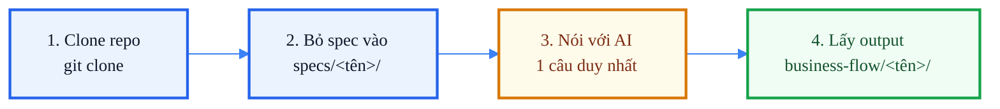

# Quick Start — Hướng dẫn nhanh cho người mới bắt đầu

> **Đối tượng:** Bất kì ai muốn sử dụng tool để phân tích spec thành business flow.
> **Thời gian:** Chỉ cần 5 phút setup và mỗi lần phân tích spec mới chỉ cần nói 1 câu với AI.

---

## Bức tranh tổng quát



> **AI tự lo toàn bộ phần kỹ thuật** — `pnpm install`, build, bootstrap, kiểm tra môi trường. Bạn không cần gõ thêm gì.

---

## Điều kiện trên máy (1 lần duy nhất)

Chỉ cần cài **Node.js ≥ 18** — tải tại [nodejs.org](https://nodejs.org) → chọn bản LTS → cài như app bình thường.

Không cần biết Node.js là gì. Chỉ cần nó có mặt trên máy.

---

## Bước 1 — Clone repo

Mở **Terminal** (macOS: `Cmd+Space` → gõ `Terminal` → Enter).

```bash
git clone <URL_repo> create-business-flow-tool
cd create-business-flow-tool
```

> **Vì sao thư mục `node_modules/` và `dist/` trống sau khi clone?**
>
> Hai thư mục này đã khai báo trong `.gitignore` — được giữ out of Git để repo gọn và tránh xung đột phiên bản.
> `node_modules/` là thư viện, `dist/` là bản build đã compile.
> AI sẽ tự tạo cả hai ở lần đầu chạy — **không ảnh hưởng gì đến bạn**.

---

## Bước 2 — Đặt file spec đúng chỗ

Tạo thư mục con dưới `specs/` và bỏ tất cả file spec liên quan vào đó:

```text
create-business-flow-tool/
└── specs/
    └── ten-project/          ← tên ngắn, không dấu, không khoảng trắng
        ├── requirement.md
        ├── business-rule.docx
        ├── data-flow.pdf
        └── fields-table.xlsx
```

Định dạng được hỗ trợ: `.md` `.docx` `.pdf` `.xlsx` `.csv` `.json` `.txt`.
Bỏ lẫn lộn các loại cũng được — tool tự gộp lại.

---

## Bước 3 — Bảo AI chạy (chọn 1 trong 3 cách)

Bạn **không cần gõ lệnh CLI**. Nói một câu, AI tự cài, tự chạy, tự kiểm tra, báo khi xong.

---

### Cách A — GitHub Copilot Chat trong VS Code

```
1. Mở thư mục create-business-flow-tool bằng VS Code
2. Mở Copilot Chat (sidebar trái → biểu tượng chat)
3. Nhập đúng câu sau (thay ten-project):
```

```
@workspace
Run the full business-flow pipeline for specs/ten-project.
Use heuristic mode. Produce the final artifact pack under business-flow/ten-project/.
Bootstrap the repo first if needed (corepack enable, pnpm install, pnpm run doctor).
Report only the final result.
```

> Copilot đọc `AGENTS.md` + `.github/prompts/03-full-pipeline.prompt.md` và tự xử lý tất cả.
> Nếu VS Code hỏi **"Allow terminal command?"** → bấm **Allow**.

---

### Cách B — Claude Code (VS Code Extension)

```
1. Cài extension "Claude Code" trong VS Code (Extensions → tìm "Claude Code" → Install)
2. Mở thư mục create-business-flow-tool bằng VS Code
3. Mở Claude panel (sidebar hoặc Cmd+Shift+P → "Claude: Open")
4. Nhập đúng câu sau (thay ten-project):
```

```
Run the full business-flow pipeline for specs/ten-project.
Use heuristic mode. Produce the final artifact pack under business-flow/ten-project/.
Bootstrap the repo first if needed (corepack enable, pnpm install).
Report only the final result.
```

> Claude Code có quyền truy cập file và terminal trong VS Code — sẽ tự xử lý hoàn toàn.
> Mỗi lần tool chạy lệnh sẽ hiện nút **Accept** — bấm để cho phép.

---

### Cách C — Claude Code (Terminal)

```
1. Cài Claude Code: https://claude.ai/code
2. Mở Terminal, vào thư mục repo:
```

```bash
cd create-business-flow-tool
claude
```

```
3. Khi cửa sổ Claude mở, nhập đúng câu sau (thay ten-project):
```

```
Run the full business-flow pipeline for specs/ten-project.
Use heuristic mode. Produce the final artifact pack under business-flow/ten-project/.
Bootstrap the repo first if needed. Report only the final result.
```

> Claude Code đọc `CLAUDE.md` + `AGENTS.md` và tự xử lý toàn bộ pipeline.
> Mỗi bước sẽ hiện output ngay trong terminal.

---

## Bước 4 — Lấy kết quả

Khi AI báo xong, mở thư mục `business-flow/ten-project/`:

```text
business-flow/ten-project/
│
├── 01-source/
│   └── normalized-spec.md          ← Toàn bộ spec gộp lại, đánh số từng dòng
│
├── 02-analysis/
│   └── business-flow-document.md   ← TÀI LIỆU CHÍNH (19 mục) — đây là file bạn cần
│
├── 03-mermaid/
│   └── business-flow-mermaid.md    ← Flowchart + Swimlane + State diagram
│
└── debug/
    ├── validation.json             ← Pass / Warn / Fail checks
    ├── permissions.json            ← Ma trận phân quyền
    ├── risk.json                   ← Điểm rủi ro 0–100
    └── scenario-seeds.md           ← Test case mẫu
```

### File cần đọc đầu tiên

```
business-flow/ten-project/02-analysis/business-flow-document.md
```

Mở bằng **VS Code** hoặc **Typora** để thấy bảng + Mermaid diagram đẹp.

| # | Mục | Cho bạn biết |
|---|---|---|
| 0 | Scope | Flow này nói về cái gì, phạm vi |
| 2 | Summary | Goal, actor, trigger, outcome |
| 3 | Business Flow Table | Bảng từng bước (1 dòng = 1 hành động) |
| 5 | Decisions & Exceptions | Nhánh rẽ, lỗi, path ngoại lệ |
| 7 | Questions | Câu hỏi cần stakeholder trả lời |
| 13 | Risk Hotspots | Rủi ro được đánh điểm 0–100 |
| 16 | Validation Report | Pass / Warn / Fail với giải thích |

---

## Mockup output

```
┌──────────────────────────────────────────────────────────────────┐
│  business-flow-document.md                    Score: 86 / 100    │
├──────────────────────────────────────────────────────────────────┤
│                                                                  │
│  ## 0) Scope                                                     │
│   Goal:    Cho phép thu ngân tạo và gửi đơn lên KDS              │
│   Domain:  fulfillment / restaurant operations                   │
│   Status:  PASS                                                  │
│                                                                  │
│  ## 3) Business Flow Table                                       │
│  ┌───┬────────────┬────────────────┬──────────┬──────────────┐   │
│  │ # │ Actor      │ Step           │ Decision │ Outcome      │   │
│  ├───┼────────────┼────────────────┼──────────┼──────────────┤   │
│  │ 1 │ Cashier    │ Open order     │ —        │ Draft order  │   │
│  │ 2 │ Cashier    │ Add menu item  │ In-stock │ Item added   │   │
│  │ 3 │ KDS Server │ Receive ticket │ —        │ Queued       │   │
│  └───┴────────────┴────────────────┴──────────┴──────────────┘   │
│                                                                  │
│  ## 13) Risk Hotspots                             [████████░] 78 │
│   HIGH: no idempotency on ticket re-fire                         │
│   MED:  missing offline-mode contract                            │
│                                                                  │
│  → business-flow/ten-project/03-mermaid/business-flow-mermaid.md│
└──────────────────────────────────────────────────────────────────┘
```

---

## Câu hỏi thường gặp

**Q: Tôi không biết đặt tên slug thế nào?**
A: Dùng tên ngắn, viết thường, thay khoảng trắng bằng gạch. Ví dụ: `kds-order-flow`, `user-onboarding`.

**Q: Có cần OpenAI API key không?**
A: Không bắt buộc. Mặc định tool chạy `heuristic` — offline, không cần key.

**Q: Output có bị push lên Git không?**
A: Không. `specs/` và `business-flow/` đều trong `.gitignore` — luôn ở local.

**Q: Chạy lại lần 2 khi spec thay đổi?**
A: Cứ nói lại câu prompt — output sẽ được overwrite với nội dung mới.

**Q: Lỗi "node: command not found"?**
A: Cần cài Node.js — xem phần **Điều kiện trên máy** ở đầu trang.

**Q: AI báo lỗi "pnpm not found"?**
A: Thêm vào câu prompt: `"run npm install -g pnpm@10 first if pnpm is missing"`.

---

## Checklist trước khi bắt đầu

- [ ] Node.js ≥ 18 đã cài trên máy (`node -v` in ra số phiên bản)
- [ ] Đã clone repo bằng `git clone …`
- [ ] Đã tạo `specs/ten-project/` và bỏ file spec vào
- [ ] Đã chọn cách A, B, hoặc C ở Bước 3
- [ ] Đã nhập câu prompt đúng định dạng (thay `ten-project`)
- [ ] Đã bấm Allow/Accept khi AI xin quyền chạy lệnh

Tick đủ 6 dòng → nhận output tại `business-flow/ten-project/`.

---

## Tài liệu thêm

| Nhu cầu | Đọc |
|---|---|
| Chi tiết kỹ thuật | [README.md](README.md) |
| Hướng dẫn dùng đầy đủ | [docs/UNIVERSAL_USAGE_GUIDELINES.md](docs/UNIVERSAL_USAGE_GUIDELINES.md) |
| Workflow nâng cao | [docs/WORKFLOWS.md](docs/WORKFLOWS.md) |
| Bộ icon Mermaid | [assets/mermaid-icons/](assets/mermaid-icons/) |
