# Mermaid Icon Gallery

This gallery provides a fast in-repo preview of the generated physical SVG icon library grouped by business domain.

- Total icons: `1,440`
- View the interactive HTML gallery in `docs/icons/mermaid-icon-gallery.html` for search and filtering.
- Use `docs/icons/mermaid-icon-catalog.md` for the structural overview and `icon-manifest.json` for machine-readable lookup.

## Commerce

- Domain key: `commerce`
- Icon count: `96`
- Recommended domain glyph family: `shopping-cart`

<table>
<tr>
<td align="center" valign="top" width="16.6%">
  
   <code>commerce.request.draft</code>
   request · draft
</td>
<td align="center" valign="top" width="16.6%">
  
   <code>commerce.request.submitted</code>
   request · submitted
</td>
<td align="center" valign="top" width="16.6%">
  
   <code>commerce.request.verified</code>
   request · verified
</td>
<td align="center" valign="top" width="16.6%">
  
   <code>commerce.request.approved</code>
   request · approved
</td>
<td align="center" valign="top" width="16.6%">
  
   <code>commerce.request.rejected</code>
   request · rejected
</td>
<td align="center" valign="top" width="16.6%">
  
   <code>commerce.request.completed</code>
   request · completed
</td>
</tr>
<tr>
<td align="center" valign="top" width="16.6%">
  
   <code>commerce.task.draft</code>
   task · draft
</td>
<td align="center" valign="top" width="16.6%">
  
   <code>commerce.task.submitted</code>
   task · submitted
</td>
<td align="center" valign="top" width="16.6%">
  
   <code>commerce.task.verified</code>
   task · verified
</td>
<td align="center" valign="top" width="16.6%">
  
   <code>commerce.task.approved</code>
   task · approved
</td>
<td align="center" valign="top" width="16.6%">
  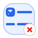
   <code>commerce.task.rejected</code>
   task · rejected
</td>
<td align="center" valign="top" width="16.6%">
  
   <code>commerce.task.completed</code>
   task · completed
</td>
</tr>
<tr>
<td align="center" valign="top" width="16.6%">
  
   <code>commerce.review.draft</code>
   review · draft
</td>
<td align="center" valign="top" width="16.6%">
  
   <code>commerce.review.submitted</code>
   review · submitted
</td>
<td align="center" valign="top" width="16.6%">
  
   <code>commerce.review.verified</code>
   review · verified
</td>
<td align="center" valign="top" width="16.6%">
  
   <code>commerce.review.approved</code>
   review · approved
</td>
<td align="center" valign="top" width="16.6%">
  
   <code>commerce.review.rejected</code>
   review · rejected
</td>
<td align="center" valign="top" width="16.6%">
  
   <code>commerce.review.completed</code>
   review · completed
</td>
</tr>
<tr>
<td align="center" valign="top" width="16.6%">
  
   <code>commerce.approval.draft</code>
   approval · draft
</td>
<td align="center" valign="top" width="16.6%">
  
   <code>commerce.approval.submitted</code>
   approval · submitted
</td>
<td align="center" valign="top" width="16.6%">
  
   <code>commerce.approval.verified</code>
   approval · verified
</td>
<td align="center" valign="top" width="16.6%">
  
   <code>commerce.approval.approved</code>
   approval · approved
</td>
<td align="center" valign="top" width="16.6%">
  
   <code>commerce.approval.rejected</code>
   approval · rejected
</td>
<td align="center" valign="top" width="16.6%">
  
   <code>commerce.approval.completed</code>
   approval · completed
</td>
</tr>
<tr>
<td align="center" valign="top" width="16.6%">
  
   <code>commerce.order.draft</code>
   order · draft
</td>
<td align="center" valign="top" width="16.6%">
  
   <code>commerce.order.submitted</code>
   order · submitted
</td>
<td align="center" valign="top" width="16.6%">
  
   <code>commerce.order.verified</code>
   order · verified
</td>
<td align="center" valign="top" width="16.6%">
  
   <code>commerce.order.approved</code>
   order · approved
</td>
<td align="center" valign="top" width="16.6%">
  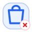
   <code>commerce.order.rejected</code>
   order · rejected
</td>
<td align="center" valign="top" width="16.6%">
  
   <code>commerce.order.completed</code>
   order · completed
</td>
</tr>
<tr>
<td align="center" valign="top" width="16.6%">
  
   <code>commerce.payment.draft</code>
   payment · draft
</td>
<td align="center" valign="top" width="16.6%">
  
   <code>commerce.payment.submitted</code>
   payment · submitted
</td>
<td align="center" valign="top" width="16.6%">
  
   <code>commerce.payment.verified</code>
   payment · verified
</td>
<td align="center" valign="top" width="16.6%">
  
   <code>commerce.payment.approved</code>
   payment · approved
</td>
<td align="center" valign="top" width="16.6%">
  
   <code>commerce.payment.rejected</code>
   payment · rejected
</td>
<td align="center" valign="top" width="16.6%">
  
   <code>commerce.payment.completed</code>
   payment · completed
</td>
</tr>
<tr>
<td align="center" valign="top" width="16.6%">
  
   <code>commerce.invoice.draft</code>
   invoice · draft
</td>
<td align="center" valign="top" width="16.6%">
  
   <code>commerce.invoice.submitted</code>
   invoice · submitted
</td>
<td align="center" valign="top" width="16.6%">
  
   <code>commerce.invoice.verified</code>
   invoice · verified
</td>
<td align="center" valign="top" width="16.6%">
  
   <code>commerce.invoice.approved</code>
   invoice · approved
</td>
<td align="center" valign="top" width="16.6%">
  
   <code>commerce.invoice.rejected</code>
   invoice · rejected
</td>
<td align="center" valign="top" width="16.6%">
  
   <code>commerce.invoice.completed</code>
   invoice · completed
</td>
</tr>
<tr>
<td align="center" valign="top" width="16.6%">
  
   <code>commerce.shipment.draft</code>
   shipment · draft
</td>
<td align="center" valign="top" width="16.6%">
  
   <code>commerce.shipment.submitted</code>
   shipment · submitted
</td>
<td align="center" valign="top" width="16.6%">
  
   <code>commerce.shipment.verified</code>
   shipment · verified
</td>
<td align="center" valign="top" width="16.6%">
  
   <code>commerce.shipment.approved</code>
   shipment · approved
</td>
<td align="center" valign="top" width="16.6%">
  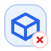
   <code>commerce.shipment.rejected</code>
   shipment · rejected
</td>
<td align="center" valign="top" width="16.6%">
  
   <code>commerce.shipment.completed</code>
   shipment · completed
</td>
</tr>
<tr>
<td align="center" valign="top" width="16.6%">
  
   <code>commerce.ticket.draft</code>
   ticket · draft
</td>
<td align="center" valign="top" width="16.6%">
  
   <code>commerce.ticket.submitted</code>
   ticket · submitted
</td>
<td align="center" valign="top" width="16.6%">
  
   <code>commerce.ticket.verified</code>
   ticket · verified
</td>
<td align="center" valign="top" width="16.6%">
  
   <code>commerce.ticket.approved</code>
   ticket · approved
</td>
<td align="center" valign="top" width="16.6%">
  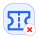
   <code>commerce.ticket.rejected</code>
   ticket · rejected
</td>
<td align="center" valign="top" width="16.6%">
  
   <code>commerce.ticket.completed</code>
   ticket · completed
</td>
</tr>
<tr>
<td align="center" valign="top" width="16.6%">
  
   <code>commerce.document.draft</code>
   document · draft
</td>
<td align="center" valign="top" width="16.6%">
  
   <code>commerce.document.submitted</code>
   document · submitted
</td>
<td align="center" valign="top" width="16.6%">
  
   <code>commerce.document.verified</code>
   document · verified
</td>
<td align="center" valign="top" width="16.6%">
  
   <code>commerce.document.approved</code>
   document · approved
</td>
<td align="center" valign="top" width="16.6%">
  
   <code>commerce.document.rejected</code>
   document · rejected
</td>
<td align="center" valign="top" width="16.6%">
  
   <code>commerce.document.completed</code>
   document · completed
</td>
</tr>
<tr>
<td align="center" valign="top" width="16.6%">
  
   <code>commerce.notification.draft</code>
   notification · draft
</td>
<td align="center" valign="top" width="16.6%">
  
   <code>commerce.notification.submitted</code>
   notification · submitted
</td>
<td align="center" valign="top" width="16.6%">
  
   <code>commerce.notification.verified</code>
   notification · verified
</td>
<td align="center" valign="top" width="16.6%">
  
   <code>commerce.notification.approved</code>
   notification · approved
</td>
<td align="center" valign="top" width="16.6%">
  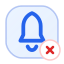
   <code>commerce.notification.rejected</code>
   notification · rejected
</td>
<td align="center" valign="top" width="16.6%">
  
   <code>commerce.notification.completed</code>
   notification · completed
</td>
</tr>
<tr>
<td align="center" valign="top" width="16.6%">
  
   <code>commerce.user.draft</code>
   user · draft
</td>
<td align="center" valign="top" width="16.6%">
  
   <code>commerce.user.submitted</code>
   user · submitted
</td>
<td align="center" valign="top" width="16.6%">
  
   <code>commerce.user.verified</code>
   user · verified
</td>
<td align="center" valign="top" width="16.6%">
  
   <code>commerce.user.approved</code>
   user · approved
</td>
<td align="center" valign="top" width="16.6%">
  
   <code>commerce.user.rejected</code>
   user · rejected
</td>
<td align="center" valign="top" width="16.6%">
  
   <code>commerce.user.completed</code>
   user · completed
</td>
</tr>
<tr>
<td align="center" valign="top" width="16.6%">
  
   <code>commerce.role.draft</code>
   role · draft
</td>
<td align="center" valign="top" width="16.6%">
  
   <code>commerce.role.submitted</code>
   role · submitted
</td>
<td align="center" valign="top" width="16.6%">
  
   <code>commerce.role.verified</code>
   role · verified
</td>
<td align="center" valign="top" width="16.6%">
  
   <code>commerce.role.approved</code>
   role · approved
</td>
<td align="center" valign="top" width="16.6%">
  
   <code>commerce.role.rejected</code>
   role · rejected
</td>
<td align="center" valign="top" width="16.6%">
  
   <code>commerce.role.completed</code>
   role · completed
</td>
</tr>
<tr>
<td align="center" valign="top" width="16.6%">
  
   <code>commerce.rule.draft</code>
   rule · draft
</td>
<td align="center" valign="top" width="16.6%">
  
   <code>commerce.rule.submitted</code>
   rule · submitted
</td>
<td align="center" valign="top" width="16.6%">
  
   <code>commerce.rule.verified</code>
   rule · verified
</td>
<td align="center" valign="top" width="16.6%">
  
   <code>commerce.rule.approved</code>
   rule · approved
</td>
<td align="center" valign="top" width="16.6%">
  
   <code>commerce.rule.rejected</code>
   rule · rejected
</td>
<td align="center" valign="top" width="16.6%">
  
   <code>commerce.rule.completed</code>
   rule · completed
</td>
</tr>
<tr>
<td align="center" valign="top" width="16.6%">
  
   <code>commerce.report.draft</code>
   report · draft
</td>
<td align="center" valign="top" width="16.6%">
  
   <code>commerce.report.submitted</code>
   report · submitted
</td>
<td align="center" valign="top" width="16.6%">
  
   <code>commerce.report.verified</code>
   report · verified
</td>
<td align="center" valign="top" width="16.6%">
  
   <code>commerce.report.approved</code>
   report · approved
</td>
<td align="center" valign="top" width="16.6%">
  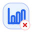
   <code>commerce.report.rejected</code>
   report · rejected
</td>
<td align="center" valign="top" width="16.6%">
  
   <code>commerce.report.completed</code>
   report · completed
</td>
</tr>
<tr>
<td align="center" valign="top" width="16.6%">
  
   <code>commerce.record.draft</code>
   record · draft
</td>
<td align="center" valign="top" width="16.6%">
  
   <code>commerce.record.submitted</code>
   record · submitted
</td>
<td align="center" valign="top" width="16.6%">
  
   <code>commerce.record.verified</code>
   record · verified
</td>
<td align="center" valign="top" width="16.6%">
  
   <code>commerce.record.approved</code>
   record · approved
</td>
<td align="center" valign="top" width="16.6%">
  
   <code>commerce.record.rejected</code>
   record · rejected
</td>
<td align="center" valign="top" width="16.6%">
  
   <code>commerce.record.completed</code>
   record · completed
</td>
</tr>
</table>

## Customer

- Domain key: `customer`
- Icon count: `96`
- Recommended domain glyph family: `users-round`

<table>
<tr>
<td align="center" valign="top" width="16.6%">
  
   <code>customer.request.draft</code>
   request · draft
</td>
<td align="center" valign="top" width="16.6%">
  
   <code>customer.request.submitted</code>
   request · submitted
</td>
<td align="center" valign="top" width="16.6%">
  
   <code>customer.request.verified</code>
   request · verified
</td>
<td align="center" valign="top" width="16.6%">
  
   <code>customer.request.approved</code>
   request · approved
</td>
<td align="center" valign="top" width="16.6%">
  
   <code>customer.request.rejected</code>
   request · rejected
</td>
<td align="center" valign="top" width="16.6%">
  
   <code>customer.request.completed</code>
   request · completed
</td>
</tr>
<tr>
<td align="center" valign="top" width="16.6%">
  
   <code>customer.task.draft</code>
   task · draft
</td>
<td align="center" valign="top" width="16.6%">
  
   <code>customer.task.submitted</code>
   task · submitted
</td>
<td align="center" valign="top" width="16.6%">
  
   <code>customer.task.verified</code>
   task · verified
</td>
<td align="center" valign="top" width="16.6%">
  
   <code>customer.task.approved</code>
   task · approved
</td>
<td align="center" valign="top" width="16.6%">
  
   <code>customer.task.rejected</code>
   task · rejected
</td>
<td align="center" valign="top" width="16.6%">
  
   <code>customer.task.completed</code>
   task · completed
</td>
</tr>
<tr>
<td align="center" valign="top" width="16.6%">
  
   <code>customer.review.draft</code>
   review · draft
</td>
<td align="center" valign="top" width="16.6%">
  
   <code>customer.review.submitted</code>
   review · submitted
</td>
<td align="center" valign="top" width="16.6%">
  
   <code>customer.review.verified</code>
   review · verified
</td>
<td align="center" valign="top" width="16.6%">
  
   <code>customer.review.approved</code>
   review · approved
</td>
<td align="center" valign="top" width="16.6%">
  
   <code>customer.review.rejected</code>
   review · rejected
</td>
<td align="center" valign="top" width="16.6%">
  
   <code>customer.review.completed</code>
   review · completed
</td>
</tr>
<tr>
<td align="center" valign="top" width="16.6%">
  
   <code>customer.approval.draft</code>
   approval · draft
</td>
<td align="center" valign="top" width="16.6%">
  
   <code>customer.approval.submitted</code>
   approval · submitted
</td>
<td align="center" valign="top" width="16.6%">
  
   <code>customer.approval.verified</code>
   approval · verified
</td>
<td align="center" valign="top" width="16.6%">
  
   <code>customer.approval.approved</code>
   approval · approved
</td>
<td align="center" valign="top" width="16.6%">
  
   <code>customer.approval.rejected</code>
   approval · rejected
</td>
<td align="center" valign="top" width="16.6%">
  
   <code>customer.approval.completed</code>
   approval · completed
</td>
</tr>
<tr>
<td align="center" valign="top" width="16.6%">
  
   <code>customer.order.draft</code>
   order · draft
</td>
<td align="center" valign="top" width="16.6%">
  
   <code>customer.order.submitted</code>
   order · submitted
</td>
<td align="center" valign="top" width="16.6%">
  
   <code>customer.order.verified</code>
   order · verified
</td>
<td align="center" valign="top" width="16.6%">
  
   <code>customer.order.approved</code>
   order · approved
</td>
<td align="center" valign="top" width="16.6%">
  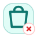
   <code>customer.order.rejected</code>
   order · rejected
</td>
<td align="center" valign="top" width="16.6%">
  
   <code>customer.order.completed</code>
   order · completed
</td>
</tr>
<tr>
<td align="center" valign="top" width="16.6%">
  
   <code>customer.payment.draft</code>
   payment · draft
</td>
<td align="center" valign="top" width="16.6%">
  
   <code>customer.payment.submitted</code>
   payment · submitted
</td>
<td align="center" valign="top" width="16.6%">
  
   <code>customer.payment.verified</code>
   payment · verified
</td>
<td align="center" valign="top" width="16.6%">
  
   <code>customer.payment.approved</code>
   payment · approved
</td>
<td align="center" valign="top" width="16.6%">
  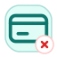
   <code>customer.payment.rejected</code>
   payment · rejected
</td>
<td align="center" valign="top" width="16.6%">
  
   <code>customer.payment.completed</code>
   payment · completed
</td>
</tr>
<tr>
<td align="center" valign="top" width="16.6%">
  
   <code>customer.invoice.draft</code>
   invoice · draft
</td>
<td align="center" valign="top" width="16.6%">
  
   <code>customer.invoice.submitted</code>
   invoice · submitted
</td>
<td align="center" valign="top" width="16.6%">
  
   <code>customer.invoice.verified</code>
   invoice · verified
</td>
<td align="center" valign="top" width="16.6%">
  
   <code>customer.invoice.approved</code>
   invoice · approved
</td>
<td align="center" valign="top" width="16.6%">
  
   <code>customer.invoice.rejected</code>
   invoice · rejected
</td>
<td align="center" valign="top" width="16.6%">
  
   <code>customer.invoice.completed</code>
   invoice · completed
</td>
</tr>
<tr>
<td align="center" valign="top" width="16.6%">
  
   <code>customer.shipment.draft</code>
   shipment · draft
</td>
<td align="center" valign="top" width="16.6%">
  
   <code>customer.shipment.submitted</code>
   shipment · submitted
</td>
<td align="center" valign="top" width="16.6%">
  
   <code>customer.shipment.verified</code>
   shipment · verified
</td>
<td align="center" valign="top" width="16.6%">
  
   <code>customer.shipment.approved</code>
   shipment · approved
</td>
<td align="center" valign="top" width="16.6%">
  
   <code>customer.shipment.rejected</code>
   shipment · rejected
</td>
<td align="center" valign="top" width="16.6%">
  
   <code>customer.shipment.completed</code>
   shipment · completed
</td>
</tr>
<tr>
<td align="center" valign="top" width="16.6%">
  
   <code>customer.ticket.draft</code>
   ticket · draft
</td>
<td align="center" valign="top" width="16.6%">
  
   <code>customer.ticket.submitted</code>
   ticket · submitted
</td>
<td align="center" valign="top" width="16.6%">
  
   <code>customer.ticket.verified</code>
   ticket · verified
</td>
<td align="center" valign="top" width="16.6%">
  
   <code>customer.ticket.approved</code>
   ticket · approved
</td>
<td align="center" valign="top" width="16.6%">
  
   <code>customer.ticket.rejected</code>
   ticket · rejected
</td>
<td align="center" valign="top" width="16.6%">
  
   <code>customer.ticket.completed</code>
   ticket · completed
</td>
</tr>
<tr>
<td align="center" valign="top" width="16.6%">
  
   <code>customer.document.draft</code>
   document · draft
</td>
<td align="center" valign="top" width="16.6%">
  
   <code>customer.document.submitted</code>
   document · submitted
</td>
<td align="center" valign="top" width="16.6%">
  
   <code>customer.document.verified</code>
   document · verified
</td>
<td align="center" valign="top" width="16.6%">
  
   <code>customer.document.approved</code>
   document · approved
</td>
<td align="center" valign="top" width="16.6%">
  
   <code>customer.document.rejected</code>
   document · rejected
</td>
<td align="center" valign="top" width="16.6%">
  
   <code>customer.document.completed</code>
   document · completed
</td>
</tr>
<tr>
<td align="center" valign="top" width="16.6%">
  
   <code>customer.notification.draft</code>
   notification · draft
</td>
<td align="center" valign="top" width="16.6%">
  
   <code>customer.notification.submitted</code>
   notification · submitted
</td>
<td align="center" valign="top" width="16.6%">
  
   <code>customer.notification.verified</code>
   notification · verified
</td>
<td align="center" valign="top" width="16.6%">
  
   <code>customer.notification.approved</code>
   notification · approved
</td>
<td align="center" valign="top" width="16.6%">
  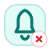
   <code>customer.notification.rejected</code>
   notification · rejected
</td>
<td align="center" valign="top" width="16.6%">
  
   <code>customer.notification.completed</code>
   notification · completed
</td>
</tr>
<tr>
<td align="center" valign="top" width="16.6%">
  
   <code>customer.user.draft</code>
   user · draft
</td>
<td align="center" valign="top" width="16.6%">
  
   <code>customer.user.submitted</code>
   user · submitted
</td>
<td align="center" valign="top" width="16.6%">
  
   <code>customer.user.verified</code>
   user · verified
</td>
<td align="center" valign="top" width="16.6%">
  
   <code>customer.user.approved</code>
   user · approved
</td>
<td align="center" valign="top" width="16.6%">
  
   <code>customer.user.rejected</code>
   user · rejected
</td>
<td align="center" valign="top" width="16.6%">
  
   <code>customer.user.completed</code>
   user · completed
</td>
</tr>
<tr>
<td align="center" valign="top" width="16.6%">
  
   <code>customer.role.draft</code>
   role · draft
</td>
<td align="center" valign="top" width="16.6%">
  
   <code>customer.role.submitted</code>
   role · submitted
</td>
<td align="center" valign="top" width="16.6%">
  
   <code>customer.role.verified</code>
   role · verified
</td>
<td align="center" valign="top" width="16.6%">
  
   <code>customer.role.approved</code>
   role · approved
</td>
<td align="center" valign="top" width="16.6%">
  
   <code>customer.role.rejected</code>
   role · rejected
</td>
<td align="center" valign="top" width="16.6%">
  
   <code>customer.role.completed</code>
   role · completed
</td>
</tr>
<tr>
<td align="center" valign="top" width="16.6%">
  
   <code>customer.rule.draft</code>
   rule · draft
</td>
<td align="center" valign="top" width="16.6%">
  
   <code>customer.rule.submitted</code>
   rule · submitted
</td>
<td align="center" valign="top" width="16.6%">
  
   <code>customer.rule.verified</code>
   rule · verified
</td>
<td align="center" valign="top" width="16.6%">
  
   <code>customer.rule.approved</code>
   rule · approved
</td>
<td align="center" valign="top" width="16.6%">
  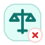
   <code>customer.rule.rejected</code>
   rule · rejected
</td>
<td align="center" valign="top" width="16.6%">
  
   <code>customer.rule.completed</code>
   rule · completed
</td>
</tr>
<tr>
<td align="center" valign="top" width="16.6%">
  
   <code>customer.report.draft</code>
   report · draft
</td>
<td align="center" valign="top" width="16.6%">
  
   <code>customer.report.submitted</code>
   report · submitted
</td>
<td align="center" valign="top" width="16.6%">
  
   <code>customer.report.verified</code>
   report · verified
</td>
<td align="center" valign="top" width="16.6%">
  
   <code>customer.report.approved</code>
   report · approved
</td>
<td align="center" valign="top" width="16.6%">
  
   <code>customer.report.rejected</code>
   report · rejected
</td>
<td align="center" valign="top" width="16.6%">
  
   <code>customer.report.completed</code>
   report · completed
</td>
</tr>
<tr>
<td align="center" valign="top" width="16.6%">
  
   <code>customer.record.draft</code>
   record · draft
</td>
<td align="center" valign="top" width="16.6%">
  
   <code>customer.record.submitted</code>
   record · submitted
</td>
<td align="center" valign="top" width="16.6%">
  
   <code>customer.record.verified</code>
   record · verified
</td>
<td align="center" valign="top" width="16.6%">
  
   <code>customer.record.approved</code>
   record · approved
</td>
<td align="center" valign="top" width="16.6%">
  
   <code>customer.record.rejected</code>
   record · rejected
</td>
<td align="center" valign="top" width="16.6%">
  
   <code>customer.record.completed</code>
   record · completed
</td>
</tr>
</table>

## Identity

- Domain key: `identity`
- Icon count: `96`
- Recommended domain glyph family: `shield-user`

<table>
<tr>
<td align="center" valign="top" width="16.6%">
  
   <code>identity.request.draft</code>
   request · draft
</td>
<td align="center" valign="top" width="16.6%">
  
   <code>identity.request.submitted</code>
   request · submitted
</td>
<td align="center" valign="top" width="16.6%">
  
   <code>identity.request.verified</code>
   request · verified
</td>
<td align="center" valign="top" width="16.6%">
  
   <code>identity.request.approved</code>
   request · approved
</td>
<td align="center" valign="top" width="16.6%">
  
   <code>identity.request.rejected</code>
   request · rejected
</td>
<td align="center" valign="top" width="16.6%">
  
   <code>identity.request.completed</code>
   request · completed
</td>
</tr>
<tr>
<td align="center" valign="top" width="16.6%">
  
   <code>identity.task.draft</code>
   task · draft
</td>
<td align="center" valign="top" width="16.6%">
  
   <code>identity.task.submitted</code>
   task · submitted
</td>
<td align="center" valign="top" width="16.6%">
  
   <code>identity.task.verified</code>
   task · verified
</td>
<td align="center" valign="top" width="16.6%">
  
   <code>identity.task.approved</code>
   task · approved
</td>
<td align="center" valign="top" width="16.6%">
  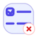
   <code>identity.task.rejected</code>
   task · rejected
</td>
<td align="center" valign="top" width="16.6%">
  
   <code>identity.task.completed</code>
   task · completed
</td>
</tr>
<tr>
<td align="center" valign="top" width="16.6%">
  
   <code>identity.review.draft</code>
   review · draft
</td>
<td align="center" valign="top" width="16.6%">
  
   <code>identity.review.submitted</code>
   review · submitted
</td>
<td align="center" valign="top" width="16.6%">
  
   <code>identity.review.verified</code>
   review · verified
</td>
<td align="center" valign="top" width="16.6%">
  
   <code>identity.review.approved</code>
   review · approved
</td>
<td align="center" valign="top" width="16.6%">
  
   <code>identity.review.rejected</code>
   review · rejected
</td>
<td align="center" valign="top" width="16.6%">
  
   <code>identity.review.completed</code>
   review · completed
</td>
</tr>
<tr>
<td align="center" valign="top" width="16.6%">
  
   <code>identity.approval.draft</code>
   approval · draft
</td>
<td align="center" valign="top" width="16.6%">
  
   <code>identity.approval.submitted</code>
   approval · submitted
</td>
<td align="center" valign="top" width="16.6%">
  
   <code>identity.approval.verified</code>
   approval · verified
</td>
<td align="center" valign="top" width="16.6%">
  
   <code>identity.approval.approved</code>
   approval · approved
</td>
<td align="center" valign="top" width="16.6%">
  
   <code>identity.approval.rejected</code>
   approval · rejected
</td>
<td align="center" valign="top" width="16.6%">
  
   <code>identity.approval.completed</code>
   approval · completed
</td>
</tr>
<tr>
<td align="center" valign="top" width="16.6%">
  
   <code>identity.order.draft</code>
   order · draft
</td>
<td align="center" valign="top" width="16.6%">
  
   <code>identity.order.submitted</code>
   order · submitted
</td>
<td align="center" valign="top" width="16.6%">
  
   <code>identity.order.verified</code>
   order · verified
</td>
<td align="center" valign="top" width="16.6%">
  
   <code>identity.order.approved</code>
   order · approved
</td>
<td align="center" valign="top" width="16.6%">
  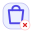
   <code>identity.order.rejected</code>
   order · rejected
</td>
<td align="center" valign="top" width="16.6%">
  
   <code>identity.order.completed</code>
   order · completed
</td>
</tr>
<tr>
<td align="center" valign="top" width="16.6%">
  
   <code>identity.payment.draft</code>
   payment · draft
</td>
<td align="center" valign="top" width="16.6%">
  
   <code>identity.payment.submitted</code>
   payment · submitted
</td>
<td align="center" valign="top" width="16.6%">
  
   <code>identity.payment.verified</code>
   payment · verified
</td>
<td align="center" valign="top" width="16.6%">
  
   <code>identity.payment.approved</code>
   payment · approved
</td>
<td align="center" valign="top" width="16.6%">
  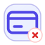
   <code>identity.payment.rejected</code>
   payment · rejected
</td>
<td align="center" valign="top" width="16.6%">
  
   <code>identity.payment.completed</code>
   payment · completed
</td>
</tr>
<tr>
<td align="center" valign="top" width="16.6%">
  
   <code>identity.invoice.draft</code>
   invoice · draft
</td>
<td align="center" valign="top" width="16.6%">
  
   <code>identity.invoice.submitted</code>
   invoice · submitted
</td>
<td align="center" valign="top" width="16.6%">
  
   <code>identity.invoice.verified</code>
   invoice · verified
</td>
<td align="center" valign="top" width="16.6%">
  
   <code>identity.invoice.approved</code>
   invoice · approved
</td>
<td align="center" valign="top" width="16.6%">
  
   <code>identity.invoice.rejected</code>
   invoice · rejected
</td>
<td align="center" valign="top" width="16.6%">
  
   <code>identity.invoice.completed</code>
   invoice · completed
</td>
</tr>
<tr>
<td align="center" valign="top" width="16.6%">
  
   <code>identity.shipment.draft</code>
   shipment · draft
</td>
<td align="center" valign="top" width="16.6%">
  
   <code>identity.shipment.submitted</code>
   shipment · submitted
</td>
<td align="center" valign="top" width="16.6%">
  
   <code>identity.shipment.verified</code>
   shipment · verified
</td>
<td align="center" valign="top" width="16.6%">
  
   <code>identity.shipment.approved</code>
   shipment · approved
</td>
<td align="center" valign="top" width="16.6%">
  
   <code>identity.shipment.rejected</code>
   shipment · rejected
</td>
<td align="center" valign="top" width="16.6%">
  
   <code>identity.shipment.completed</code>
   shipment · completed
</td>
</tr>
<tr>
<td align="center" valign="top" width="16.6%">
  
   <code>identity.ticket.draft</code>
   ticket · draft
</td>
<td align="center" valign="top" width="16.6%">
  
   <code>identity.ticket.submitted</code>
   ticket · submitted
</td>
<td align="center" valign="top" width="16.6%">
  
   <code>identity.ticket.verified</code>
   ticket · verified
</td>
<td align="center" valign="top" width="16.6%">
  
   <code>identity.ticket.approved</code>
   ticket · approved
</td>
<td align="center" valign="top" width="16.6%">
  
   <code>identity.ticket.rejected</code>
   ticket · rejected
</td>
<td align="center" valign="top" width="16.6%">
  
   <code>identity.ticket.completed</code>
   ticket · completed
</td>
</tr>
<tr>
<td align="center" valign="top" width="16.6%">
  
   <code>identity.document.draft</code>
   document · draft
</td>
<td align="center" valign="top" width="16.6%">
  
   <code>identity.document.submitted</code>
   document · submitted
</td>
<td align="center" valign="top" width="16.6%">
  
   <code>identity.document.verified</code>
   document · verified
</td>
<td align="center" valign="top" width="16.6%">
  
   <code>identity.document.approved</code>
   document · approved
</td>
<td align="center" valign="top" width="16.6%">
  
   <code>identity.document.rejected</code>
   document · rejected
</td>
<td align="center" valign="top" width="16.6%">
  
   <code>identity.document.completed</code>
   document · completed
</td>
</tr>
<tr>
<td align="center" valign="top" width="16.6%">
  
   <code>identity.notification.draft</code>
   notification · draft
</td>
<td align="center" valign="top" width="16.6%">
  
   <code>identity.notification.submitted</code>
   notification · submitted
</td>
<td align="center" valign="top" width="16.6%">
  
   <code>identity.notification.verified</code>
   notification · verified
</td>
<td align="center" valign="top" width="16.6%">
  
   <code>identity.notification.approved</code>
   notification · approved
</td>
<td align="center" valign="top" width="16.6%">
  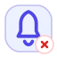
   <code>identity.notification.rejected</code>
   notification · rejected
</td>
<td align="center" valign="top" width="16.6%">
  
   <code>identity.notification.completed</code>
   notification · completed
</td>
</tr>
<tr>
<td align="center" valign="top" width="16.6%">
  
   <code>identity.user.draft</code>
   user · draft
</td>
<td align="center" valign="top" width="16.6%">
  
   <code>identity.user.submitted</code>
   user · submitted
</td>
<td align="center" valign="top" width="16.6%">
  
   <code>identity.user.verified</code>
   user · verified
</td>
<td align="center" valign="top" width="16.6%">
  
   <code>identity.user.approved</code>
   user · approved
</td>
<td align="center" valign="top" width="16.6%">
  
   <code>identity.user.rejected</code>
   user · rejected
</td>
<td align="center" valign="top" width="16.6%">
  
   <code>identity.user.completed</code>
   user · completed
</td>
</tr>
<tr>
<td align="center" valign="top" width="16.6%">
  
   <code>identity.role.draft</code>
   role · draft
</td>
<td align="center" valign="top" width="16.6%">
  
   <code>identity.role.submitted</code>
   role · submitted
</td>
<td align="center" valign="top" width="16.6%">
  
   <code>identity.role.verified</code>
   role · verified
</td>
<td align="center" valign="top" width="16.6%">
  
   <code>identity.role.approved</code>
   role · approved
</td>
<td align="center" valign="top" width="16.6%">
  
   <code>identity.role.rejected</code>
   role · rejected
</td>
<td align="center" valign="top" width="16.6%">
  
   <code>identity.role.completed</code>
   role · completed
</td>
</tr>
<tr>
<td align="center" valign="top" width="16.6%">
  
   <code>identity.rule.draft</code>
   rule · draft
</td>
<td align="center" valign="top" width="16.6%">
  
   <code>identity.rule.submitted</code>
   rule · submitted
</td>
<td align="center" valign="top" width="16.6%">
  
   <code>identity.rule.verified</code>
   rule · verified
</td>
<td align="center" valign="top" width="16.6%">
  
   <code>identity.rule.approved</code>
   rule · approved
</td>
<td align="center" valign="top" width="16.6%">
  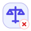
   <code>identity.rule.rejected</code>
   rule · rejected
</td>
<td align="center" valign="top" width="16.6%">
  
   <code>identity.rule.completed</code>
   rule · completed
</td>
</tr>
<tr>
<td align="center" valign="top" width="16.6%">
  
   <code>identity.report.draft</code>
   report · draft
</td>
<td align="center" valign="top" width="16.6%">
  
   <code>identity.report.submitted</code>
   report · submitted
</td>
<td align="center" valign="top" width="16.6%">
  
   <code>identity.report.verified</code>
   report · verified
</td>
<td align="center" valign="top" width="16.6%">
  
   <code>identity.report.approved</code>
   report · approved
</td>
<td align="center" valign="top" width="16.6%">
  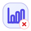
   <code>identity.report.rejected</code>
   report · rejected
</td>
<td align="center" valign="top" width="16.6%">
  
   <code>identity.report.completed</code>
   report · completed
</td>
</tr>
<tr>
<td align="center" valign="top" width="16.6%">
  
   <code>identity.record.draft</code>
   record · draft
</td>
<td align="center" valign="top" width="16.6%">
  
   <code>identity.record.submitted</code>
   record · submitted
</td>
<td align="center" valign="top" width="16.6%">
  
   <code>identity.record.verified</code>
   record · verified
</td>
<td align="center" valign="top" width="16.6%">
  
   <code>identity.record.approved</code>
   record · approved
</td>
<td align="center" valign="top" width="16.6%">
  
   <code>identity.record.rejected</code>
   record · rejected
</td>
<td align="center" valign="top" width="16.6%">
  
   <code>identity.record.completed</code>
   record · completed
</td>
</tr>
</table>

## Sales

- Domain key: `sales`
- Icon count: `96`
- Recommended domain glyph family: `badge-dollar-sign`

<table>
<tr>
<td align="center" valign="top" width="16.6%">
  
   <code>sales.request.draft</code>
   request · draft
</td>
<td align="center" valign="top" width="16.6%">
  
   <code>sales.request.submitted</code>
   request · submitted
</td>
<td align="center" valign="top" width="16.6%">
  
   <code>sales.request.verified</code>
   request · verified
</td>
<td align="center" valign="top" width="16.6%">
  
   <code>sales.request.approved</code>
   request · approved
</td>
<td align="center" valign="top" width="16.6%">
  
   <code>sales.request.rejected</code>
   request · rejected
</td>
<td align="center" valign="top" width="16.6%">
  
   <code>sales.request.completed</code>
   request · completed
</td>
</tr>
<tr>
<td align="center" valign="top" width="16.6%">
  
   <code>sales.task.draft</code>
   task · draft
</td>
<td align="center" valign="top" width="16.6%">
  
   <code>sales.task.submitted</code>
   task · submitted
</td>
<td align="center" valign="top" width="16.6%">
  
   <code>sales.task.verified</code>
   task · verified
</td>
<td align="center" valign="top" width="16.6%">
  
   <code>sales.task.approved</code>
   task · approved
</td>
<td align="center" valign="top" width="16.6%">
  
   <code>sales.task.rejected</code>
   task · rejected
</td>
<td align="center" valign="top" width="16.6%">
  
   <code>sales.task.completed</code>
   task · completed
</td>
</tr>
<tr>
<td align="center" valign="top" width="16.6%">
  
   <code>sales.review.draft</code>
   review · draft
</td>
<td align="center" valign="top" width="16.6%">
  
   <code>sales.review.submitted</code>
   review · submitted
</td>
<td align="center" valign="top" width="16.6%">
  
   <code>sales.review.verified</code>
   review · verified
</td>
<td align="center" valign="top" width="16.6%">
  
   <code>sales.review.approved</code>
   review · approved
</td>
<td align="center" valign="top" width="16.6%">
  
   <code>sales.review.rejected</code>
   review · rejected
</td>
<td align="center" valign="top" width="16.6%">
  
   <code>sales.review.completed</code>
   review · completed
</td>
</tr>
<tr>
<td align="center" valign="top" width="16.6%">
  
   <code>sales.approval.draft</code>
   approval · draft
</td>
<td align="center" valign="top" width="16.6%">
  
   <code>sales.approval.submitted</code>
   approval · submitted
</td>
<td align="center" valign="top" width="16.6%">
  
   <code>sales.approval.verified</code>
   approval · verified
</td>
<td align="center" valign="top" width="16.6%">
  
   <code>sales.approval.approved</code>
   approval · approved
</td>
<td align="center" valign="top" width="16.6%">
  
   <code>sales.approval.rejected</code>
   approval · rejected
</td>
<td align="center" valign="top" width="16.6%">
  
   <code>sales.approval.completed</code>
   approval · completed
</td>
</tr>
<tr>
<td align="center" valign="top" width="16.6%">
  
   <code>sales.order.draft</code>
   order · draft
</td>
<td align="center" valign="top" width="16.6%">
  
   <code>sales.order.submitted</code>
   order · submitted
</td>
<td align="center" valign="top" width="16.6%">
  
   <code>sales.order.verified</code>
   order · verified
</td>
<td align="center" valign="top" width="16.6%">
  
   <code>sales.order.approved</code>
   order · approved
</td>
<td align="center" valign="top" width="16.6%">
  
   <code>sales.order.rejected</code>
   order · rejected
</td>
<td align="center" valign="top" width="16.6%">
  
   <code>sales.order.completed</code>
   order · completed
</td>
</tr>
<tr>
<td align="center" valign="top" width="16.6%">
  
   <code>sales.payment.draft</code>
   payment · draft
</td>
<td align="center" valign="top" width="16.6%">
  
   <code>sales.payment.submitted</code>
   payment · submitted
</td>
<td align="center" valign="top" width="16.6%">
  
   <code>sales.payment.verified</code>
   payment · verified
</td>
<td align="center" valign="top" width="16.6%">
  
   <code>sales.payment.approved</code>
   payment · approved
</td>
<td align="center" valign="top" width="16.6%">
  
   <code>sales.payment.rejected</code>
   payment · rejected
</td>
<td align="center" valign="top" width="16.6%">
  
   <code>sales.payment.completed</code>
   payment · completed
</td>
</tr>
<tr>
<td align="center" valign="top" width="16.6%">
  
   <code>sales.invoice.draft</code>
   invoice · draft
</td>
<td align="center" valign="top" width="16.6%">
  
   <code>sales.invoice.submitted</code>
   invoice · submitted
</td>
<td align="center" valign="top" width="16.6%">
  
   <code>sales.invoice.verified</code>
   invoice · verified
</td>
<td align="center" valign="top" width="16.6%">
  
   <code>sales.invoice.approved</code>
   invoice · approved
</td>
<td align="center" valign="top" width="16.6%">
  
   <code>sales.invoice.rejected</code>
   invoice · rejected
</td>
<td align="center" valign="top" width="16.6%">
  
   <code>sales.invoice.completed</code>
   invoice · completed
</td>
</tr>
<tr>
<td align="center" valign="top" width="16.6%">
  
   <code>sales.shipment.draft</code>
   shipment · draft
</td>
<td align="center" valign="top" width="16.6%">
  
   <code>sales.shipment.submitted</code>
   shipment · submitted
</td>
<td align="center" valign="top" width="16.6%">
  
   <code>sales.shipment.verified</code>
   shipment · verified
</td>
<td align="center" valign="top" width="16.6%">
  
   <code>sales.shipment.approved</code>
   shipment · approved
</td>
<td align="center" valign="top" width="16.6%">
  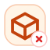
   <code>sales.shipment.rejected</code>
   shipment · rejected
</td>
<td align="center" valign="top" width="16.6%">
  
   <code>sales.shipment.completed</code>
   shipment · completed
</td>
</tr>
<tr>
<td align="center" valign="top" width="16.6%">
  
   <code>sales.ticket.draft</code>
   ticket · draft
</td>
<td align="center" valign="top" width="16.6%">
  
   <code>sales.ticket.submitted</code>
   ticket · submitted
</td>
<td align="center" valign="top" width="16.6%">
  
   <code>sales.ticket.verified</code>
   ticket · verified
</td>
<td align="center" valign="top" width="16.6%">
  
   <code>sales.ticket.approved</code>
   ticket · approved
</td>
<td align="center" valign="top" width="16.6%">
  
   <code>sales.ticket.rejected</code>
   ticket · rejected
</td>
<td align="center" valign="top" width="16.6%">
  
   <code>sales.ticket.completed</code>
   ticket · completed
</td>
</tr>
<tr>
<td align="center" valign="top" width="16.6%">
  
   <code>sales.document.draft</code>
   document · draft
</td>
<td align="center" valign="top" width="16.6%">
  
   <code>sales.document.submitted</code>
   document · submitted
</td>
<td align="center" valign="top" width="16.6%">
  
   <code>sales.document.verified</code>
   document · verified
</td>
<td align="center" valign="top" width="16.6%">
  
   <code>sales.document.approved</code>
   document · approved
</td>
<td align="center" valign="top" width="16.6%">
  
   <code>sales.document.rejected</code>
   document · rejected
</td>
<td align="center" valign="top" width="16.6%">
  
   <code>sales.document.completed</code>
   document · completed
</td>
</tr>
<tr>
<td align="center" valign="top" width="16.6%">
  
   <code>sales.notification.draft</code>
   notification · draft
</td>
<td align="center" valign="top" width="16.6%">
  
   <code>sales.notification.submitted</code>
   notification · submitted
</td>
<td align="center" valign="top" width="16.6%">
  
   <code>sales.notification.verified</code>
   notification · verified
</td>
<td align="center" valign="top" width="16.6%">
  
   <code>sales.notification.approved</code>
   notification · approved
</td>
<td align="center" valign="top" width="16.6%">
  
   <code>sales.notification.rejected</code>
   notification · rejected
</td>
<td align="center" valign="top" width="16.6%">
  
   <code>sales.notification.completed</code>
   notification · completed
</td>
</tr>
<tr>
<td align="center" valign="top" width="16.6%">
  
   <code>sales.user.draft</code>
   user · draft
</td>
<td align="center" valign="top" width="16.6%">
  
   <code>sales.user.submitted</code>
   user · submitted
</td>
<td align="center" valign="top" width="16.6%">
  
   <code>sales.user.verified</code>
   user · verified
</td>
<td align="center" valign="top" width="16.6%">
  
   <code>sales.user.approved</code>
   user · approved
</td>
<td align="center" valign="top" width="16.6%">
  
   <code>sales.user.rejected</code>
   user · rejected
</td>
<td align="center" valign="top" width="16.6%">
  
   <code>sales.user.completed</code>
   user · completed
</td>
</tr>
<tr>
<td align="center" valign="top" width="16.6%">
  
   <code>sales.role.draft</code>
   role · draft
</td>
<td align="center" valign="top" width="16.6%">
  
   <code>sales.role.submitted</code>
   role · submitted
</td>
<td align="center" valign="top" width="16.6%">
  
   <code>sales.role.verified</code>
   role · verified
</td>
<td align="center" valign="top" width="16.6%">
  
   <code>sales.role.approved</code>
   role · approved
</td>
<td align="center" valign="top" width="16.6%">
  
   <code>sales.role.rejected</code>
   role · rejected
</td>
<td align="center" valign="top" width="16.6%">
  
   <code>sales.role.completed</code>
   role · completed
</td>
</tr>
<tr>
<td align="center" valign="top" width="16.6%">
  
   <code>sales.rule.draft</code>
   rule · draft
</td>
<td align="center" valign="top" width="16.6%">
  
   <code>sales.rule.submitted</code>
   rule · submitted
</td>
<td align="center" valign="top" width="16.6%">
  
   <code>sales.rule.verified</code>
   rule · verified
</td>
<td align="center" valign="top" width="16.6%">
  
   <code>sales.rule.approved</code>
   rule · approved
</td>
<td align="center" valign="top" width="16.6%">
  
   <code>sales.rule.rejected</code>
   rule · rejected
</td>
<td align="center" valign="top" width="16.6%">
  
   <code>sales.rule.completed</code>
   rule · completed
</td>
</tr>
<tr>
<td align="center" valign="top" width="16.6%">
  
   <code>sales.report.draft</code>
   report · draft
</td>
<td align="center" valign="top" width="16.6%">
  
   <code>sales.report.submitted</code>
   report · submitted
</td>
<td align="center" valign="top" width="16.6%">
  
   <code>sales.report.verified</code>
   report · verified
</td>
<td align="center" valign="top" width="16.6%">
  
   <code>sales.report.approved</code>
   report · approved
</td>
<td align="center" valign="top" width="16.6%">
  
   <code>sales.report.rejected</code>
   report · rejected
</td>
<td align="center" valign="top" width="16.6%">
  
   <code>sales.report.completed</code>
   report · completed
</td>
</tr>
<tr>
<td align="center" valign="top" width="16.6%">
  
   <code>sales.record.draft</code>
   record · draft
</td>
<td align="center" valign="top" width="16.6%">
  
   <code>sales.record.submitted</code>
   record · submitted
</td>
<td align="center" valign="top" width="16.6%">
  
   <code>sales.record.verified</code>
   record · verified
</td>
<td align="center" valign="top" width="16.6%">
  
   <code>sales.record.approved</code>
   record · approved
</td>
<td align="center" valign="top" width="16.6%">
  
   <code>sales.record.rejected</code>
   record · rejected
</td>
<td align="center" valign="top" width="16.6%">
  
   <code>sales.record.completed</code>
   record · completed
</td>
</tr>
</table>

## Finance

- Domain key: `finance`
- Icon count: `96`
- Recommended domain glyph family: `wallet`

<table>
<tr>
<td align="center" valign="top" width="16.6%">
  
   <code>finance.request.draft</code>
   request · draft
</td>
<td align="center" valign="top" width="16.6%">
  
   <code>finance.request.submitted</code>
   request · submitted
</td>
<td align="center" valign="top" width="16.6%">
  
   <code>finance.request.verified</code>
   request · verified
</td>
<td align="center" valign="top" width="16.6%">
  
   <code>finance.request.approved</code>
   request · approved
</td>
<td align="center" valign="top" width="16.6%">
  
   <code>finance.request.rejected</code>
   request · rejected
</td>
<td align="center" valign="top" width="16.6%">
  
   <code>finance.request.completed</code>
   request · completed
</td>
</tr>
<tr>
<td align="center" valign="top" width="16.6%">
  
   <code>finance.task.draft</code>
   task · draft
</td>
<td align="center" valign="top" width="16.6%">
  
   <code>finance.task.submitted</code>
   task · submitted
</td>
<td align="center" valign="top" width="16.6%">
  
   <code>finance.task.verified</code>
   task · verified
</td>
<td align="center" valign="top" width="16.6%">
  
   <code>finance.task.approved</code>
   task · approved
</td>
<td align="center" valign="top" width="16.6%">
  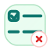
   <code>finance.task.rejected</code>
   task · rejected
</td>
<td align="center" valign="top" width="16.6%">
  
   <code>finance.task.completed</code>
   task · completed
</td>
</tr>
<tr>
<td align="center" valign="top" width="16.6%">
  
   <code>finance.review.draft</code>
   review · draft
</td>
<td align="center" valign="top" width="16.6%">
  
   <code>finance.review.submitted</code>
   review · submitted
</td>
<td align="center" valign="top" width="16.6%">
  
   <code>finance.review.verified</code>
   review · verified
</td>
<td align="center" valign="top" width="16.6%">
  
   <code>finance.review.approved</code>
   review · approved
</td>
<td align="center" valign="top" width="16.6%">
  
   <code>finance.review.rejected</code>
   review · rejected
</td>
<td align="center" valign="top" width="16.6%">
  
   <code>finance.review.completed</code>
   review · completed
</td>
</tr>
<tr>
<td align="center" valign="top" width="16.6%">
  
   <code>finance.approval.draft</code>
   approval · draft
</td>
<td align="center" valign="top" width="16.6%">
  
   <code>finance.approval.submitted</code>
   approval · submitted
</td>
<td align="center" valign="top" width="16.6%">
  
   <code>finance.approval.verified</code>
   approval · verified
</td>
<td align="center" valign="top" width="16.6%">
  
   <code>finance.approval.approved</code>
   approval · approved
</td>
<td align="center" valign="top" width="16.6%">
  
   <code>finance.approval.rejected</code>
   approval · rejected
</td>
<td align="center" valign="top" width="16.6%">
  
   <code>finance.approval.completed</code>
   approval · completed
</td>
</tr>
<tr>
<td align="center" valign="top" width="16.6%">
  
   <code>finance.order.draft</code>
   order · draft
</td>
<td align="center" valign="top" width="16.6%">
  
   <code>finance.order.submitted</code>
   order · submitted
</td>
<td align="center" valign="top" width="16.6%">
  
   <code>finance.order.verified</code>
   order · verified
</td>
<td align="center" valign="top" width="16.6%">
  
   <code>finance.order.approved</code>
   order · approved
</td>
<td align="center" valign="top" width="16.6%">
  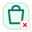
   <code>finance.order.rejected</code>
   order · rejected
</td>
<td align="center" valign="top" width="16.6%">
  
   <code>finance.order.completed</code>
   order · completed
</td>
</tr>
<tr>
<td align="center" valign="top" width="16.6%">
  
   <code>finance.payment.draft</code>
   payment · draft
</td>
<td align="center" valign="top" width="16.6%">
  
   <code>finance.payment.submitted</code>
   payment · submitted
</td>
<td align="center" valign="top" width="16.6%">
  
   <code>finance.payment.verified</code>
   payment · verified
</td>
<td align="center" valign="top" width="16.6%">
  
   <code>finance.payment.approved</code>
   payment · approved
</td>
<td align="center" valign="top" width="16.6%">
  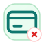
   <code>finance.payment.rejected</code>
   payment · rejected
</td>
<td align="center" valign="top" width="16.6%">
  
   <code>finance.payment.completed</code>
   payment · completed
</td>
</tr>
<tr>
<td align="center" valign="top" width="16.6%">
  
   <code>finance.invoice.draft</code>
   invoice · draft
</td>
<td align="center" valign="top" width="16.6%">
  
   <code>finance.invoice.submitted</code>
   invoice · submitted
</td>
<td align="center" valign="top" width="16.6%">
  
   <code>finance.invoice.verified</code>
   invoice · verified
</td>
<td align="center" valign="top" width="16.6%">
  
   <code>finance.invoice.approved</code>
   invoice · approved
</td>
<td align="center" valign="top" width="16.6%">
  
   <code>finance.invoice.rejected</code>
   invoice · rejected
</td>
<td align="center" valign="top" width="16.6%">
  
   <code>finance.invoice.completed</code>
   invoice · completed
</td>
</tr>
<tr>
<td align="center" valign="top" width="16.6%">
  
   <code>finance.shipment.draft</code>
   shipment · draft
</td>
<td align="center" valign="top" width="16.6%">
  
   <code>finance.shipment.submitted</code>
   shipment · submitted
</td>
<td align="center" valign="top" width="16.6%">
  
   <code>finance.shipment.verified</code>
   shipment · verified
</td>
<td align="center" valign="top" width="16.6%">
  
   <code>finance.shipment.approved</code>
   shipment · approved
</td>
<td align="center" valign="top" width="16.6%">
  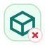
   <code>finance.shipment.rejected</code>
   shipment · rejected
</td>
<td align="center" valign="top" width="16.6%">
  
   <code>finance.shipment.completed</code>
   shipment · completed
</td>
</tr>
<tr>
<td align="center" valign="top" width="16.6%">
  
   <code>finance.ticket.draft</code>
   ticket · draft
</td>
<td align="center" valign="top" width="16.6%">
  
   <code>finance.ticket.submitted</code>
   ticket · submitted
</td>
<td align="center" valign="top" width="16.6%">
  
   <code>finance.ticket.verified</code>
   ticket · verified
</td>
<td align="center" valign="top" width="16.6%">
  
   <code>finance.ticket.approved</code>
   ticket · approved
</td>
<td align="center" valign="top" width="16.6%">
  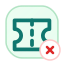
   <code>finance.ticket.rejected</code>
   ticket · rejected
</td>
<td align="center" valign="top" width="16.6%">
  
   <code>finance.ticket.completed</code>
   ticket · completed
</td>
</tr>
<tr>
<td align="center" valign="top" width="16.6%">
  
   <code>finance.document.draft</code>
   document · draft
</td>
<td align="center" valign="top" width="16.6%">
  
   <code>finance.document.submitted</code>
   document · submitted
</td>
<td align="center" valign="top" width="16.6%">
  
   <code>finance.document.verified</code>
   document · verified
</td>
<td align="center" valign="top" width="16.6%">
  
   <code>finance.document.approved</code>
   document · approved
</td>
<td align="center" valign="top" width="16.6%">
  
   <code>finance.document.rejected</code>
   document · rejected
</td>
<td align="center" valign="top" width="16.6%">
  
   <code>finance.document.completed</code>
   document · completed
</td>
</tr>
<tr>
<td align="center" valign="top" width="16.6%">
  
   <code>finance.notification.draft</code>
   notification · draft
</td>
<td align="center" valign="top" width="16.6%">
  
   <code>finance.notification.submitted</code>
   notification · submitted
</td>
<td align="center" valign="top" width="16.6%">
  
   <code>finance.notification.verified</code>
   notification · verified
</td>
<td align="center" valign="top" width="16.6%">
  
   <code>finance.notification.approved</code>
   notification · approved
</td>
<td align="center" valign="top" width="16.6%">
  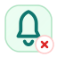
   <code>finance.notification.rejected</code>
   notification · rejected
</td>
<td align="center" valign="top" width="16.6%">
  
   <code>finance.notification.completed</code>
   notification · completed
</td>
</tr>
<tr>
<td align="center" valign="top" width="16.6%">
  
   <code>finance.user.draft</code>
   user · draft
</td>
<td align="center" valign="top" width="16.6%">
  
   <code>finance.user.submitted</code>
   user · submitted
</td>
<td align="center" valign="top" width="16.6%">
  
   <code>finance.user.verified</code>
   user · verified
</td>
<td align="center" valign="top" width="16.6%">
  
   <code>finance.user.approved</code>
   user · approved
</td>
<td align="center" valign="top" width="16.6%">
  
   <code>finance.user.rejected</code>
   user · rejected
</td>
<td align="center" valign="top" width="16.6%">
  
   <code>finance.user.completed</code>
   user · completed
</td>
</tr>
<tr>
<td align="center" valign="top" width="16.6%">
  
   <code>finance.role.draft</code>
   role · draft
</td>
<td align="center" valign="top" width="16.6%">
  
   <code>finance.role.submitted</code>
   role · submitted
</td>
<td align="center" valign="top" width="16.6%">
  
   <code>finance.role.verified</code>
   role · verified
</td>
<td align="center" valign="top" width="16.6%">
  
   <code>finance.role.approved</code>
   role · approved
</td>
<td align="center" valign="top" width="16.6%">
  
   <code>finance.role.rejected</code>
   role · rejected
</td>
<td align="center" valign="top" width="16.6%">
  
   <code>finance.role.completed</code>
   role · completed
</td>
</tr>
<tr>
<td align="center" valign="top" width="16.6%">
  
   <code>finance.rule.draft</code>
   rule · draft
</td>
<td align="center" valign="top" width="16.6%">
  
   <code>finance.rule.submitted</code>
   rule · submitted
</td>
<td align="center" valign="top" width="16.6%">
  
   <code>finance.rule.verified</code>
   rule · verified
</td>
<td align="center" valign="top" width="16.6%">
  
   <code>finance.rule.approved</code>
   rule · approved
</td>
<td align="center" valign="top" width="16.6%">
  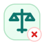
   <code>finance.rule.rejected</code>
   rule · rejected
</td>
<td align="center" valign="top" width="16.6%">
  
   <code>finance.rule.completed</code>
   rule · completed
</td>
</tr>
<tr>
<td align="center" valign="top" width="16.6%">
  
   <code>finance.report.draft</code>
   report · draft
</td>
<td align="center" valign="top" width="16.6%">
  
   <code>finance.report.submitted</code>
   report · submitted
</td>
<td align="center" valign="top" width="16.6%">
  
   <code>finance.report.verified</code>
   report · verified
</td>
<td align="center" valign="top" width="16.6%">
  
   <code>finance.report.approved</code>
   report · approved
</td>
<td align="center" valign="top" width="16.6%">
  
   <code>finance.report.rejected</code>
   report · rejected
</td>
<td align="center" valign="top" width="16.6%">
  
   <code>finance.report.completed</code>
   report · completed
</td>
</tr>
<tr>
<td align="center" valign="top" width="16.6%">
  
   <code>finance.record.draft</code>
   record · draft
</td>
<td align="center" valign="top" width="16.6%">
  
   <code>finance.record.submitted</code>
   record · submitted
</td>
<td align="center" valign="top" width="16.6%">
  
   <code>finance.record.verified</code>
   record · verified
</td>
<td align="center" valign="top" width="16.6%">
  
   <code>finance.record.approved</code>
   record · approved
</td>
<td align="center" valign="top" width="16.6%">
  
   <code>finance.record.rejected</code>
   record · rejected
</td>
<td align="center" valign="top" width="16.6%">
  
   <code>finance.record.completed</code>
   record · completed
</td>
</tr>
</table>

## Risk

- Domain key: `risk`
- Icon count: `96`
- Recommended domain glyph family: `shield-alert`

<table>
<tr>
<td align="center" valign="top" width="16.6%">
  
   <code>risk.request.draft</code>
   request · draft
</td>
<td align="center" valign="top" width="16.6%">
  
   <code>risk.request.submitted</code>
   request · submitted
</td>
<td align="center" valign="top" width="16.6%">
  
   <code>risk.request.verified</code>
   request · verified
</td>
<td align="center" valign="top" width="16.6%">
  
   <code>risk.request.approved</code>
   request · approved
</td>
<td align="center" valign="top" width="16.6%">
  
   <code>risk.request.rejected</code>
   request · rejected
</td>
<td align="center" valign="top" width="16.6%">
  
   <code>risk.request.completed</code>
   request · completed
</td>
</tr>
<tr>
<td align="center" valign="top" width="16.6%">
  
   <code>risk.task.draft</code>
   task · draft
</td>
<td align="center" valign="top" width="16.6%">
  
   <code>risk.task.submitted</code>
   task · submitted
</td>
<td align="center" valign="top" width="16.6%">
  
   <code>risk.task.verified</code>
   task · verified
</td>
<td align="center" valign="top" width="16.6%">
  
   <code>risk.task.approved</code>
   task · approved
</td>
<td align="center" valign="top" width="16.6%">
  
   <code>risk.task.rejected</code>
   task · rejected
</td>
<td align="center" valign="top" width="16.6%">
  
   <code>risk.task.completed</code>
   task · completed
</td>
</tr>
<tr>
<td align="center" valign="top" width="16.6%">
  
   <code>risk.review.draft</code>
   review · draft
</td>
<td align="center" valign="top" width="16.6%">
  
   <code>risk.review.submitted</code>
   review · submitted
</td>
<td align="center" valign="top" width="16.6%">
  
   <code>risk.review.verified</code>
   review · verified
</td>
<td align="center" valign="top" width="16.6%">
  
   <code>risk.review.approved</code>
   review · approved
</td>
<td align="center" valign="top" width="16.6%">
  
   <code>risk.review.rejected</code>
   review · rejected
</td>
<td align="center" valign="top" width="16.6%">
  
   <code>risk.review.completed</code>
   review · completed
</td>
</tr>
<tr>
<td align="center" valign="top" width="16.6%">
  
   <code>risk.approval.draft</code>
   approval · draft
</td>
<td align="center" valign="top" width="16.6%">
  
   <code>risk.approval.submitted</code>
   approval · submitted
</td>
<td align="center" valign="top" width="16.6%">
  
   <code>risk.approval.verified</code>
   approval · verified
</td>
<td align="center" valign="top" width="16.6%">
  
   <code>risk.approval.approved</code>
   approval · approved
</td>
<td align="center" valign="top" width="16.6%">
  
   <code>risk.approval.rejected</code>
   approval · rejected
</td>
<td align="center" valign="top" width="16.6%">
  
   <code>risk.approval.completed</code>
   approval · completed
</td>
</tr>
<tr>
<td align="center" valign="top" width="16.6%">
  
   <code>risk.order.draft</code>
   order · draft
</td>
<td align="center" valign="top" width="16.6%">
  
   <code>risk.order.submitted</code>
   order · submitted
</td>
<td align="center" valign="top" width="16.6%">
  
   <code>risk.order.verified</code>
   order · verified
</td>
<td align="center" valign="top" width="16.6%">
  
   <code>risk.order.approved</code>
   order · approved
</td>
<td align="center" valign="top" width="16.6%">
  
   <code>risk.order.rejected</code>
   order · rejected
</td>
<td align="center" valign="top" width="16.6%">
  
   <code>risk.order.completed</code>
   order · completed
</td>
</tr>
<tr>
<td align="center" valign="top" width="16.6%">
  
   <code>risk.payment.draft</code>
   payment · draft
</td>
<td align="center" valign="top" width="16.6%">
  
   <code>risk.payment.submitted</code>
   payment · submitted
</td>
<td align="center" valign="top" width="16.6%">
  
   <code>risk.payment.verified</code>
   payment · verified
</td>
<td align="center" valign="top" width="16.6%">
  
   <code>risk.payment.approved</code>
   payment · approved
</td>
<td align="center" valign="top" width="16.6%">
  
   <code>risk.payment.rejected</code>
   payment · rejected
</td>
<td align="center" valign="top" width="16.6%">
  
   <code>risk.payment.completed</code>
   payment · completed
</td>
</tr>
<tr>
<td align="center" valign="top" width="16.6%">
  
   <code>risk.invoice.draft</code>
   invoice · draft
</td>
<td align="center" valign="top" width="16.6%">
  
   <code>risk.invoice.submitted</code>
   invoice · submitted
</td>
<td align="center" valign="top" width="16.6%">
  
   <code>risk.invoice.verified</code>
   invoice · verified
</td>
<td align="center" valign="top" width="16.6%">
  
   <code>risk.invoice.approved</code>
   invoice · approved
</td>
<td align="center" valign="top" width="16.6%">
  
   <code>risk.invoice.rejected</code>
   invoice · rejected
</td>
<td align="center" valign="top" width="16.6%">
  
   <code>risk.invoice.completed</code>
   invoice · completed
</td>
</tr>
<tr>
<td align="center" valign="top" width="16.6%">
  
   <code>risk.shipment.draft</code>
   shipment · draft
</td>
<td align="center" valign="top" width="16.6%">
  
   <code>risk.shipment.submitted</code>
   shipment · submitted
</td>
<td align="center" valign="top" width="16.6%">
  
   <code>risk.shipment.verified</code>
   shipment · verified
</td>
<td align="center" valign="top" width="16.6%">
  
   <code>risk.shipment.approved</code>
   shipment · approved
</td>
<td align="center" valign="top" width="16.6%">
  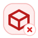
   <code>risk.shipment.rejected</code>
   shipment · rejected
</td>
<td align="center" valign="top" width="16.6%">
  
   <code>risk.shipment.completed</code>
   shipment · completed
</td>
</tr>
<tr>
<td align="center" valign="top" width="16.6%">
  
   <code>risk.ticket.draft</code>
   ticket · draft
</td>
<td align="center" valign="top" width="16.6%">
  
   <code>risk.ticket.submitted</code>
   ticket · submitted
</td>
<td align="center" valign="top" width="16.6%">
  
   <code>risk.ticket.verified</code>
   ticket · verified
</td>
<td align="center" valign="top" width="16.6%">
  
   <code>risk.ticket.approved</code>
   ticket · approved
</td>
<td align="center" valign="top" width="16.6%">
  
   <code>risk.ticket.rejected</code>
   ticket · rejected
</td>
<td align="center" valign="top" width="16.6%">
  
   <code>risk.ticket.completed</code>
   ticket · completed
</td>
</tr>
<tr>
<td align="center" valign="top" width="16.6%">
  
   <code>risk.document.draft</code>
   document · draft
</td>
<td align="center" valign="top" width="16.6%">
  
   <code>risk.document.submitted</code>
   document · submitted
</td>
<td align="center" valign="top" width="16.6%">
  
   <code>risk.document.verified</code>
   document · verified
</td>
<td align="center" valign="top" width="16.6%">
  
   <code>risk.document.approved</code>
   document · approved
</td>
<td align="center" valign="top" width="16.6%">
  
   <code>risk.document.rejected</code>
   document · rejected
</td>
<td align="center" valign="top" width="16.6%">
  
   <code>risk.document.completed</code>
   document · completed
</td>
</tr>
<tr>
<td align="center" valign="top" width="16.6%">
  
   <code>risk.notification.draft</code>
   notification · draft
</td>
<td align="center" valign="top" width="16.6%">
  
   <code>risk.notification.submitted</code>
   notification · submitted
</td>
<td align="center" valign="top" width="16.6%">
  
   <code>risk.notification.verified</code>
   notification · verified
</td>
<td align="center" valign="top" width="16.6%">
  
   <code>risk.notification.approved</code>
   notification · approved
</td>
<td align="center" valign="top" width="16.6%">
  
   <code>risk.notification.rejected</code>
   notification · rejected
</td>
<td align="center" valign="top" width="16.6%">
  
   <code>risk.notification.completed</code>
   notification · completed
</td>
</tr>
<tr>
<td align="center" valign="top" width="16.6%">
  
   <code>risk.user.draft</code>
   user · draft
</td>
<td align="center" valign="top" width="16.6%">
  
   <code>risk.user.submitted</code>
   user · submitted
</td>
<td align="center" valign="top" width="16.6%">
  
   <code>risk.user.verified</code>
   user · verified
</td>
<td align="center" valign="top" width="16.6%">
  
   <code>risk.user.approved</code>
   user · approved
</td>
<td align="center" valign="top" width="16.6%">
  
   <code>risk.user.rejected</code>
   user · rejected
</td>
<td align="center" valign="top" width="16.6%">
  
   <code>risk.user.completed</code>
   user · completed
</td>
</tr>
<tr>
<td align="center" valign="top" width="16.6%">
  
   <code>risk.role.draft</code>
   role · draft
</td>
<td align="center" valign="top" width="16.6%">
  
   <code>risk.role.submitted</code>
   role · submitted
</td>
<td align="center" valign="top" width="16.6%">
  
   <code>risk.role.verified</code>
   role · verified
</td>
<td align="center" valign="top" width="16.6%">
  
   <code>risk.role.approved</code>
   role · approved
</td>
<td align="center" valign="top" width="16.6%">
  
   <code>risk.role.rejected</code>
   role · rejected
</td>
<td align="center" valign="top" width="16.6%">
  
   <code>risk.role.completed</code>
   role · completed
</td>
</tr>
<tr>
<td align="center" valign="top" width="16.6%">
  
   <code>risk.rule.draft</code>
   rule · draft
</td>
<td align="center" valign="top" width="16.6%">
  
   <code>risk.rule.submitted</code>
   rule · submitted
</td>
<td align="center" valign="top" width="16.6%">
  
   <code>risk.rule.verified</code>
   rule · verified
</td>
<td align="center" valign="top" width="16.6%">
  
   <code>risk.rule.approved</code>
   rule · approved
</td>
<td align="center" valign="top" width="16.6%">
  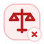
   <code>risk.rule.rejected</code>
   rule · rejected
</td>
<td align="center" valign="top" width="16.6%">
  
   <code>risk.rule.completed</code>
   rule · completed
</td>
</tr>
<tr>
<td align="center" valign="top" width="16.6%">
  
   <code>risk.report.draft</code>
   report · draft
</td>
<td align="center" valign="top" width="16.6%">
  
   <code>risk.report.submitted</code>
   report · submitted
</td>
<td align="center" valign="top" width="16.6%">
  
   <code>risk.report.verified</code>
   report · verified
</td>
<td align="center" valign="top" width="16.6%">
  
   <code>risk.report.approved</code>
   report · approved
</td>
<td align="center" valign="top" width="16.6%">
  
   <code>risk.report.rejected</code>
   report · rejected
</td>
<td align="center" valign="top" width="16.6%">
  
   <code>risk.report.completed</code>
   report · completed
</td>
</tr>
<tr>
<td align="center" valign="top" width="16.6%">
  
   <code>risk.record.draft</code>
   record · draft
</td>
<td align="center" valign="top" width="16.6%">
  
   <code>risk.record.submitted</code>
   record · submitted
</td>
<td align="center" valign="top" width="16.6%">
  
   <code>risk.record.verified</code>
   record · verified
</td>
<td align="center" valign="top" width="16.6%">
  
   <code>risk.record.approved</code>
   record · approved
</td>
<td align="center" valign="top" width="16.6%">
  
   <code>risk.record.rejected</code>
   record · rejected
</td>
<td align="center" valign="top" width="16.6%">
  
   <code>risk.record.completed</code>
   record · completed
</td>
</tr>
</table>

## Compliance

- Domain key: `compliance`
- Icon count: `96`
- Recommended domain glyph family: `shield-check`

<table>
<tr>
<td align="center" valign="top" width="16.6%">
  
   <code>compliance.request.draft</code>
   request · draft
</td>
<td align="center" valign="top" width="16.6%">
  
   <code>compliance.request.submitted</code>
   request · submitted
</td>
<td align="center" valign="top" width="16.6%">
  
   <code>compliance.request.verified</code>
   request · verified
</td>
<td align="center" valign="top" width="16.6%">
  
   <code>compliance.request.approved</code>
   request · approved
</td>
<td align="center" valign="top" width="16.6%">
  
   <code>compliance.request.rejected</code>
   request · rejected
</td>
<td align="center" valign="top" width="16.6%">
  
   <code>compliance.request.completed</code>
   request · completed
</td>
</tr>
<tr>
<td align="center" valign="top" width="16.6%">
  
   <code>compliance.task.draft</code>
   task · draft
</td>
<td align="center" valign="top" width="16.6%">
  
   <code>compliance.task.submitted</code>
   task · submitted
</td>
<td align="center" valign="top" width="16.6%">
  
   <code>compliance.task.verified</code>
   task · verified
</td>
<td align="center" valign="top" width="16.6%">
  
   <code>compliance.task.approved</code>
   task · approved
</td>
<td align="center" valign="top" width="16.6%">
  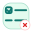
   <code>compliance.task.rejected</code>
   task · rejected
</td>
<td align="center" valign="top" width="16.6%">
  
   <code>compliance.task.completed</code>
   task · completed
</td>
</tr>
<tr>
<td align="center" valign="top" width="16.6%">
  
   <code>compliance.review.draft</code>
   review · draft
</td>
<td align="center" valign="top" width="16.6%">
  
   <code>compliance.review.submitted</code>
   review · submitted
</td>
<td align="center" valign="top" width="16.6%">
  
   <code>compliance.review.verified</code>
   review · verified
</td>
<td align="center" valign="top" width="16.6%">
  
   <code>compliance.review.approved</code>
   review · approved
</td>
<td align="center" valign="top" width="16.6%">
  
   <code>compliance.review.rejected</code>
   review · rejected
</td>
<td align="center" valign="top" width="16.6%">
  
   <code>compliance.review.completed</code>
   review · completed
</td>
</tr>
<tr>
<td align="center" valign="top" width="16.6%">
  
   <code>compliance.approval.draft</code>
   approval · draft
</td>
<td align="center" valign="top" width="16.6%">
  
   <code>compliance.approval.submitted</code>
   approval · submitted
</td>
<td align="center" valign="top" width="16.6%">
  
   <code>compliance.approval.verified</code>
   approval · verified
</td>
<td align="center" valign="top" width="16.6%">
  
   <code>compliance.approval.approved</code>
   approval · approved
</td>
<td align="center" valign="top" width="16.6%">
  
   <code>compliance.approval.rejected</code>
   approval · rejected
</td>
<td align="center" valign="top" width="16.6%">
  
   <code>compliance.approval.completed</code>
   approval · completed
</td>
</tr>
<tr>
<td align="center" valign="top" width="16.6%">
  
   <code>compliance.order.draft</code>
   order · draft
</td>
<td align="center" valign="top" width="16.6%">
  
   <code>compliance.order.submitted</code>
   order · submitted
</td>
<td align="center" valign="top" width="16.6%">
  
   <code>compliance.order.verified</code>
   order · verified
</td>
<td align="center" valign="top" width="16.6%">
  
   <code>compliance.order.approved</code>
   order · approved
</td>
<td align="center" valign="top" width="16.6%">
  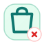
   <code>compliance.order.rejected</code>
   order · rejected
</td>
<td align="center" valign="top" width="16.6%">
  
   <code>compliance.order.completed</code>
   order · completed
</td>
</tr>
<tr>
<td align="center" valign="top" width="16.6%">
  
   <code>compliance.payment.draft</code>
   payment · draft
</td>
<td align="center" valign="top" width="16.6%">
  
   <code>compliance.payment.submitted</code>
   payment · submitted
</td>
<td align="center" valign="top" width="16.6%">
  
   <code>compliance.payment.verified</code>
   payment · verified
</td>
<td align="center" valign="top" width="16.6%">
  
   <code>compliance.payment.approved</code>
   payment · approved
</td>
<td align="center" valign="top" width="16.6%">
  
   <code>compliance.payment.rejected</code>
   payment · rejected
</td>
<td align="center" valign="top" width="16.6%">
  
   <code>compliance.payment.completed</code>
   payment · completed
</td>
</tr>
<tr>
<td align="center" valign="top" width="16.6%">
  
   <code>compliance.invoice.draft</code>
   invoice · draft
</td>
<td align="center" valign="top" width="16.6%">
  
   <code>compliance.invoice.submitted</code>
   invoice · submitted
</td>
<td align="center" valign="top" width="16.6%">
  
   <code>compliance.invoice.verified</code>
   invoice · verified
</td>
<td align="center" valign="top" width="16.6%">
  
   <code>compliance.invoice.approved</code>
   invoice · approved
</td>
<td align="center" valign="top" width="16.6%">
  
   <code>compliance.invoice.rejected</code>
   invoice · rejected
</td>
<td align="center" valign="top" width="16.6%">
  
   <code>compliance.invoice.completed</code>
   invoice · completed
</td>
</tr>
<tr>
<td align="center" valign="top" width="16.6%">
  
   <code>compliance.shipment.draft</code>
   shipment · draft
</td>
<td align="center" valign="top" width="16.6%">
  
   <code>compliance.shipment.submitted</code>
   shipment · submitted
</td>
<td align="center" valign="top" width="16.6%">
  
   <code>compliance.shipment.verified</code>
   shipment · verified
</td>
<td align="center" valign="top" width="16.6%">
  
   <code>compliance.shipment.approved</code>
   shipment · approved
</td>
<td align="center" valign="top" width="16.6%">
  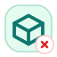
   <code>compliance.shipment.rejected</code>
   shipment · rejected
</td>
<td align="center" valign="top" width="16.6%">
  
   <code>compliance.shipment.completed</code>
   shipment · completed
</td>
</tr>
<tr>
<td align="center" valign="top" width="16.6%">
  
   <code>compliance.ticket.draft</code>
   ticket · draft
</td>
<td align="center" valign="top" width="16.6%">
  
   <code>compliance.ticket.submitted</code>
   ticket · submitted
</td>
<td align="center" valign="top" width="16.6%">
  
   <code>compliance.ticket.verified</code>
   ticket · verified
</td>
<td align="center" valign="top" width="16.6%">
  
   <code>compliance.ticket.approved</code>
   ticket · approved
</td>
<td align="center" valign="top" width="16.6%">
  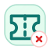
   <code>compliance.ticket.rejected</code>
   ticket · rejected
</td>
<td align="center" valign="top" width="16.6%">
  
   <code>compliance.ticket.completed</code>
   ticket · completed
</td>
</tr>
<tr>
<td align="center" valign="top" width="16.6%">
  
   <code>compliance.document.draft</code>
   document · draft
</td>
<td align="center" valign="top" width="16.6%">
  
   <code>compliance.document.submitted</code>
   document · submitted
</td>
<td align="center" valign="top" width="16.6%">
  
   <code>compliance.document.verified</code>
   document · verified
</td>
<td align="center" valign="top" width="16.6%">
  
   <code>compliance.document.approved</code>
   document · approved
</td>
<td align="center" valign="top" width="16.6%">
  
   <code>compliance.document.rejected</code>
   document · rejected
</td>
<td align="center" valign="top" width="16.6%">
  
   <code>compliance.document.completed</code>
   document · completed
</td>
</tr>
<tr>
<td align="center" valign="top" width="16.6%">
  
   <code>compliance.notification.draft</code>
   notification · draft
</td>
<td align="center" valign="top" width="16.6%">
  
   <code>compliance.notification.submitted</code>
   notification · submitted
</td>
<td align="center" valign="top" width="16.6%">
  
   <code>compliance.notification.verified</code>
   notification · verified
</td>
<td align="center" valign="top" width="16.6%">
  
   <code>compliance.notification.approved</code>
   notification · approved
</td>
<td align="center" valign="top" width="16.6%">
  
   <code>compliance.notification.rejected</code>
   notification · rejected
</td>
<td align="center" valign="top" width="16.6%">
  
   <code>compliance.notification.completed</code>
   notification · completed
</td>
</tr>
<tr>
<td align="center" valign="top" width="16.6%">
  
   <code>compliance.user.draft</code>
   user · draft
</td>
<td align="center" valign="top" width="16.6%">
  
   <code>compliance.user.submitted</code>
   user · submitted
</td>
<td align="center" valign="top" width="16.6%">
  
   <code>compliance.user.verified</code>
   user · verified
</td>
<td align="center" valign="top" width="16.6%">
  
   <code>compliance.user.approved</code>
   user · approved
</td>
<td align="center" valign="top" width="16.6%">
  
   <code>compliance.user.rejected</code>
   user · rejected
</td>
<td align="center" valign="top" width="16.6%">
  
   <code>compliance.user.completed</code>
   user · completed
</td>
</tr>
<tr>
<td align="center" valign="top" width="16.6%">
  
   <code>compliance.role.draft</code>
   role · draft
</td>
<td align="center" valign="top" width="16.6%">
  
   <code>compliance.role.submitted</code>
   role · submitted
</td>
<td align="center" valign="top" width="16.6%">
  
   <code>compliance.role.verified</code>
   role · verified
</td>
<td align="center" valign="top" width="16.6%">
  
   <code>compliance.role.approved</code>
   role · approved
</td>
<td align="center" valign="top" width="16.6%">
  
   <code>compliance.role.rejected</code>
   role · rejected
</td>
<td align="center" valign="top" width="16.6%">
  
   <code>compliance.role.completed</code>
   role · completed
</td>
</tr>
<tr>
<td align="center" valign="top" width="16.6%">
  
   <code>compliance.rule.draft</code>
   rule · draft
</td>
<td align="center" valign="top" width="16.6%">
  
   <code>compliance.rule.submitted</code>
   rule · submitted
</td>
<td align="center" valign="top" width="16.6%">
  
   <code>compliance.rule.verified</code>
   rule · verified
</td>
<td align="center" valign="top" width="16.6%">
  
   <code>compliance.rule.approved</code>
   rule · approved
</td>
<td align="center" valign="top" width="16.6%">
  
   <code>compliance.rule.rejected</code>
   rule · rejected
</td>
<td align="center" valign="top" width="16.6%">
  
   <code>compliance.rule.completed</code>
   rule · completed
</td>
</tr>
<tr>
<td align="center" valign="top" width="16.6%">
  
   <code>compliance.report.draft</code>
   report · draft
</td>
<td align="center" valign="top" width="16.6%">
  
   <code>compliance.report.submitted</code>
   report · submitted
</td>
<td align="center" valign="top" width="16.6%">
  
   <code>compliance.report.verified</code>
   report · verified
</td>
<td align="center" valign="top" width="16.6%">
  
   <code>compliance.report.approved</code>
   report · approved
</td>
<td align="center" valign="top" width="16.6%">
  
   <code>compliance.report.rejected</code>
   report · rejected
</td>
<td align="center" valign="top" width="16.6%">
  
   <code>compliance.report.completed</code>
   report · completed
</td>
</tr>
<tr>
<td align="center" valign="top" width="16.6%">
  
   <code>compliance.record.draft</code>
   record · draft
</td>
<td align="center" valign="top" width="16.6%">
  
   <code>compliance.record.submitted</code>
   record · submitted
</td>
<td align="center" valign="top" width="16.6%">
  
   <code>compliance.record.verified</code>
   record · verified
</td>
<td align="center" valign="top" width="16.6%">
  
   <code>compliance.record.approved</code>
   record · approved
</td>
<td align="center" valign="top" width="16.6%">
  
   <code>compliance.record.rejected</code>
   record · rejected
</td>
<td align="center" valign="top" width="16.6%">
  
   <code>compliance.record.completed</code>
   record · completed
</td>
</tr>
</table>

## Operations

- Domain key: `operations`
- Icon count: `96`
- Recommended domain glyph family: `workflow`

<table>
<tr>
<td align="center" valign="top" width="16.6%">
  
   <code>operations.request.draft</code>
   request · draft
</td>
<td align="center" valign="top" width="16.6%">
  
   <code>operations.request.submitted</code>
   request · submitted
</td>
<td align="center" valign="top" width="16.6%">
  
   <code>operations.request.verified</code>
   request · verified
</td>
<td align="center" valign="top" width="16.6%">
  
   <code>operations.request.approved</code>
   request · approved
</td>
<td align="center" valign="top" width="16.6%">
  
   <code>operations.request.rejected</code>
   request · rejected
</td>
<td align="center" valign="top" width="16.6%">
  
   <code>operations.request.completed</code>
   request · completed
</td>
</tr>
<tr>
<td align="center" valign="top" width="16.6%">
  
   <code>operations.task.draft</code>
   task · draft
</td>
<td align="center" valign="top" width="16.6%">
  
   <code>operations.task.submitted</code>
   task · submitted
</td>
<td align="center" valign="top" width="16.6%">
  
   <code>operations.task.verified</code>
   task · verified
</td>
<td align="center" valign="top" width="16.6%">
  
   <code>operations.task.approved</code>
   task · approved
</td>
<td align="center" valign="top" width="16.6%">
  
   <code>operations.task.rejected</code>
   task · rejected
</td>
<td align="center" valign="top" width="16.6%">
  
   <code>operations.task.completed</code>
   task · completed
</td>
</tr>
<tr>
<td align="center" valign="top" width="16.6%">
  
   <code>operations.review.draft</code>
   review · draft
</td>
<td align="center" valign="top" width="16.6%">
  
   <code>operations.review.submitted</code>
   review · submitted
</td>
<td align="center" valign="top" width="16.6%">
  
   <code>operations.review.verified</code>
   review · verified
</td>
<td align="center" valign="top" width="16.6%">
  
   <code>operations.review.approved</code>
   review · approved
</td>
<td align="center" valign="top" width="16.6%">
  
   <code>operations.review.rejected</code>
   review · rejected
</td>
<td align="center" valign="top" width="16.6%">
  
   <code>operations.review.completed</code>
   review · completed
</td>
</tr>
<tr>
<td align="center" valign="top" width="16.6%">
  
   <code>operations.approval.draft</code>
   approval · draft
</td>
<td align="center" valign="top" width="16.6%">
  
   <code>operations.approval.submitted</code>
   approval · submitted
</td>
<td align="center" valign="top" width="16.6%">
  
   <code>operations.approval.verified</code>
   approval · verified
</td>
<td align="center" valign="top" width="16.6%">
  
   <code>operations.approval.approved</code>
   approval · approved
</td>
<td align="center" valign="top" width="16.6%">
  
   <code>operations.approval.rejected</code>
   approval · rejected
</td>
<td align="center" valign="top" width="16.6%">
  
   <code>operations.approval.completed</code>
   approval · completed
</td>
</tr>
<tr>
<td align="center" valign="top" width="16.6%">
  
   <code>operations.order.draft</code>
   order · draft
</td>
<td align="center" valign="top" width="16.6%">
  
   <code>operations.order.submitted</code>
   order · submitted
</td>
<td align="center" valign="top" width="16.6%">
  
   <code>operations.order.verified</code>
   order · verified
</td>
<td align="center" valign="top" width="16.6%">
  
   <code>operations.order.approved</code>
   order · approved
</td>
<td align="center" valign="top" width="16.6%">
  
   <code>operations.order.rejected</code>
   order · rejected
</td>
<td align="center" valign="top" width="16.6%">
  
   <code>operations.order.completed</code>
   order · completed
</td>
</tr>
<tr>
<td align="center" valign="top" width="16.6%">
  
   <code>operations.payment.draft</code>
   payment · draft
</td>
<td align="center" valign="top" width="16.6%">
  
   <code>operations.payment.submitted</code>
   payment · submitted
</td>
<td align="center" valign="top" width="16.6%">
  
   <code>operations.payment.verified</code>
   payment · verified
</td>
<td align="center" valign="top" width="16.6%">
  
   <code>operations.payment.approved</code>
   payment · approved
</td>
<td align="center" valign="top" width="16.6%">
  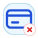
   <code>operations.payment.rejected</code>
   payment · rejected
</td>
<td align="center" valign="top" width="16.6%">
  
   <code>operations.payment.completed</code>
   payment · completed
</td>
</tr>
<tr>
<td align="center" valign="top" width="16.6%">
  
   <code>operations.invoice.draft</code>
   invoice · draft
</td>
<td align="center" valign="top" width="16.6%">
  
   <code>operations.invoice.submitted</code>
   invoice · submitted
</td>
<td align="center" valign="top" width="16.6%">
  
   <code>operations.invoice.verified</code>
   invoice · verified
</td>
<td align="center" valign="top" width="16.6%">
  
   <code>operations.invoice.approved</code>
   invoice · approved
</td>
<td align="center" valign="top" width="16.6%">
  
   <code>operations.invoice.rejected</code>
   invoice · rejected
</td>
<td align="center" valign="top" width="16.6%">
  
   <code>operations.invoice.completed</code>
   invoice · completed
</td>
</tr>
<tr>
<td align="center" valign="top" width="16.6%">
  
   <code>operations.shipment.draft</code>
   shipment · draft
</td>
<td align="center" valign="top" width="16.6%">
  
   <code>operations.shipment.submitted</code>
   shipment · submitted
</td>
<td align="center" valign="top" width="16.6%">
  
   <code>operations.shipment.verified</code>
   shipment · verified
</td>
<td align="center" valign="top" width="16.6%">
  
   <code>operations.shipment.approved</code>
   shipment · approved
</td>
<td align="center" valign="top" width="16.6%">
  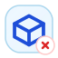
   <code>operations.shipment.rejected</code>
   shipment · rejected
</td>
<td align="center" valign="top" width="16.6%">
  
   <code>operations.shipment.completed</code>
   shipment · completed
</td>
</tr>
<tr>
<td align="center" valign="top" width="16.6%">
  
   <code>operations.ticket.draft</code>
   ticket · draft
</td>
<td align="center" valign="top" width="16.6%">
  
   <code>operations.ticket.submitted</code>
   ticket · submitted
</td>
<td align="center" valign="top" width="16.6%">
  
   <code>operations.ticket.verified</code>
   ticket · verified
</td>
<td align="center" valign="top" width="16.6%">
  
   <code>operations.ticket.approved</code>
   ticket · approved
</td>
<td align="center" valign="top" width="16.6%">
  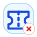
   <code>operations.ticket.rejected</code>
   ticket · rejected
</td>
<td align="center" valign="top" width="16.6%">
  
   <code>operations.ticket.completed</code>
   ticket · completed
</td>
</tr>
<tr>
<td align="center" valign="top" width="16.6%">
  
   <code>operations.document.draft</code>
   document · draft
</td>
<td align="center" valign="top" width="16.6%">
  
   <code>operations.document.submitted</code>
   document · submitted
</td>
<td align="center" valign="top" width="16.6%">
  
   <code>operations.document.verified</code>
   document · verified
</td>
<td align="center" valign="top" width="16.6%">
  
   <code>operations.document.approved</code>
   document · approved
</td>
<td align="center" valign="top" width="16.6%">
  
   <code>operations.document.rejected</code>
   document · rejected
</td>
<td align="center" valign="top" width="16.6%">
  
   <code>operations.document.completed</code>
   document · completed
</td>
</tr>
<tr>
<td align="center" valign="top" width="16.6%">
  
   <code>operations.notification.draft</code>
   notification · draft
</td>
<td align="center" valign="top" width="16.6%">
  
   <code>operations.notification.submitted</code>
   notification · submitted
</td>
<td align="center" valign="top" width="16.6%">
  
   <code>operations.notification.verified</code>
   notification · verified
</td>
<td align="center" valign="top" width="16.6%">
  
   <code>operations.notification.approved</code>
   notification · approved
</td>
<td align="center" valign="top" width="16.6%">
  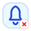
   <code>operations.notification.rejected</code>
   notification · rejected
</td>
<td align="center" valign="top" width="16.6%">
  
   <code>operations.notification.completed</code>
   notification · completed
</td>
</tr>
<tr>
<td align="center" valign="top" width="16.6%">
  
   <code>operations.user.draft</code>
   user · draft
</td>
<td align="center" valign="top" width="16.6%">
  
   <code>operations.user.submitted</code>
   user · submitted
</td>
<td align="center" valign="top" width="16.6%">
  
   <code>operations.user.verified</code>
   user · verified
</td>
<td align="center" valign="top" width="16.6%">
  
   <code>operations.user.approved</code>
   user · approved
</td>
<td align="center" valign="top" width="16.6%">
  
   <code>operations.user.rejected</code>
   user · rejected
</td>
<td align="center" valign="top" width="16.6%">
  
   <code>operations.user.completed</code>
   user · completed
</td>
</tr>
<tr>
<td align="center" valign="top" width="16.6%">
  
   <code>operations.role.draft</code>
   role · draft
</td>
<td align="center" valign="top" width="16.6%">
  
   <code>operations.role.submitted</code>
   role · submitted
</td>
<td align="center" valign="top" width="16.6%">
  
   <code>operations.role.verified</code>
   role · verified
</td>
<td align="center" valign="top" width="16.6%">
  
   <code>operations.role.approved</code>
   role · approved
</td>
<td align="center" valign="top" width="16.6%">
  
   <code>operations.role.rejected</code>
   role · rejected
</td>
<td align="center" valign="top" width="16.6%">
  
   <code>operations.role.completed</code>
   role · completed
</td>
</tr>
<tr>
<td align="center" valign="top" width="16.6%">
  
   <code>operations.rule.draft</code>
   rule · draft
</td>
<td align="center" valign="top" width="16.6%">
  
   <code>operations.rule.submitted</code>
   rule · submitted
</td>
<td align="center" valign="top" width="16.6%">
  
   <code>operations.rule.verified</code>
   rule · verified
</td>
<td align="center" valign="top" width="16.6%">
  
   <code>operations.rule.approved</code>
   rule · approved
</td>
<td align="center" valign="top" width="16.6%">
  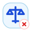
   <code>operations.rule.rejected</code>
   rule · rejected
</td>
<td align="center" valign="top" width="16.6%">
  
   <code>operations.rule.completed</code>
   rule · completed
</td>
</tr>
<tr>
<td align="center" valign="top" width="16.6%">
  
   <code>operations.report.draft</code>
   report · draft
</td>
<td align="center" valign="top" width="16.6%">
  
   <code>operations.report.submitted</code>
   report · submitted
</td>
<td align="center" valign="top" width="16.6%">
  
   <code>operations.report.verified</code>
   report · verified
</td>
<td align="center" valign="top" width="16.6%">
  
   <code>operations.report.approved</code>
   report · approved
</td>
<td align="center" valign="top" width="16.6%">
  
   <code>operations.report.rejected</code>
   report · rejected
</td>
<td align="center" valign="top" width="16.6%">
  
   <code>operations.report.completed</code>
   report · completed
</td>
</tr>
<tr>
<td align="center" valign="top" width="16.6%">
  
   <code>operations.record.draft</code>
   record · draft
</td>
<td align="center" valign="top" width="16.6%">
  
   <code>operations.record.submitted</code>
   record · submitted
</td>
<td align="center" valign="top" width="16.6%">
  
   <code>operations.record.verified</code>
   record · verified
</td>
<td align="center" valign="top" width="16.6%">
  
   <code>operations.record.approved</code>
   record · approved
</td>
<td align="center" valign="top" width="16.6%">
  
   <code>operations.record.rejected</code>
   record · rejected
</td>
<td align="center" valign="top" width="16.6%">
  
   <code>operations.record.completed</code>
   record · completed
</td>
</tr>
</table>

## Fulfillment

- Domain key: `fulfillment`
- Icon count: `96`
- Recommended domain glyph family: `package`

<table>
<tr>
<td align="center" valign="top" width="16.6%">
  
   <code>fulfillment.request.draft</code>
   request · draft
</td>
<td align="center" valign="top" width="16.6%">
  
   <code>fulfillment.request.submitted</code>
   request · submitted
</td>
<td align="center" valign="top" width="16.6%">
  
   <code>fulfillment.request.verified</code>
   request · verified
</td>
<td align="center" valign="top" width="16.6%">
  
   <code>fulfillment.request.approved</code>
   request · approved
</td>
<td align="center" valign="top" width="16.6%">
  
   <code>fulfillment.request.rejected</code>
   request · rejected
</td>
<td align="center" valign="top" width="16.6%">
  
   <code>fulfillment.request.completed</code>
   request · completed
</td>
</tr>
<tr>
<td align="center" valign="top" width="16.6%">
  
   <code>fulfillment.task.draft</code>
   task · draft
</td>
<td align="center" valign="top" width="16.6%">
  
   <code>fulfillment.task.submitted</code>
   task · submitted
</td>
<td align="center" valign="top" width="16.6%">
  
   <code>fulfillment.task.verified</code>
   task · verified
</td>
<td align="center" valign="top" width="16.6%">
  
   <code>fulfillment.task.approved</code>
   task · approved
</td>
<td align="center" valign="top" width="16.6%">
  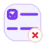
   <code>fulfillment.task.rejected</code>
   task · rejected
</td>
<td align="center" valign="top" width="16.6%">
  
   <code>fulfillment.task.completed</code>
   task · completed
</td>
</tr>
<tr>
<td align="center" valign="top" width="16.6%">
  
   <code>fulfillment.review.draft</code>
   review · draft
</td>
<td align="center" valign="top" width="16.6%">
  
   <code>fulfillment.review.submitted</code>
   review · submitted
</td>
<td align="center" valign="top" width="16.6%">
  
   <code>fulfillment.review.verified</code>
   review · verified
</td>
<td align="center" valign="top" width="16.6%">
  
   <code>fulfillment.review.approved</code>
   review · approved
</td>
<td align="center" valign="top" width="16.6%">
  
   <code>fulfillment.review.rejected</code>
   review · rejected
</td>
<td align="center" valign="top" width="16.6%">
  
   <code>fulfillment.review.completed</code>
   review · completed
</td>
</tr>
<tr>
<td align="center" valign="top" width="16.6%">
  
   <code>fulfillment.approval.draft</code>
   approval · draft
</td>
<td align="center" valign="top" width="16.6%">
  
   <code>fulfillment.approval.submitted</code>
   approval · submitted
</td>
<td align="center" valign="top" width="16.6%">
  
   <code>fulfillment.approval.verified</code>
   approval · verified
</td>
<td align="center" valign="top" width="16.6%">
  
   <code>fulfillment.approval.approved</code>
   approval · approved
</td>
<td align="center" valign="top" width="16.6%">
  
   <code>fulfillment.approval.rejected</code>
   approval · rejected
</td>
<td align="center" valign="top" width="16.6%">
  
   <code>fulfillment.approval.completed</code>
   approval · completed
</td>
</tr>
<tr>
<td align="center" valign="top" width="16.6%">
  
   <code>fulfillment.order.draft</code>
   order · draft
</td>
<td align="center" valign="top" width="16.6%">
  
   <code>fulfillment.order.submitted</code>
   order · submitted
</td>
<td align="center" valign="top" width="16.6%">
  
   <code>fulfillment.order.verified</code>
   order · verified
</td>
<td align="center" valign="top" width="16.6%">
  
   <code>fulfillment.order.approved</code>
   order · approved
</td>
<td align="center" valign="top" width="16.6%">
  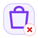
   <code>fulfillment.order.rejected</code>
   order · rejected
</td>
<td align="center" valign="top" width="16.6%">
  
   <code>fulfillment.order.completed</code>
   order · completed
</td>
</tr>
<tr>
<td align="center" valign="top" width="16.6%">
  
   <code>fulfillment.payment.draft</code>
   payment · draft
</td>
<td align="center" valign="top" width="16.6%">
  
   <code>fulfillment.payment.submitted</code>
   payment · submitted
</td>
<td align="center" valign="top" width="16.6%">
  
   <code>fulfillment.payment.verified</code>
   payment · verified
</td>
<td align="center" valign="top" width="16.6%">
  
   <code>fulfillment.payment.approved</code>
   payment · approved
</td>
<td align="center" valign="top" width="16.6%">
  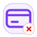
   <code>fulfillment.payment.rejected</code>
   payment · rejected
</td>
<td align="center" valign="top" width="16.6%">
  
   <code>fulfillment.payment.completed</code>
   payment · completed
</td>
</tr>
<tr>
<td align="center" valign="top" width="16.6%">
  
   <code>fulfillment.invoice.draft</code>
   invoice · draft
</td>
<td align="center" valign="top" width="16.6%">
  
   <code>fulfillment.invoice.submitted</code>
   invoice · submitted
</td>
<td align="center" valign="top" width="16.6%">
  
   <code>fulfillment.invoice.verified</code>
   invoice · verified
</td>
<td align="center" valign="top" width="16.6%">
  
   <code>fulfillment.invoice.approved</code>
   invoice · approved
</td>
<td align="center" valign="top" width="16.6%">
  
   <code>fulfillment.invoice.rejected</code>
   invoice · rejected
</td>
<td align="center" valign="top" width="16.6%">
  
   <code>fulfillment.invoice.completed</code>
   invoice · completed
</td>
</tr>
<tr>
<td align="center" valign="top" width="16.6%">
  
   <code>fulfillment.shipment.draft</code>
   shipment · draft
</td>
<td align="center" valign="top" width="16.6%">
  
   <code>fulfillment.shipment.submitted</code>
   shipment · submitted
</td>
<td align="center" valign="top" width="16.6%">
  
   <code>fulfillment.shipment.verified</code>
   shipment · verified
</td>
<td align="center" valign="top" width="16.6%">
  
   <code>fulfillment.shipment.approved</code>
   shipment · approved
</td>
<td align="center" valign="top" width="16.6%">
  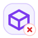
   <code>fulfillment.shipment.rejected</code>
   shipment · rejected
</td>
<td align="center" valign="top" width="16.6%">
  
   <code>fulfillment.shipment.completed</code>
   shipment · completed
</td>
</tr>
<tr>
<td align="center" valign="top" width="16.6%">
  
   <code>fulfillment.ticket.draft</code>
   ticket · draft
</td>
<td align="center" valign="top" width="16.6%">
  
   <code>fulfillment.ticket.submitted</code>
   ticket · submitted
</td>
<td align="center" valign="top" width="16.6%">
  
   <code>fulfillment.ticket.verified</code>
   ticket · verified
</td>
<td align="center" valign="top" width="16.6%">
  
   <code>fulfillment.ticket.approved</code>
   ticket · approved
</td>
<td align="center" valign="top" width="16.6%">
  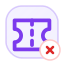
   <code>fulfillment.ticket.rejected</code>
   ticket · rejected
</td>
<td align="center" valign="top" width="16.6%">
  
   <code>fulfillment.ticket.completed</code>
   ticket · completed
</td>
</tr>
<tr>
<td align="center" valign="top" width="16.6%">
  
   <code>fulfillment.document.draft</code>
   document · draft
</td>
<td align="center" valign="top" width="16.6%">
  
   <code>fulfillment.document.submitted</code>
   document · submitted
</td>
<td align="center" valign="top" width="16.6%">
  
   <code>fulfillment.document.verified</code>
   document · verified
</td>
<td align="center" valign="top" width="16.6%">
  
   <code>fulfillment.document.approved</code>
   document · approved
</td>
<td align="center" valign="top" width="16.6%">
  
   <code>fulfillment.document.rejected</code>
   document · rejected
</td>
<td align="center" valign="top" width="16.6%">
  
   <code>fulfillment.document.completed</code>
   document · completed
</td>
</tr>
<tr>
<td align="center" valign="top" width="16.6%">
  
   <code>fulfillment.notification.draft</code>
   notification · draft
</td>
<td align="center" valign="top" width="16.6%">
  
   <code>fulfillment.notification.submitted</code>
   notification · submitted
</td>
<td align="center" valign="top" width="16.6%">
  
   <code>fulfillment.notification.verified</code>
   notification · verified
</td>
<td align="center" valign="top" width="16.6%">
  
   <code>fulfillment.notification.approved</code>
   notification · approved
</td>
<td align="center" valign="top" width="16.6%">
  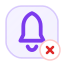
   <code>fulfillment.notification.rejected</code>
   notification · rejected
</td>
<td align="center" valign="top" width="16.6%">
  
   <code>fulfillment.notification.completed</code>
   notification · completed
</td>
</tr>
<tr>
<td align="center" valign="top" width="16.6%">
  
   <code>fulfillment.user.draft</code>
   user · draft
</td>
<td align="center" valign="top" width="16.6%">
  
   <code>fulfillment.user.submitted</code>
   user · submitted
</td>
<td align="center" valign="top" width="16.6%">
  
   <code>fulfillment.user.verified</code>
   user · verified
</td>
<td align="center" valign="top" width="16.6%">
  
   <code>fulfillment.user.approved</code>
   user · approved
</td>
<td align="center" valign="top" width="16.6%">
  
   <code>fulfillment.user.rejected</code>
   user · rejected
</td>
<td align="center" valign="top" width="16.6%">
  
   <code>fulfillment.user.completed</code>
   user · completed
</td>
</tr>
<tr>
<td align="center" valign="top" width="16.6%">
  
   <code>fulfillment.role.draft</code>
   role · draft
</td>
<td align="center" valign="top" width="16.6%">
  
   <code>fulfillment.role.submitted</code>
   role · submitted
</td>
<td align="center" valign="top" width="16.6%">
  
   <code>fulfillment.role.verified</code>
   role · verified
</td>
<td align="center" valign="top" width="16.6%">
  
   <code>fulfillment.role.approved</code>
   role · approved
</td>
<td align="center" valign="top" width="16.6%">
  
   <code>fulfillment.role.rejected</code>
   role · rejected
</td>
<td align="center" valign="top" width="16.6%">
  
   <code>fulfillment.role.completed</code>
   role · completed
</td>
</tr>
<tr>
<td align="center" valign="top" width="16.6%">
  
   <code>fulfillment.rule.draft</code>
   rule · draft
</td>
<td align="center" valign="top" width="16.6%">
  
   <code>fulfillment.rule.submitted</code>
   rule · submitted
</td>
<td align="center" valign="top" width="16.6%">
  
   <code>fulfillment.rule.verified</code>
   rule · verified
</td>
<td align="center" valign="top" width="16.6%">
  
   <code>fulfillment.rule.approved</code>
   rule · approved
</td>
<td align="center" valign="top" width="16.6%">
  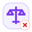
   <code>fulfillment.rule.rejected</code>
   rule · rejected
</td>
<td align="center" valign="top" width="16.6%">
  
   <code>fulfillment.rule.completed</code>
   rule · completed
</td>
</tr>
<tr>
<td align="center" valign="top" width="16.6%">
  
   <code>fulfillment.report.draft</code>
   report · draft
</td>
<td align="center" valign="top" width="16.6%">
  
   <code>fulfillment.report.submitted</code>
   report · submitted
</td>
<td align="center" valign="top" width="16.6%">
  
   <code>fulfillment.report.verified</code>
   report · verified
</td>
<td align="center" valign="top" width="16.6%">
  
   <code>fulfillment.report.approved</code>
   report · approved
</td>
<td align="center" valign="top" width="16.6%">
  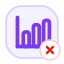
   <code>fulfillment.report.rejected</code>
   report · rejected
</td>
<td align="center" valign="top" width="16.6%">
  
   <code>fulfillment.report.completed</code>
   report · completed
</td>
</tr>
<tr>
<td align="center" valign="top" width="16.6%">
  
   <code>fulfillment.record.draft</code>
   record · draft
</td>
<td align="center" valign="top" width="16.6%">
  
   <code>fulfillment.record.submitted</code>
   record · submitted
</td>
<td align="center" valign="top" width="16.6%">
  
   <code>fulfillment.record.verified</code>
   record · verified
</td>
<td align="center" valign="top" width="16.6%">
  
   <code>fulfillment.record.approved</code>
   record · approved
</td>
<td align="center" valign="top" width="16.6%">
  
   <code>fulfillment.record.rejected</code>
   record · rejected
</td>
<td align="center" valign="top" width="16.6%">
  
   <code>fulfillment.record.completed</code>
   record · completed
</td>
</tr>
</table>

## Support

- Domain key: `support`
- Icon count: `96`
- Recommended domain glyph family: `life-buoy`

<table>
<tr>
<td align="center" valign="top" width="16.6%">
  
   <code>support.request.draft</code>
   request · draft
</td>
<td align="center" valign="top" width="16.6%">
  
   <code>support.request.submitted</code>
   request · submitted
</td>
<td align="center" valign="top" width="16.6%">
  
   <code>support.request.verified</code>
   request · verified
</td>
<td align="center" valign="top" width="16.6%">
  
   <code>support.request.approved</code>
   request · approved
</td>
<td align="center" valign="top" width="16.6%">
  
   <code>support.request.rejected</code>
   request · rejected
</td>
<td align="center" valign="top" width="16.6%">
  
   <code>support.request.completed</code>
   request · completed
</td>
</tr>
<tr>
<td align="center" valign="top" width="16.6%">
  
   <code>support.task.draft</code>
   task · draft
</td>
<td align="center" valign="top" width="16.6%">
  
   <code>support.task.submitted</code>
   task · submitted
</td>
<td align="center" valign="top" width="16.6%">
  
   <code>support.task.verified</code>
   task · verified
</td>
<td align="center" valign="top" width="16.6%">
  
   <code>support.task.approved</code>
   task · approved
</td>
<td align="center" valign="top" width="16.6%">
  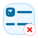
   <code>support.task.rejected</code>
   task · rejected
</td>
<td align="center" valign="top" width="16.6%">
  
   <code>support.task.completed</code>
   task · completed
</td>
</tr>
<tr>
<td align="center" valign="top" width="16.6%">
  
   <code>support.review.draft</code>
   review · draft
</td>
<td align="center" valign="top" width="16.6%">
  
   <code>support.review.submitted</code>
   review · submitted
</td>
<td align="center" valign="top" width="16.6%">
  
   <code>support.review.verified</code>
   review · verified
</td>
<td align="center" valign="top" width="16.6%">
  
   <code>support.review.approved</code>
   review · approved
</td>
<td align="center" valign="top" width="16.6%">
  
   <code>support.review.rejected</code>
   review · rejected
</td>
<td align="center" valign="top" width="16.6%">
  
   <code>support.review.completed</code>
   review · completed
</td>
</tr>
<tr>
<td align="center" valign="top" width="16.6%">
  
   <code>support.approval.draft</code>
   approval · draft
</td>
<td align="center" valign="top" width="16.6%">
  
   <code>support.approval.submitted</code>
   approval · submitted
</td>
<td align="center" valign="top" width="16.6%">
  
   <code>support.approval.verified</code>
   approval · verified
</td>
<td align="center" valign="top" width="16.6%">
  
   <code>support.approval.approved</code>
   approval · approved
</td>
<td align="center" valign="top" width="16.6%">
  
   <code>support.approval.rejected</code>
   approval · rejected
</td>
<td align="center" valign="top" width="16.6%">
  
   <code>support.approval.completed</code>
   approval · completed
</td>
</tr>
<tr>
<td align="center" valign="top" width="16.6%">
  
   <code>support.order.draft</code>
   order · draft
</td>
<td align="center" valign="top" width="16.6%">
  
   <code>support.order.submitted</code>
   order · submitted
</td>
<td align="center" valign="top" width="16.6%">
  
   <code>support.order.verified</code>
   order · verified
</td>
<td align="center" valign="top" width="16.6%">
  
   <code>support.order.approved</code>
   order · approved
</td>
<td align="center" valign="top" width="16.6%">
  
   <code>support.order.rejected</code>
   order · rejected
</td>
<td align="center" valign="top" width="16.6%">
  
   <code>support.order.completed</code>
   order · completed
</td>
</tr>
<tr>
<td align="center" valign="top" width="16.6%">
  
   <code>support.payment.draft</code>
   payment · draft
</td>
<td align="center" valign="top" width="16.6%">
  
   <code>support.payment.submitted</code>
   payment · submitted
</td>
<td align="center" valign="top" width="16.6%">
  
   <code>support.payment.verified</code>
   payment · verified
</td>
<td align="center" valign="top" width="16.6%">
  
   <code>support.payment.approved</code>
   payment · approved
</td>
<td align="center" valign="top" width="16.6%">
  
   <code>support.payment.rejected</code>
   payment · rejected
</td>
<td align="center" valign="top" width="16.6%">
  
   <code>support.payment.completed</code>
   payment · completed
</td>
</tr>
<tr>
<td align="center" valign="top" width="16.6%">
  
   <code>support.invoice.draft</code>
   invoice · draft
</td>
<td align="center" valign="top" width="16.6%">
  
   <code>support.invoice.submitted</code>
   invoice · submitted
</td>
<td align="center" valign="top" width="16.6%">
  
   <code>support.invoice.verified</code>
   invoice · verified
</td>
<td align="center" valign="top" width="16.6%">
  
   <code>support.invoice.approved</code>
   invoice · approved
</td>
<td align="center" valign="top" width="16.6%">
  
   <code>support.invoice.rejected</code>
   invoice · rejected
</td>
<td align="center" valign="top" width="16.6%">
  
   <code>support.invoice.completed</code>
   invoice · completed
</td>
</tr>
<tr>
<td align="center" valign="top" width="16.6%">
  
   <code>support.shipment.draft</code>
   shipment · draft
</td>
<td align="center" valign="top" width="16.6%">
  
   <code>support.shipment.submitted</code>
   shipment · submitted
</td>
<td align="center" valign="top" width="16.6%">
  
   <code>support.shipment.verified</code>
   shipment · verified
</td>
<td align="center" valign="top" width="16.6%">
  
   <code>support.shipment.approved</code>
   shipment · approved
</td>
<td align="center" valign="top" width="16.6%">
  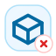
   <code>support.shipment.rejected</code>
   shipment · rejected
</td>
<td align="center" valign="top" width="16.6%">
  
   <code>support.shipment.completed</code>
   shipment · completed
</td>
</tr>
<tr>
<td align="center" valign="top" width="16.6%">
  
   <code>support.ticket.draft</code>
   ticket · draft
</td>
<td align="center" valign="top" width="16.6%">
  
   <code>support.ticket.submitted</code>
   ticket · submitted
</td>
<td align="center" valign="top" width="16.6%">
  
   <code>support.ticket.verified</code>
   ticket · verified
</td>
<td align="center" valign="top" width="16.6%">
  
   <code>support.ticket.approved</code>
   ticket · approved
</td>
<td align="center" valign="top" width="16.6%">
  
   <code>support.ticket.rejected</code>
   ticket · rejected
</td>
<td align="center" valign="top" width="16.6%">
  
   <code>support.ticket.completed</code>
   ticket · completed
</td>
</tr>
<tr>
<td align="center" valign="top" width="16.6%">
  
   <code>support.document.draft</code>
   document · draft
</td>
<td align="center" valign="top" width="16.6%">
  
   <code>support.document.submitted</code>
   document · submitted
</td>
<td align="center" valign="top" width="16.6%">
  
   <code>support.document.verified</code>
   document · verified
</td>
<td align="center" valign="top" width="16.6%">
  
   <code>support.document.approved</code>
   document · approved
</td>
<td align="center" valign="top" width="16.6%">
  
   <code>support.document.rejected</code>
   document · rejected
</td>
<td align="center" valign="top" width="16.6%">
  
   <code>support.document.completed</code>
   document · completed
</td>
</tr>
<tr>
<td align="center" valign="top" width="16.6%">
  
   <code>support.notification.draft</code>
   notification · draft
</td>
<td align="center" valign="top" width="16.6%">
  
   <code>support.notification.submitted</code>
   notification · submitted
</td>
<td align="center" valign="top" width="16.6%">
  
   <code>support.notification.verified</code>
   notification · verified
</td>
<td align="center" valign="top" width="16.6%">
  
   <code>support.notification.approved</code>
   notification · approved
</td>
<td align="center" valign="top" width="16.6%">
  
   <code>support.notification.rejected</code>
   notification · rejected
</td>
<td align="center" valign="top" width="16.6%">
  
   <code>support.notification.completed</code>
   notification · completed
</td>
</tr>
<tr>
<td align="center" valign="top" width="16.6%">
  
   <code>support.user.draft</code>
   user · draft
</td>
<td align="center" valign="top" width="16.6%">
  
   <code>support.user.submitted</code>
   user · submitted
</td>
<td align="center" valign="top" width="16.6%">
  
   <code>support.user.verified</code>
   user · verified
</td>
<td align="center" valign="top" width="16.6%">
  
   <code>support.user.approved</code>
   user · approved
</td>
<td align="center" valign="top" width="16.6%">
  
   <code>support.user.rejected</code>
   user · rejected
</td>
<td align="center" valign="top" width="16.6%">
  
   <code>support.user.completed</code>
   user · completed
</td>
</tr>
<tr>
<td align="center" valign="top" width="16.6%">
  
   <code>support.role.draft</code>
   role · draft
</td>
<td align="center" valign="top" width="16.6%">
  
   <code>support.role.submitted</code>
   role · submitted
</td>
<td align="center" valign="top" width="16.6%">
  
   <code>support.role.verified</code>
   role · verified
</td>
<td align="center" valign="top" width="16.6%">
  
   <code>support.role.approved</code>
   role · approved
</td>
<td align="center" valign="top" width="16.6%">
  
   <code>support.role.rejected</code>
   role · rejected
</td>
<td align="center" valign="top" width="16.6%">
  
   <code>support.role.completed</code>
   role · completed
</td>
</tr>
<tr>
<td align="center" valign="top" width="16.6%">
  
   <code>support.rule.draft</code>
   rule · draft
</td>
<td align="center" valign="top" width="16.6%">
  
   <code>support.rule.submitted</code>
   rule · submitted
</td>
<td align="center" valign="top" width="16.6%">
  
   <code>support.rule.verified</code>
   rule · verified
</td>
<td align="center" valign="top" width="16.6%">
  
   <code>support.rule.approved</code>
   rule · approved
</td>
<td align="center" valign="top" width="16.6%">
  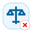
   <code>support.rule.rejected</code>
   rule · rejected
</td>
<td align="center" valign="top" width="16.6%">
  
   <code>support.rule.completed</code>
   rule · completed
</td>
</tr>
<tr>
<td align="center" valign="top" width="16.6%">
  
   <code>support.report.draft</code>
   report · draft
</td>
<td align="center" valign="top" width="16.6%">
  
   <code>support.report.submitted</code>
   report · submitted
</td>
<td align="center" valign="top" width="16.6%">
  
   <code>support.report.verified</code>
   report · verified
</td>
<td align="center" valign="top" width="16.6%">
  
   <code>support.report.approved</code>
   report · approved
</td>
<td align="center" valign="top" width="16.6%">
  
   <code>support.report.rejected</code>
   report · rejected
</td>
<td align="center" valign="top" width="16.6%">
  
   <code>support.report.completed</code>
   report · completed
</td>
</tr>
<tr>
<td align="center" valign="top" width="16.6%">
  
   <code>support.record.draft</code>
   record · draft
</td>
<td align="center" valign="top" width="16.6%">
  
   <code>support.record.submitted</code>
   record · submitted
</td>
<td align="center" valign="top" width="16.6%">
  
   <code>support.record.verified</code>
   record · verified
</td>
<td align="center" valign="top" width="16.6%">
  
   <code>support.record.approved</code>
   record · approved
</td>
<td align="center" valign="top" width="16.6%">
  
   <code>support.record.rejected</code>
   record · rejected
</td>
<td align="center" valign="top" width="16.6%">
  
   <code>support.record.completed</code>
   record · completed
</td>
</tr>
</table>

## Marketing

- Domain key: `marketing`
- Icon count: `96`
- Recommended domain glyph family: `megaphone`

<table>
<tr>
<td align="center" valign="top" width="16.6%">
  
   <code>marketing.request.draft</code>
   request · draft
</td>
<td align="center" valign="top" width="16.6%">
  
   <code>marketing.request.submitted</code>
   request · submitted
</td>
<td align="center" valign="top" width="16.6%">
  
   <code>marketing.request.verified</code>
   request · verified
</td>
<td align="center" valign="top" width="16.6%">
  
   <code>marketing.request.approved</code>
   request · approved
</td>
<td align="center" valign="top" width="16.6%">
  
   <code>marketing.request.rejected</code>
   request · rejected
</td>
<td align="center" valign="top" width="16.6%">
  
   <code>marketing.request.completed</code>
   request · completed
</td>
</tr>
<tr>
<td align="center" valign="top" width="16.6%">
  
   <code>marketing.task.draft</code>
   task · draft
</td>
<td align="center" valign="top" width="16.6%">
  
   <code>marketing.task.submitted</code>
   task · submitted
</td>
<td align="center" valign="top" width="16.6%">
  
   <code>marketing.task.verified</code>
   task · verified
</td>
<td align="center" valign="top" width="16.6%">
  
   <code>marketing.task.approved</code>
   task · approved
</td>
<td align="center" valign="top" width="16.6%">
  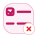
   <code>marketing.task.rejected</code>
   task · rejected
</td>
<td align="center" valign="top" width="16.6%">
  
   <code>marketing.task.completed</code>
   task · completed
</td>
</tr>
<tr>
<td align="center" valign="top" width="16.6%">
  
   <code>marketing.review.draft</code>
   review · draft
</td>
<td align="center" valign="top" width="16.6%">
  
   <code>marketing.review.submitted</code>
   review · submitted
</td>
<td align="center" valign="top" width="16.6%">
  
   <code>marketing.review.verified</code>
   review · verified
</td>
<td align="center" valign="top" width="16.6%">
  
   <code>marketing.review.approved</code>
   review · approved
</td>
<td align="center" valign="top" width="16.6%">
  
   <code>marketing.review.rejected</code>
   review · rejected
</td>
<td align="center" valign="top" width="16.6%">
  
   <code>marketing.review.completed</code>
   review · completed
</td>
</tr>
<tr>
<td align="center" valign="top" width="16.6%">
  
   <code>marketing.approval.draft</code>
   approval · draft
</td>
<td align="center" valign="top" width="16.6%">
  
   <code>marketing.approval.submitted</code>
   approval · submitted
</td>
<td align="center" valign="top" width="16.6%">
  
   <code>marketing.approval.verified</code>
   approval · verified
</td>
<td align="center" valign="top" width="16.6%">
  
   <code>marketing.approval.approved</code>
   approval · approved
</td>
<td align="center" valign="top" width="16.6%">
  
   <code>marketing.approval.rejected</code>
   approval · rejected
</td>
<td align="center" valign="top" width="16.6%">
  
   <code>marketing.approval.completed</code>
   approval · completed
</td>
</tr>
<tr>
<td align="center" valign="top" width="16.6%">
  
   <code>marketing.order.draft</code>
   order · draft
</td>
<td align="center" valign="top" width="16.6%">
  
   <code>marketing.order.submitted</code>
   order · submitted
</td>
<td align="center" valign="top" width="16.6%">
  
   <code>marketing.order.verified</code>
   order · verified
</td>
<td align="center" valign="top" width="16.6%">
  
   <code>marketing.order.approved</code>
   order · approved
</td>
<td align="center" valign="top" width="16.6%">
  
   <code>marketing.order.rejected</code>
   order · rejected
</td>
<td align="center" valign="top" width="16.6%">
  
   <code>marketing.order.completed</code>
   order · completed
</td>
</tr>
<tr>
<td align="center" valign="top" width="16.6%">
  
   <code>marketing.payment.draft</code>
   payment · draft
</td>
<td align="center" valign="top" width="16.6%">
  
   <code>marketing.payment.submitted</code>
   payment · submitted
</td>
<td align="center" valign="top" width="16.6%">
  
   <code>marketing.payment.verified</code>
   payment · verified
</td>
<td align="center" valign="top" width="16.6%">
  
   <code>marketing.payment.approved</code>
   payment · approved
</td>
<td align="center" valign="top" width="16.6%">
  
   <code>marketing.payment.rejected</code>
   payment · rejected
</td>
<td align="center" valign="top" width="16.6%">
  
   <code>marketing.payment.completed</code>
   payment · completed
</td>
</tr>
<tr>
<td align="center" valign="top" width="16.6%">
  
   <code>marketing.invoice.draft</code>
   invoice · draft
</td>
<td align="center" valign="top" width="16.6%">
  
   <code>marketing.invoice.submitted</code>
   invoice · submitted
</td>
<td align="center" valign="top" width="16.6%">
  
   <code>marketing.invoice.verified</code>
   invoice · verified
</td>
<td align="center" valign="top" width="16.6%">
  
   <code>marketing.invoice.approved</code>
   invoice · approved
</td>
<td align="center" valign="top" width="16.6%">
  
   <code>marketing.invoice.rejected</code>
   invoice · rejected
</td>
<td align="center" valign="top" width="16.6%">
  
   <code>marketing.invoice.completed</code>
   invoice · completed
</td>
</tr>
<tr>
<td align="center" valign="top" width="16.6%">
  
   <code>marketing.shipment.draft</code>
   shipment · draft
</td>
<td align="center" valign="top" width="16.6%">
  
   <code>marketing.shipment.submitted</code>
   shipment · submitted
</td>
<td align="center" valign="top" width="16.6%">
  
   <code>marketing.shipment.verified</code>
   shipment · verified
</td>
<td align="center" valign="top" width="16.6%">
  
   <code>marketing.shipment.approved</code>
   shipment · approved
</td>
<td align="center" valign="top" width="16.6%">
  
   <code>marketing.shipment.rejected</code>
   shipment · rejected
</td>
<td align="center" valign="top" width="16.6%">
  
   <code>marketing.shipment.completed</code>
   shipment · completed
</td>
</tr>
<tr>
<td align="center" valign="top" width="16.6%">
  
   <code>marketing.ticket.draft</code>
   ticket · draft
</td>
<td align="center" valign="top" width="16.6%">
  
   <code>marketing.ticket.submitted</code>
   ticket · submitted
</td>
<td align="center" valign="top" width="16.6%">
  
   <code>marketing.ticket.verified</code>
   ticket · verified
</td>
<td align="center" valign="top" width="16.6%">
  
   <code>marketing.ticket.approved</code>
   ticket · approved
</td>
<td align="center" valign="top" width="16.6%">
  
   <code>marketing.ticket.rejected</code>
   ticket · rejected
</td>
<td align="center" valign="top" width="16.6%">
  
   <code>marketing.ticket.completed</code>
   ticket · completed
</td>
</tr>
<tr>
<td align="center" valign="top" width="16.6%">
  
   <code>marketing.document.draft</code>
   document · draft
</td>
<td align="center" valign="top" width="16.6%">
  
   <code>marketing.document.submitted</code>
   document · submitted
</td>
<td align="center" valign="top" width="16.6%">
  
   <code>marketing.document.verified</code>
   document · verified
</td>
<td align="center" valign="top" width="16.6%">
  
   <code>marketing.document.approved</code>
   document · approved
</td>
<td align="center" valign="top" width="16.6%">
  
   <code>marketing.document.rejected</code>
   document · rejected
</td>
<td align="center" valign="top" width="16.6%">
  
   <code>marketing.document.completed</code>
   document · completed
</td>
</tr>
<tr>
<td align="center" valign="top" width="16.6%">
  
   <code>marketing.notification.draft</code>
   notification · draft
</td>
<td align="center" valign="top" width="16.6%">
  
   <code>marketing.notification.submitted</code>
   notification · submitted
</td>
<td align="center" valign="top" width="16.6%">
  
   <code>marketing.notification.verified</code>
   notification · verified
</td>
<td align="center" valign="top" width="16.6%">
  
   <code>marketing.notification.approved</code>
   notification · approved
</td>
<td align="center" valign="top" width="16.6%">
  
   <code>marketing.notification.rejected</code>
   notification · rejected
</td>
<td align="center" valign="top" width="16.6%">
  
   <code>marketing.notification.completed</code>
   notification · completed
</td>
</tr>
<tr>
<td align="center" valign="top" width="16.6%">
  
   <code>marketing.user.draft</code>
   user · draft
</td>
<td align="center" valign="top" width="16.6%">
  
   <code>marketing.user.submitted</code>
   user · submitted
</td>
<td align="center" valign="top" width="16.6%">
  
   <code>marketing.user.verified</code>
   user · verified
</td>
<td align="center" valign="top" width="16.6%">
  
   <code>marketing.user.approved</code>
   user · approved
</td>
<td align="center" valign="top" width="16.6%">
  
   <code>marketing.user.rejected</code>
   user · rejected
</td>
<td align="center" valign="top" width="16.6%">
  
   <code>marketing.user.completed</code>
   user · completed
</td>
</tr>
<tr>
<td align="center" valign="top" width="16.6%">
  
   <code>marketing.role.draft</code>
   role · draft
</td>
<td align="center" valign="top" width="16.6%">
  
   <code>marketing.role.submitted</code>
   role · submitted
</td>
<td align="center" valign="top" width="16.6%">
  
   <code>marketing.role.verified</code>
   role · verified
</td>
<td align="center" valign="top" width="16.6%">
  
   <code>marketing.role.approved</code>
   role · approved
</td>
<td align="center" valign="top" width="16.6%">
  
   <code>marketing.role.rejected</code>
   role · rejected
</td>
<td align="center" valign="top" width="16.6%">
  
   <code>marketing.role.completed</code>
   role · completed
</td>
</tr>
<tr>
<td align="center" valign="top" width="16.6%">
  
   <code>marketing.rule.draft</code>
   rule · draft
</td>
<td align="center" valign="top" width="16.6%">
  
   <code>marketing.rule.submitted</code>
   rule · submitted
</td>
<td align="center" valign="top" width="16.6%">
  
   <code>marketing.rule.verified</code>
   rule · verified
</td>
<td align="center" valign="top" width="16.6%">
  
   <code>marketing.rule.approved</code>
   rule · approved
</td>
<td align="center" valign="top" width="16.6%">
  
   <code>marketing.rule.rejected</code>
   rule · rejected
</td>
<td align="center" valign="top" width="16.6%">
  
   <code>marketing.rule.completed</code>
   rule · completed
</td>
</tr>
<tr>
<td align="center" valign="top" width="16.6%">
  
   <code>marketing.report.draft</code>
   report · draft
</td>
<td align="center" valign="top" width="16.6%">
  
   <code>marketing.report.submitted</code>
   report · submitted
</td>
<td align="center" valign="top" width="16.6%">
  
   <code>marketing.report.verified</code>
   report · verified
</td>
<td align="center" valign="top" width="16.6%">
  
   <code>marketing.report.approved</code>
   report · approved
</td>
<td align="center" valign="top" width="16.6%">
  
   <code>marketing.report.rejected</code>
   report · rejected
</td>
<td align="center" valign="top" width="16.6%">
  
   <code>marketing.report.completed</code>
   report · completed
</td>
</tr>
<tr>
<td align="center" valign="top" width="16.6%">
  
   <code>marketing.record.draft</code>
   record · draft
</td>
<td align="center" valign="top" width="16.6%">
  
   <code>marketing.record.submitted</code>
   record · submitted
</td>
<td align="center" valign="top" width="16.6%">
  
   <code>marketing.record.verified</code>
   record · verified
</td>
<td align="center" valign="top" width="16.6%">
  
   <code>marketing.record.approved</code>
   record · approved
</td>
<td align="center" valign="top" width="16.6%">
  
   <code>marketing.record.rejected</code>
   record · rejected
</td>
<td align="center" valign="top" width="16.6%">
  
   <code>marketing.record.completed</code>
   record · completed
</td>
</tr>
</table>

## Content

- Domain key: `content`
- Icon count: `96`
- Recommended domain glyph family: `file-stack`

<table>
<tr>
<td align="center" valign="top" width="16.6%">
  
   <code>content.request.draft</code>
   request · draft
</td>
<td align="center" valign="top" width="16.6%">
  
   <code>content.request.submitted</code>
   request · submitted
</td>
<td align="center" valign="top" width="16.6%">
  
   <code>content.request.verified</code>
   request · verified
</td>
<td align="center" valign="top" width="16.6%">
  
   <code>content.request.approved</code>
   request · approved
</td>
<td align="center" valign="top" width="16.6%">
  
   <code>content.request.rejected</code>
   request · rejected
</td>
<td align="center" valign="top" width="16.6%">
  
   <code>content.request.completed</code>
   request · completed
</td>
</tr>
<tr>
<td align="center" valign="top" width="16.6%">
  
   <code>content.task.draft</code>
   task · draft
</td>
<td align="center" valign="top" width="16.6%">
  
   <code>content.task.submitted</code>
   task · submitted
</td>
<td align="center" valign="top" width="16.6%">
  
   <code>content.task.verified</code>
   task · verified
</td>
<td align="center" valign="top" width="16.6%">
  
   <code>content.task.approved</code>
   task · approved
</td>
<td align="center" valign="top" width="16.6%">
  
   <code>content.task.rejected</code>
   task · rejected
</td>
<td align="center" valign="top" width="16.6%">
  
   <code>content.task.completed</code>
   task · completed
</td>
</tr>
<tr>
<td align="center" valign="top" width="16.6%">
  
   <code>content.review.draft</code>
   review · draft
</td>
<td align="center" valign="top" width="16.6%">
  
   <code>content.review.submitted</code>
   review · submitted
</td>
<td align="center" valign="top" width="16.6%">
  
   <code>content.review.verified</code>
   review · verified
</td>
<td align="center" valign="top" width="16.6%">
  
   <code>content.review.approved</code>
   review · approved
</td>
<td align="center" valign="top" width="16.6%">
  
   <code>content.review.rejected</code>
   review · rejected
</td>
<td align="center" valign="top" width="16.6%">
  
   <code>content.review.completed</code>
   review · completed
</td>
</tr>
<tr>
<td align="center" valign="top" width="16.6%">
  
   <code>content.approval.draft</code>
   approval · draft
</td>
<td align="center" valign="top" width="16.6%">
  
   <code>content.approval.submitted</code>
   approval · submitted
</td>
<td align="center" valign="top" width="16.6%">
  
   <code>content.approval.verified</code>
   approval · verified
</td>
<td align="center" valign="top" width="16.6%">
  
   <code>content.approval.approved</code>
   approval · approved
</td>
<td align="center" valign="top" width="16.6%">
  
   <code>content.approval.rejected</code>
   approval · rejected
</td>
<td align="center" valign="top" width="16.6%">
  
   <code>content.approval.completed</code>
   approval · completed
</td>
</tr>
<tr>
<td align="center" valign="top" width="16.6%">
  
   <code>content.order.draft</code>
   order · draft
</td>
<td align="center" valign="top" width="16.6%">
  
   <code>content.order.submitted</code>
   order · submitted
</td>
<td align="center" valign="top" width="16.6%">
  
   <code>content.order.verified</code>
   order · verified
</td>
<td align="center" valign="top" width="16.6%">
  
   <code>content.order.approved</code>
   order · approved
</td>
<td align="center" valign="top" width="16.6%">
  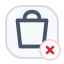
   <code>content.order.rejected</code>
   order · rejected
</td>
<td align="center" valign="top" width="16.6%">
  
   <code>content.order.completed</code>
   order · completed
</td>
</tr>
<tr>
<td align="center" valign="top" width="16.6%">
  
   <code>content.payment.draft</code>
   payment · draft
</td>
<td align="center" valign="top" width="16.6%">
  
   <code>content.payment.submitted</code>
   payment · submitted
</td>
<td align="center" valign="top" width="16.6%">
  
   <code>content.payment.verified</code>
   payment · verified
</td>
<td align="center" valign="top" width="16.6%">
  
   <code>content.payment.approved</code>
   payment · approved
</td>
<td align="center" valign="top" width="16.6%">
  
   <code>content.payment.rejected</code>
   payment · rejected
</td>
<td align="center" valign="top" width="16.6%">
  
   <code>content.payment.completed</code>
   payment · completed
</td>
</tr>
<tr>
<td align="center" valign="top" width="16.6%">
  
   <code>content.invoice.draft</code>
   invoice · draft
</td>
<td align="center" valign="top" width="16.6%">
  
   <code>content.invoice.submitted</code>
   invoice · submitted
</td>
<td align="center" valign="top" width="16.6%">
  
   <code>content.invoice.verified</code>
   invoice · verified
</td>
<td align="center" valign="top" width="16.6%">
  
   <code>content.invoice.approved</code>
   invoice · approved
</td>
<td align="center" valign="top" width="16.6%">
  
   <code>content.invoice.rejected</code>
   invoice · rejected
</td>
<td align="center" valign="top" width="16.6%">
  
   <code>content.invoice.completed</code>
   invoice · completed
</td>
</tr>
<tr>
<td align="center" valign="top" width="16.6%">
  
   <code>content.shipment.draft</code>
   shipment · draft
</td>
<td align="center" valign="top" width="16.6%">
  
   <code>content.shipment.submitted</code>
   shipment · submitted
</td>
<td align="center" valign="top" width="16.6%">
  
   <code>content.shipment.verified</code>
   shipment · verified
</td>
<td align="center" valign="top" width="16.6%">
  
   <code>content.shipment.approved</code>
   shipment · approved
</td>
<td align="center" valign="top" width="16.6%">
  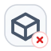
   <code>content.shipment.rejected</code>
   shipment · rejected
</td>
<td align="center" valign="top" width="16.6%">
  
   <code>content.shipment.completed</code>
   shipment · completed
</td>
</tr>
<tr>
<td align="center" valign="top" width="16.6%">
  
   <code>content.ticket.draft</code>
   ticket · draft
</td>
<td align="center" valign="top" width="16.6%">
  
   <code>content.ticket.submitted</code>
   ticket · submitted
</td>
<td align="center" valign="top" width="16.6%">
  
   <code>content.ticket.verified</code>
   ticket · verified
</td>
<td align="center" valign="top" width="16.6%">
  
   <code>content.ticket.approved</code>
   ticket · approved
</td>
<td align="center" valign="top" width="16.6%">
  
   <code>content.ticket.rejected</code>
   ticket · rejected
</td>
<td align="center" valign="top" width="16.6%">
  
   <code>content.ticket.completed</code>
   ticket · completed
</td>
</tr>
<tr>
<td align="center" valign="top" width="16.6%">
  
   <code>content.document.draft</code>
   document · draft
</td>
<td align="center" valign="top" width="16.6%">
  
   <code>content.document.submitted</code>
   document · submitted
</td>
<td align="center" valign="top" width="16.6%">
  
   <code>content.document.verified</code>
   document · verified
</td>
<td align="center" valign="top" width="16.6%">
  
   <code>content.document.approved</code>
   document · approved
</td>
<td align="center" valign="top" width="16.6%">
  
   <code>content.document.rejected</code>
   document · rejected
</td>
<td align="center" valign="top" width="16.6%">
  
   <code>content.document.completed</code>
   document · completed
</td>
</tr>
<tr>
<td align="center" valign="top" width="16.6%">
  
   <code>content.notification.draft</code>
   notification · draft
</td>
<td align="center" valign="top" width="16.6%">
  
   <code>content.notification.submitted</code>
   notification · submitted
</td>
<td align="center" valign="top" width="16.6%">
  
   <code>content.notification.verified</code>
   notification · verified
</td>
<td align="center" valign="top" width="16.6%">
  
   <code>content.notification.approved</code>
   notification · approved
</td>
<td align="center" valign="top" width="16.6%">
  
   <code>content.notification.rejected</code>
   notification · rejected
</td>
<td align="center" valign="top" width="16.6%">
  
   <code>content.notification.completed</code>
   notification · completed
</td>
</tr>
<tr>
<td align="center" valign="top" width="16.6%">
  
   <code>content.user.draft</code>
   user · draft
</td>
<td align="center" valign="top" width="16.6%">
  
   <code>content.user.submitted</code>
   user · submitted
</td>
<td align="center" valign="top" width="16.6%">
  
   <code>content.user.verified</code>
   user · verified
</td>
<td align="center" valign="top" width="16.6%">
  
   <code>content.user.approved</code>
   user · approved
</td>
<td align="center" valign="top" width="16.6%">
  
   <code>content.user.rejected</code>
   user · rejected
</td>
<td align="center" valign="top" width="16.6%">
  
   <code>content.user.completed</code>
   user · completed
</td>
</tr>
<tr>
<td align="center" valign="top" width="16.6%">
  
   <code>content.role.draft</code>
   role · draft
</td>
<td align="center" valign="top" width="16.6%">
  
   <code>content.role.submitted</code>
   role · submitted
</td>
<td align="center" valign="top" width="16.6%">
  
   <code>content.role.verified</code>
   role · verified
</td>
<td align="center" valign="top" width="16.6%">
  
   <code>content.role.approved</code>
   role · approved
</td>
<td align="center" valign="top" width="16.6%">
  
   <code>content.role.rejected</code>
   role · rejected
</td>
<td align="center" valign="top" width="16.6%">
  
   <code>content.role.completed</code>
   role · completed
</td>
</tr>
<tr>
<td align="center" valign="top" width="16.6%">
  
   <code>content.rule.draft</code>
   rule · draft
</td>
<td align="center" valign="top" width="16.6%">
  
   <code>content.rule.submitted</code>
   rule · submitted
</td>
<td align="center" valign="top" width="16.6%">
  
   <code>content.rule.verified</code>
   rule · verified
</td>
<td align="center" valign="top" width="16.6%">
  
   <code>content.rule.approved</code>
   rule · approved
</td>
<td align="center" valign="top" width="16.6%">
  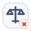
   <code>content.rule.rejected</code>
   rule · rejected
</td>
<td align="center" valign="top" width="16.6%">
  
   <code>content.rule.completed</code>
   rule · completed
</td>
</tr>
<tr>
<td align="center" valign="top" width="16.6%">
  
   <code>content.report.draft</code>
   report · draft
</td>
<td align="center" valign="top" width="16.6%">
  
   <code>content.report.submitted</code>
   report · submitted
</td>
<td align="center" valign="top" width="16.6%">
  
   <code>content.report.verified</code>
   report · verified
</td>
<td align="center" valign="top" width="16.6%">
  
   <code>content.report.approved</code>
   report · approved
</td>
<td align="center" valign="top" width="16.6%">
  
   <code>content.report.rejected</code>
   report · rejected
</td>
<td align="center" valign="top" width="16.6%">
  
   <code>content.report.completed</code>
   report · completed
</td>
</tr>
<tr>
<td align="center" valign="top" width="16.6%">
  
   <code>content.record.draft</code>
   record · draft
</td>
<td align="center" valign="top" width="16.6%">
  
   <code>content.record.submitted</code>
   record · submitted
</td>
<td align="center" valign="top" width="16.6%">
  
   <code>content.record.verified</code>
   record · verified
</td>
<td align="center" valign="top" width="16.6%">
  
   <code>content.record.approved</code>
   record · approved
</td>
<td align="center" valign="top" width="16.6%">
  
   <code>content.record.rejected</code>
   record · rejected
</td>
<td align="center" valign="top" width="16.6%">
  
   <code>content.record.completed</code>
   record · completed
</td>
</tr>
</table>

## Analytics

- Domain key: `analytics`
- Icon count: `96`
- Recommended domain glyph family: `chart-column`

<table>
<tr>
<td align="center" valign="top" width="16.6%">
  
   <code>analytics.request.draft</code>
   request · draft
</td>
<td align="center" valign="top" width="16.6%">
  
   <code>analytics.request.submitted</code>
   request · submitted
</td>
<td align="center" valign="top" width="16.6%">
  
   <code>analytics.request.verified</code>
   request · verified
</td>
<td align="center" valign="top" width="16.6%">
  
   <code>analytics.request.approved</code>
   request · approved
</td>
<td align="center" valign="top" width="16.6%">
  
   <code>analytics.request.rejected</code>
   request · rejected
</td>
<td align="center" valign="top" width="16.6%">
  
   <code>analytics.request.completed</code>
   request · completed
</td>
</tr>
<tr>
<td align="center" valign="top" width="16.6%">
  
   <code>analytics.task.draft</code>
   task · draft
</td>
<td align="center" valign="top" width="16.6%">
  
   <code>analytics.task.submitted</code>
   task · submitted
</td>
<td align="center" valign="top" width="16.6%">
  
   <code>analytics.task.verified</code>
   task · verified
</td>
<td align="center" valign="top" width="16.6%">
  
   <code>analytics.task.approved</code>
   task · approved
</td>
<td align="center" valign="top" width="16.6%">
  
   <code>analytics.task.rejected</code>
   task · rejected
</td>
<td align="center" valign="top" width="16.6%">
  
   <code>analytics.task.completed</code>
   task · completed
</td>
</tr>
<tr>
<td align="center" valign="top" width="16.6%">
  
   <code>analytics.review.draft</code>
   review · draft
</td>
<td align="center" valign="top" width="16.6%">
  
   <code>analytics.review.submitted</code>
   review · submitted
</td>
<td align="center" valign="top" width="16.6%">
  
   <code>analytics.review.verified</code>
   review · verified
</td>
<td align="center" valign="top" width="16.6%">
  
   <code>analytics.review.approved</code>
   review · approved
</td>
<td align="center" valign="top" width="16.6%">
  
   <code>analytics.review.rejected</code>
   review · rejected
</td>
<td align="center" valign="top" width="16.6%">
  
   <code>analytics.review.completed</code>
   review · completed
</td>
</tr>
<tr>
<td align="center" valign="top" width="16.6%">
  
   <code>analytics.approval.draft</code>
   approval · draft
</td>
<td align="center" valign="top" width="16.6%">
  
   <code>analytics.approval.submitted</code>
   approval · submitted
</td>
<td align="center" valign="top" width="16.6%">
  
   <code>analytics.approval.verified</code>
   approval · verified
</td>
<td align="center" valign="top" width="16.6%">
  
   <code>analytics.approval.approved</code>
   approval · approved
</td>
<td align="center" valign="top" width="16.6%">
  
   <code>analytics.approval.rejected</code>
   approval · rejected
</td>
<td align="center" valign="top" width="16.6%">
  
   <code>analytics.approval.completed</code>
   approval · completed
</td>
</tr>
<tr>
<td align="center" valign="top" width="16.6%">
  
   <code>analytics.order.draft</code>
   order · draft
</td>
<td align="center" valign="top" width="16.6%">
  
   <code>analytics.order.submitted</code>
   order · submitted
</td>
<td align="center" valign="top" width="16.6%">
  
   <code>analytics.order.verified</code>
   order · verified
</td>
<td align="center" valign="top" width="16.6%">
  
   <code>analytics.order.approved</code>
   order · approved
</td>
<td align="center" valign="top" width="16.6%">
  
   <code>analytics.order.rejected</code>
   order · rejected
</td>
<td align="center" valign="top" width="16.6%">
  
   <code>analytics.order.completed</code>
   order · completed
</td>
</tr>
<tr>
<td align="center" valign="top" width="16.6%">
  
   <code>analytics.payment.draft</code>
   payment · draft
</td>
<td align="center" valign="top" width="16.6%">
  
   <code>analytics.payment.submitted</code>
   payment · submitted
</td>
<td align="center" valign="top" width="16.6%">
  
   <code>analytics.payment.verified</code>
   payment · verified
</td>
<td align="center" valign="top" width="16.6%">
  
   <code>analytics.payment.approved</code>
   payment · approved
</td>
<td align="center" valign="top" width="16.6%">
  
   <code>analytics.payment.rejected</code>
   payment · rejected
</td>
<td align="center" valign="top" width="16.6%">
  
   <code>analytics.payment.completed</code>
   payment · completed
</td>
</tr>
<tr>
<td align="center" valign="top" width="16.6%">
  
   <code>analytics.invoice.draft</code>
   invoice · draft
</td>
<td align="center" valign="top" width="16.6%">
  
   <code>analytics.invoice.submitted</code>
   invoice · submitted
</td>
<td align="center" valign="top" width="16.6%">
  
   <code>analytics.invoice.verified</code>
   invoice · verified
</td>
<td align="center" valign="top" width="16.6%">
  
   <code>analytics.invoice.approved</code>
   invoice · approved
</td>
<td align="center" valign="top" width="16.6%">
  
   <code>analytics.invoice.rejected</code>
   invoice · rejected
</td>
<td align="center" valign="top" width="16.6%">
  
   <code>analytics.invoice.completed</code>
   invoice · completed
</td>
</tr>
<tr>
<td align="center" valign="top" width="16.6%">
  
   <code>analytics.shipment.draft</code>
   shipment · draft
</td>
<td align="center" valign="top" width="16.6%">
  
   <code>analytics.shipment.submitted</code>
   shipment · submitted
</td>
<td align="center" valign="top" width="16.6%">
  
   <code>analytics.shipment.verified</code>
   shipment · verified
</td>
<td align="center" valign="top" width="16.6%">
  
   <code>analytics.shipment.approved</code>
   shipment · approved
</td>
<td align="center" valign="top" width="16.6%">
  
   <code>analytics.shipment.rejected</code>
   shipment · rejected
</td>
<td align="center" valign="top" width="16.6%">
  
   <code>analytics.shipment.completed</code>
   shipment · completed
</td>
</tr>
<tr>
<td align="center" valign="top" width="16.6%">
  
   <code>analytics.ticket.draft</code>
   ticket · draft
</td>
<td align="center" valign="top" width="16.6%">
  
   <code>analytics.ticket.submitted</code>
   ticket · submitted
</td>
<td align="center" valign="top" width="16.6%">
  
   <code>analytics.ticket.verified</code>
   ticket · verified
</td>
<td align="center" valign="top" width="16.6%">
  
   <code>analytics.ticket.approved</code>
   ticket · approved
</td>
<td align="center" valign="top" width="16.6%">
  
   <code>analytics.ticket.rejected</code>
   ticket · rejected
</td>
<td align="center" valign="top" width="16.6%">
  
   <code>analytics.ticket.completed</code>
   ticket · completed
</td>
</tr>
<tr>
<td align="center" valign="top" width="16.6%">
  
   <code>analytics.document.draft</code>
   document · draft
</td>
<td align="center" valign="top" width="16.6%">
  
   <code>analytics.document.submitted</code>
   document · submitted
</td>
<td align="center" valign="top" width="16.6%">
  
   <code>analytics.document.verified</code>
   document · verified
</td>
<td align="center" valign="top" width="16.6%">
  
   <code>analytics.document.approved</code>
   document · approved
</td>
<td align="center" valign="top" width="16.6%">
  
   <code>analytics.document.rejected</code>
   document · rejected
</td>
<td align="center" valign="top" width="16.6%">
  
   <code>analytics.document.completed</code>
   document · completed
</td>
</tr>
<tr>
<td align="center" valign="top" width="16.6%">
  
   <code>analytics.notification.draft</code>
   notification · draft
</td>
<td align="center" valign="top" width="16.6%">
  
   <code>analytics.notification.submitted</code>
   notification · submitted
</td>
<td align="center" valign="top" width="16.6%">
  
   <code>analytics.notification.verified</code>
   notification · verified
</td>
<td align="center" valign="top" width="16.6%">
  
   <code>analytics.notification.approved</code>
   notification · approved
</td>
<td align="center" valign="top" width="16.6%">
  
   <code>analytics.notification.rejected</code>
   notification · rejected
</td>
<td align="center" valign="top" width="16.6%">
  
   <code>analytics.notification.completed</code>
   notification · completed
</td>
</tr>
<tr>
<td align="center" valign="top" width="16.6%">
  
   <code>analytics.user.draft</code>
   user · draft
</td>
<td align="center" valign="top" width="16.6%">
  
   <code>analytics.user.submitted</code>
   user · submitted
</td>
<td align="center" valign="top" width="16.6%">
  
   <code>analytics.user.verified</code>
   user · verified
</td>
<td align="center" valign="top" width="16.6%">
  
   <code>analytics.user.approved</code>
   user · approved
</td>
<td align="center" valign="top" width="16.6%">
  
   <code>analytics.user.rejected</code>
   user · rejected
</td>
<td align="center" valign="top" width="16.6%">
  
   <code>analytics.user.completed</code>
   user · completed
</td>
</tr>
<tr>
<td align="center" valign="top" width="16.6%">
  
   <code>analytics.role.draft</code>
   role · draft
</td>
<td align="center" valign="top" width="16.6%">
  
   <code>analytics.role.submitted</code>
   role · submitted
</td>
<td align="center" valign="top" width="16.6%">
  
   <code>analytics.role.verified</code>
   role · verified
</td>
<td align="center" valign="top" width="16.6%">
  
   <code>analytics.role.approved</code>
   role · approved
</td>
<td align="center" valign="top" width="16.6%">
  
   <code>analytics.role.rejected</code>
   role · rejected
</td>
<td align="center" valign="top" width="16.6%">
  
   <code>analytics.role.completed</code>
   role · completed
</td>
</tr>
<tr>
<td align="center" valign="top" width="16.6%">
  
   <code>analytics.rule.draft</code>
   rule · draft
</td>
<td align="center" valign="top" width="16.6%">
  
   <code>analytics.rule.submitted</code>
   rule · submitted
</td>
<td align="center" valign="top" width="16.6%">
  
   <code>analytics.rule.verified</code>
   rule · verified
</td>
<td align="center" valign="top" width="16.6%">
  
   <code>analytics.rule.approved</code>
   rule · approved
</td>
<td align="center" valign="top" width="16.6%">
  
   <code>analytics.rule.rejected</code>
   rule · rejected
</td>
<td align="center" valign="top" width="16.6%">
  
   <code>analytics.rule.completed</code>
   rule · completed
</td>
</tr>
<tr>
<td align="center" valign="top" width="16.6%">
  
   <code>analytics.report.draft</code>
   report · draft
</td>
<td align="center" valign="top" width="16.6%">
  
   <code>analytics.report.submitted</code>
   report · submitted
</td>
<td align="center" valign="top" width="16.6%">
  
   <code>analytics.report.verified</code>
   report · verified
</td>
<td align="center" valign="top" width="16.6%">
  
   <code>analytics.report.approved</code>
   report · approved
</td>
<td align="center" valign="top" width="16.6%">
  
   <code>analytics.report.rejected</code>
   report · rejected
</td>
<td align="center" valign="top" width="16.6%">
  
   <code>analytics.report.completed</code>
   report · completed
</td>
</tr>
<tr>
<td align="center" valign="top" width="16.6%">
  
   <code>analytics.record.draft</code>
   record · draft
</td>
<td align="center" valign="top" width="16.6%">
  
   <code>analytics.record.submitted</code>
   record · submitted
</td>
<td align="center" valign="top" width="16.6%">
  
   <code>analytics.record.verified</code>
   record · verified
</td>
<td align="center" valign="top" width="16.6%">
  
   <code>analytics.record.approved</code>
   record · approved
</td>
<td align="center" valign="top" width="16.6%">
  
   <code>analytics.record.rejected</code>
   record · rejected
</td>
<td align="center" valign="top" width="16.6%">
  
   <code>analytics.record.completed</code>
   record · completed
</td>
</tr>
</table>

## Platform

- Domain key: `platform`
- Icon count: `96`
- Recommended domain glyph family: `server-cog`

<table>
<tr>
<td align="center" valign="top" width="16.6%">
  
   <code>platform.request.draft</code>
   request · draft
</td>
<td align="center" valign="top" width="16.6%">
  
   <code>platform.request.submitted</code>
   request · submitted
</td>
<td align="center" valign="top" width="16.6%">
  
   <code>platform.request.verified</code>
   request · verified
</td>
<td align="center" valign="top" width="16.6%">
  
   <code>platform.request.approved</code>
   request · approved
</td>
<td align="center" valign="top" width="16.6%">
  
   <code>platform.request.rejected</code>
   request · rejected
</td>
<td align="center" valign="top" width="16.6%">
  
   <code>platform.request.completed</code>
   request · completed
</td>
</tr>
<tr>
<td align="center" valign="top" width="16.6%">
  
   <code>platform.task.draft</code>
   task · draft
</td>
<td align="center" valign="top" width="16.6%">
  
   <code>platform.task.submitted</code>
   task · submitted
</td>
<td align="center" valign="top" width="16.6%">
  
   <code>platform.task.verified</code>
   task · verified
</td>
<td align="center" valign="top" width="16.6%">
  
   <code>platform.task.approved</code>
   task · approved
</td>
<td align="center" valign="top" width="16.6%">
  
   <code>platform.task.rejected</code>
   task · rejected
</td>
<td align="center" valign="top" width="16.6%">
  
   <code>platform.task.completed</code>
   task · completed
</td>
</tr>
<tr>
<td align="center" valign="top" width="16.6%">
  
   <code>platform.review.draft</code>
   review · draft
</td>
<td align="center" valign="top" width="16.6%">
  
   <code>platform.review.submitted</code>
   review · submitted
</td>
<td align="center" valign="top" width="16.6%">
  
   <code>platform.review.verified</code>
   review · verified
</td>
<td align="center" valign="top" width="16.6%">
  
   <code>platform.review.approved</code>
   review · approved
</td>
<td align="center" valign="top" width="16.6%">
  
   <code>platform.review.rejected</code>
   review · rejected
</td>
<td align="center" valign="top" width="16.6%">
  
   <code>platform.review.completed</code>
   review · completed
</td>
</tr>
<tr>
<td align="center" valign="top" width="16.6%">
  
   <code>platform.approval.draft</code>
   approval · draft
</td>
<td align="center" valign="top" width="16.6%">
  
   <code>platform.approval.submitted</code>
   approval · submitted
</td>
<td align="center" valign="top" width="16.6%">
  
   <code>platform.approval.verified</code>
   approval · verified
</td>
<td align="center" valign="top" width="16.6%">
  
   <code>platform.approval.approved</code>
   approval · approved
</td>
<td align="center" valign="top" width="16.6%">
  
   <code>platform.approval.rejected</code>
   approval · rejected
</td>
<td align="center" valign="top" width="16.6%">
  
   <code>platform.approval.completed</code>
   approval · completed
</td>
</tr>
<tr>
<td align="center" valign="top" width="16.6%">
  
   <code>platform.order.draft</code>
   order · draft
</td>
<td align="center" valign="top" width="16.6%">
  
   <code>platform.order.submitted</code>
   order · submitted
</td>
<td align="center" valign="top" width="16.6%">
  
   <code>platform.order.verified</code>
   order · verified
</td>
<td align="center" valign="top" width="16.6%">
  
   <code>platform.order.approved</code>
   order · approved
</td>
<td align="center" valign="top" width="16.6%">
  
   <code>platform.order.rejected</code>
   order · rejected
</td>
<td align="center" valign="top" width="16.6%">
  
   <code>platform.order.completed</code>
   order · completed
</td>
</tr>
<tr>
<td align="center" valign="top" width="16.6%">
  
   <code>platform.payment.draft</code>
   payment · draft
</td>
<td align="center" valign="top" width="16.6%">
  
   <code>platform.payment.submitted</code>
   payment · submitted
</td>
<td align="center" valign="top" width="16.6%">
  
   <code>platform.payment.verified</code>
   payment · verified
</td>
<td align="center" valign="top" width="16.6%">
  
   <code>platform.payment.approved</code>
   payment · approved
</td>
<td align="center" valign="top" width="16.6%">
  
   <code>platform.payment.rejected</code>
   payment · rejected
</td>
<td align="center" valign="top" width="16.6%">
  
   <code>platform.payment.completed</code>
   payment · completed
</td>
</tr>
<tr>
<td align="center" valign="top" width="16.6%">
  
   <code>platform.invoice.draft</code>
   invoice · draft
</td>
<td align="center" valign="top" width="16.6%">
  
   <code>platform.invoice.submitted</code>
   invoice · submitted
</td>
<td align="center" valign="top" width="16.6%">
  
   <code>platform.invoice.verified</code>
   invoice · verified
</td>
<td align="center" valign="top" width="16.6%">
  
   <code>platform.invoice.approved</code>
   invoice · approved
</td>
<td align="center" valign="top" width="16.6%">
  
   <code>platform.invoice.rejected</code>
   invoice · rejected
</td>
<td align="center" valign="top" width="16.6%">
  
   <code>platform.invoice.completed</code>
   invoice · completed
</td>
</tr>
<tr>
<td align="center" valign="top" width="16.6%">
  
   <code>platform.shipment.draft</code>
   shipment · draft
</td>
<td align="center" valign="top" width="16.6%">
  
   <code>platform.shipment.submitted</code>
   shipment · submitted
</td>
<td align="center" valign="top" width="16.6%">
  
   <code>platform.shipment.verified</code>
   shipment · verified
</td>
<td align="center" valign="top" width="16.6%">
  
   <code>platform.shipment.approved</code>
   shipment · approved
</td>
<td align="center" valign="top" width="16.6%">
  
   <code>platform.shipment.rejected</code>
   shipment · rejected
</td>
<td align="center" valign="top" width="16.6%">
  
   <code>platform.shipment.completed</code>
   shipment · completed
</td>
</tr>
<tr>
<td align="center" valign="top" width="16.6%">
  
   <code>platform.ticket.draft</code>
   ticket · draft
</td>
<td align="center" valign="top" width="16.6%">
  
   <code>platform.ticket.submitted</code>
   ticket · submitted
</td>
<td align="center" valign="top" width="16.6%">
  
   <code>platform.ticket.verified</code>
   ticket · verified
</td>
<td align="center" valign="top" width="16.6%">
  
   <code>platform.ticket.approved</code>
   ticket · approved
</td>
<td align="center" valign="top" width="16.6%">
  
   <code>platform.ticket.rejected</code>
   ticket · rejected
</td>
<td align="center" valign="top" width="16.6%">
  
   <code>platform.ticket.completed</code>
   ticket · completed
</td>
</tr>
<tr>
<td align="center" valign="top" width="16.6%">
  
   <code>platform.document.draft</code>
   document · draft
</td>
<td align="center" valign="top" width="16.6%">
  
   <code>platform.document.submitted</code>
   document · submitted
</td>
<td align="center" valign="top" width="16.6%">
  
   <code>platform.document.verified</code>
   document · verified
</td>
<td align="center" valign="top" width="16.6%">
  
   <code>platform.document.approved</code>
   document · approved
</td>
<td align="center" valign="top" width="16.6%">
  
   <code>platform.document.rejected</code>
   document · rejected
</td>
<td align="center" valign="top" width="16.6%">
  
   <code>platform.document.completed</code>
   document · completed
</td>
</tr>
<tr>
<td align="center" valign="top" width="16.6%">
  
   <code>platform.notification.draft</code>
   notification · draft
</td>
<td align="center" valign="top" width="16.6%">
  
   <code>platform.notification.submitted</code>
   notification · submitted
</td>
<td align="center" valign="top" width="16.6%">
  
   <code>platform.notification.verified</code>
   notification · verified
</td>
<td align="center" valign="top" width="16.6%">
  
   <code>platform.notification.approved</code>
   notification · approved
</td>
<td align="center" valign="top" width="16.6%">
  
   <code>platform.notification.rejected</code>
   notification · rejected
</td>
<td align="center" valign="top" width="16.6%">
  
   <code>platform.notification.completed</code>
   notification · completed
</td>
</tr>
<tr>
<td align="center" valign="top" width="16.6%">
  
   <code>platform.user.draft</code>
   user · draft
</td>
<td align="center" valign="top" width="16.6%">
  
   <code>platform.user.submitted</code>
   user · submitted
</td>
<td align="center" valign="top" width="16.6%">
  
   <code>platform.user.verified</code>
   user · verified
</td>
<td align="center" valign="top" width="16.6%">
  
   <code>platform.user.approved</code>
   user · approved
</td>
<td align="center" valign="top" width="16.6%">
  
   <code>platform.user.rejected</code>
   user · rejected
</td>
<td align="center" valign="top" width="16.6%">
  
   <code>platform.user.completed</code>
   user · completed
</td>
</tr>
<tr>
<td align="center" valign="top" width="16.6%">
  
   <code>platform.role.draft</code>
   role · draft
</td>
<td align="center" valign="top" width="16.6%">
  
   <code>platform.role.submitted</code>
   role · submitted
</td>
<td align="center" valign="top" width="16.6%">
  
   <code>platform.role.verified</code>
   role · verified
</td>
<td align="center" valign="top" width="16.6%">
  
   <code>platform.role.approved</code>
   role · approved
</td>
<td align="center" valign="top" width="16.6%">
  
   <code>platform.role.rejected</code>
   role · rejected
</td>
<td align="center" valign="top" width="16.6%">
  
   <code>platform.role.completed</code>
   role · completed
</td>
</tr>
<tr>
<td align="center" valign="top" width="16.6%">
  
   <code>platform.rule.draft</code>
   rule · draft
</td>
<td align="center" valign="top" width="16.6%">
  
   <code>platform.rule.submitted</code>
   rule · submitted
</td>
<td align="center" valign="top" width="16.6%">
  
   <code>platform.rule.verified</code>
   rule · verified
</td>
<td align="center" valign="top" width="16.6%">
  
   <code>platform.rule.approved</code>
   rule · approved
</td>
<td align="center" valign="top" width="16.6%">
  
   <code>platform.rule.rejected</code>
   rule · rejected
</td>
<td align="center" valign="top" width="16.6%">
  
   <code>platform.rule.completed</code>
   rule · completed
</td>
</tr>
<tr>
<td align="center" valign="top" width="16.6%">
  
   <code>platform.report.draft</code>
   report · draft
</td>
<td align="center" valign="top" width="16.6%">
  
   <code>platform.report.submitted</code>
   report · submitted
</td>
<td align="center" valign="top" width="16.6%">
  
   <code>platform.report.verified</code>
   report · verified
</td>
<td align="center" valign="top" width="16.6%">
  
   <code>platform.report.approved</code>
   report · approved
</td>
<td align="center" valign="top" width="16.6%">
  
   <code>platform.report.rejected</code>
   report · rejected
</td>
<td align="center" valign="top" width="16.6%">
  
   <code>platform.report.completed</code>
   report · completed
</td>
</tr>
<tr>
<td align="center" valign="top" width="16.6%">
  
   <code>platform.record.draft</code>
   record · draft
</td>
<td align="center" valign="top" width="16.6%">
  
   <code>platform.record.submitted</code>
   record · submitted
</td>
<td align="center" valign="top" width="16.6%">
  
   <code>platform.record.verified</code>
   record · verified
</td>
<td align="center" valign="top" width="16.6%">
  
   <code>platform.record.approved</code>
   record · approved
</td>
<td align="center" valign="top" width="16.6%">
  
   <code>platform.record.rejected</code>
   record · rejected
</td>
<td align="center" valign="top" width="16.6%">
  
   <code>platform.record.completed</code>
   record · completed
</td>
</tr>
</table>

## Data

- Domain key: `data`
- Icon count: `96`
- Recommended domain glyph family: `database`

<table>
<tr>
<td align="center" valign="top" width="16.6%">
  
   <code>data.request.draft</code>
   request · draft
</td>
<td align="center" valign="top" width="16.6%">
  
   <code>data.request.submitted</code>
   request · submitted
</td>
<td align="center" valign="top" width="16.6%">
  
   <code>data.request.verified</code>
   request · verified
</td>
<td align="center" valign="top" width="16.6%">
  
   <code>data.request.approved</code>
   request · approved
</td>
<td align="center" valign="top" width="16.6%">
  
   <code>data.request.rejected</code>
   request · rejected
</td>
<td align="center" valign="top" width="16.6%">
  
   <code>data.request.completed</code>
   request · completed
</td>
</tr>
<tr>
<td align="center" valign="top" width="16.6%">
  
   <code>data.task.draft</code>
   task · draft
</td>
<td align="center" valign="top" width="16.6%">
  
   <code>data.task.submitted</code>
   task · submitted
</td>
<td align="center" valign="top" width="16.6%">
  
   <code>data.task.verified</code>
   task · verified
</td>
<td align="center" valign="top" width="16.6%">
  
   <code>data.task.approved</code>
   task · approved
</td>
<td align="center" valign="top" width="16.6%">
  
   <code>data.task.rejected</code>
   task · rejected
</td>
<td align="center" valign="top" width="16.6%">
  
   <code>data.task.completed</code>
   task · completed
</td>
</tr>
<tr>
<td align="center" valign="top" width="16.6%">
  
   <code>data.review.draft</code>
   review · draft
</td>
<td align="center" valign="top" width="16.6%">
  
   <code>data.review.submitted</code>
   review · submitted
</td>
<td align="center" valign="top" width="16.6%">
  
   <code>data.review.verified</code>
   review · verified
</td>
<td align="center" valign="top" width="16.6%">
  
   <code>data.review.approved</code>
   review · approved
</td>
<td align="center" valign="top" width="16.6%">
  
   <code>data.review.rejected</code>
   review · rejected
</td>
<td align="center" valign="top" width="16.6%">
  
   <code>data.review.completed</code>
   review · completed
</td>
</tr>
<tr>
<td align="center" valign="top" width="16.6%">
  
   <code>data.approval.draft</code>
   approval · draft
</td>
<td align="center" valign="top" width="16.6%">
  
   <code>data.approval.submitted</code>
   approval · submitted
</td>
<td align="center" valign="top" width="16.6%">
  
   <code>data.approval.verified</code>
   approval · verified
</td>
<td align="center" valign="top" width="16.6%">
  
   <code>data.approval.approved</code>
   approval · approved
</td>
<td align="center" valign="top" width="16.6%">
  
   <code>data.approval.rejected</code>
   approval · rejected
</td>
<td align="center" valign="top" width="16.6%">
  
   <code>data.approval.completed</code>
   approval · completed
</td>
</tr>
<tr>
<td align="center" valign="top" width="16.6%">
  
   <code>data.order.draft</code>
   order · draft
</td>
<td align="center" valign="top" width="16.6%">
  
   <code>data.order.submitted</code>
   order · submitted
</td>
<td align="center" valign="top" width="16.6%">
  
   <code>data.order.verified</code>
   order · verified
</td>
<td align="center" valign="top" width="16.6%">
  
   <code>data.order.approved</code>
   order · approved
</td>
<td align="center" valign="top" width="16.6%">
  
   <code>data.order.rejected</code>
   order · rejected
</td>
<td align="center" valign="top" width="16.6%">
  
   <code>data.order.completed</code>
   order · completed
</td>
</tr>
<tr>
<td align="center" valign="top" width="16.6%">
  
   <code>data.payment.draft</code>
   payment · draft
</td>
<td align="center" valign="top" width="16.6%">
  
   <code>data.payment.submitted</code>
   payment · submitted
</td>
<td align="center" valign="top" width="16.6%">
  
   <code>data.payment.verified</code>
   payment · verified
</td>
<td align="center" valign="top" width="16.6%">
  
   <code>data.payment.approved</code>
   payment · approved
</td>
<td align="center" valign="top" width="16.6%">
  
   <code>data.payment.rejected</code>
   payment · rejected
</td>
<td align="center" valign="top" width="16.6%">
  
   <code>data.payment.completed</code>
   payment · completed
</td>
</tr>
<tr>
<td align="center" valign="top" width="16.6%">
  
   <code>data.invoice.draft</code>
   invoice · draft
</td>
<td align="center" valign="top" width="16.6%">
  
   <code>data.invoice.submitted</code>
   invoice · submitted
</td>
<td align="center" valign="top" width="16.6%">
  
   <code>data.invoice.verified</code>
   invoice · verified
</td>
<td align="center" valign="top" width="16.6%">
  
   <code>data.invoice.approved</code>
   invoice · approved
</td>
<td align="center" valign="top" width="16.6%">
  
   <code>data.invoice.rejected</code>
   invoice · rejected
</td>
<td align="center" valign="top" width="16.6%">
  
   <code>data.invoice.completed</code>
   invoice · completed
</td>
</tr>
<tr>
<td align="center" valign="top" width="16.6%">
  
   <code>data.shipment.draft</code>
   shipment · draft
</td>
<td align="center" valign="top" width="16.6%">
  
   <code>data.shipment.submitted</code>
   shipment · submitted
</td>
<td align="center" valign="top" width="16.6%">
  
   <code>data.shipment.verified</code>
   shipment · verified
</td>
<td align="center" valign="top" width="16.6%">
  
   <code>data.shipment.approved</code>
   shipment · approved
</td>
<td align="center" valign="top" width="16.6%">
  
   <code>data.shipment.rejected</code>
   shipment · rejected
</td>
<td align="center" valign="top" width="16.6%">
  
   <code>data.shipment.completed</code>
   shipment · completed
</td>
</tr>
<tr>
<td align="center" valign="top" width="16.6%">
  
   <code>data.ticket.draft</code>
   ticket · draft
</td>
<td align="center" valign="top" width="16.6%">
  
   <code>data.ticket.submitted</code>
   ticket · submitted
</td>
<td align="center" valign="top" width="16.6%">
  
   <code>data.ticket.verified</code>
   ticket · verified
</td>
<td align="center" valign="top" width="16.6%">
  
   <code>data.ticket.approved</code>
   ticket · approved
</td>
<td align="center" valign="top" width="16.6%">
  
   <code>data.ticket.rejected</code>
   ticket · rejected
</td>
<td align="center" valign="top" width="16.6%">
  
   <code>data.ticket.completed</code>
   ticket · completed
</td>
</tr>
<tr>
<td align="center" valign="top" width="16.6%">
  
   <code>data.document.draft</code>
   document · draft
</td>
<td align="center" valign="top" width="16.6%">
  
   <code>data.document.submitted</code>
   document · submitted
</td>
<td align="center" valign="top" width="16.6%">
  
   <code>data.document.verified</code>
   document · verified
</td>
<td align="center" valign="top" width="16.6%">
  
   <code>data.document.approved</code>
   document · approved
</td>
<td align="center" valign="top" width="16.6%">
  
   <code>data.document.rejected</code>
   document · rejected
</td>
<td align="center" valign="top" width="16.6%">
  
   <code>data.document.completed</code>
   document · completed
</td>
</tr>
<tr>
<td align="center" valign="top" width="16.6%">
  
   <code>data.notification.draft</code>
   notification · draft
</td>
<td align="center" valign="top" width="16.6%">
  
   <code>data.notification.submitted</code>
   notification · submitted
</td>
<td align="center" valign="top" width="16.6%">
  
   <code>data.notification.verified</code>
   notification · verified
</td>
<td align="center" valign="top" width="16.6%">
  
   <code>data.notification.approved</code>
   notification · approved
</td>
<td align="center" valign="top" width="16.6%">
  
   <code>data.notification.rejected</code>
   notification · rejected
</td>
<td align="center" valign="top" width="16.6%">
  
   <code>data.notification.completed</code>
   notification · completed
</td>
</tr>
<tr>
<td align="center" valign="top" width="16.6%">
  
   <code>data.user.draft</code>
   user · draft
</td>
<td align="center" valign="top" width="16.6%">
  
   <code>data.user.submitted</code>
   user · submitted
</td>
<td align="center" valign="top" width="16.6%">
  
   <code>data.user.verified</code>
   user · verified
</td>
<td align="center" valign="top" width="16.6%">
  
   <code>data.user.approved</code>
   user · approved
</td>
<td align="center" valign="top" width="16.6%">
  
   <code>data.user.rejected</code>
   user · rejected
</td>
<td align="center" valign="top" width="16.6%">
  
   <code>data.user.completed</code>
   user · completed
</td>
</tr>
<tr>
<td align="center" valign="top" width="16.6%">
  
   <code>data.role.draft</code>
   role · draft
</td>
<td align="center" valign="top" width="16.6%">
  
   <code>data.role.submitted</code>
   role · submitted
</td>
<td align="center" valign="top" width="16.6%">
  
   <code>data.role.verified</code>
   role · verified
</td>
<td align="center" valign="top" width="16.6%">
  
   <code>data.role.approved</code>
   role · approved
</td>
<td align="center" valign="top" width="16.6%">
  
   <code>data.role.rejected</code>
   role · rejected
</td>
<td align="center" valign="top" width="16.6%">
  
   <code>data.role.completed</code>
   role · completed
</td>
</tr>
<tr>
<td align="center" valign="top" width="16.6%">
  
   <code>data.rule.draft</code>
   rule · draft
</td>
<td align="center" valign="top" width="16.6%">
  
   <code>data.rule.submitted</code>
   rule · submitted
</td>
<td align="center" valign="top" width="16.6%">
  
   <code>data.rule.verified</code>
   rule · verified
</td>
<td align="center" valign="top" width="16.6%">
  
   <code>data.rule.approved</code>
   rule · approved
</td>
<td align="center" valign="top" width="16.6%">
  
   <code>data.rule.rejected</code>
   rule · rejected
</td>
<td align="center" valign="top" width="16.6%">
  
   <code>data.rule.completed</code>
   rule · completed
</td>
</tr>
<tr>
<td align="center" valign="top" width="16.6%">
  
   <code>data.report.draft</code>
   report · draft
</td>
<td align="center" valign="top" width="16.6%">
  
   <code>data.report.submitted</code>
   report · submitted
</td>
<td align="center" valign="top" width="16.6%">
  
   <code>data.report.verified</code>
   report · verified
</td>
<td align="center" valign="top" width="16.6%">
  
   <code>data.report.approved</code>
   report · approved
</td>
<td align="center" valign="top" width="16.6%">
  
   <code>data.report.rejected</code>
   report · rejected
</td>
<td align="center" valign="top" width="16.6%">
  
   <code>data.report.completed</code>
   report · completed
</td>
</tr>
<tr>
<td align="center" valign="top" width="16.6%">
  
   <code>data.record.draft</code>
   record · draft
</td>
<td align="center" valign="top" width="16.6%">
  
   <code>data.record.submitted</code>
   record · submitted
</td>
<td align="center" valign="top" width="16.6%">
  
   <code>data.record.verified</code>
   record · verified
</td>
<td align="center" valign="top" width="16.6%">
  
   <code>data.record.approved</code>
   record · approved
</td>
<td align="center" valign="top" width="16.6%">
  
   <code>data.record.rejected</code>
   record · rejected
</td>
<td align="center" valign="top" width="16.6%">
  
   <code>data.record.completed</code>
   record · completed
</td>
</tr>
</table>
